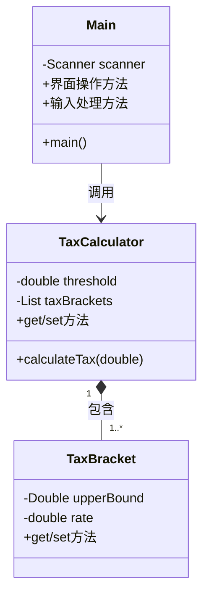
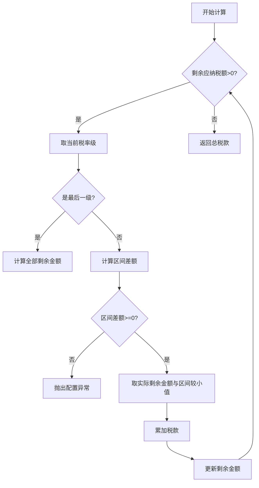
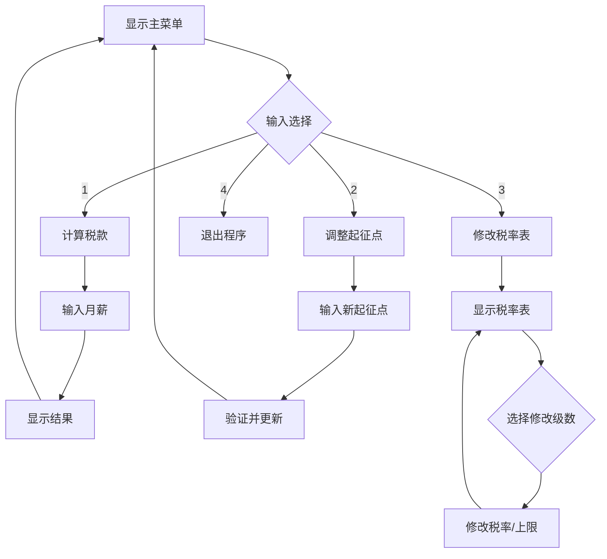

# 设计文档

## 一、实验概述

### 1.1 实验内容
设计一个基于命令行界面的计算个人所得税（工资、薪金所得）应用程序：
- 根据用户输入的当月工资薪金总额计算应缴纳的个人所得税额
- 支持对个人所得税起征点进行调整的功能
- 个人所得税各级税率也允许修改
- 使用简单的命令行菜单方式让用户选择所需的功能

### 1.2 设计目标

- 编程风格应该合理规范化
- 面向对象设计，方法和程序接口应该合理自然
- 代码具有足够的健壮性
- 对用户友好，有直观的命令行交互界面

---

## 二、系统架构

### 2.1 三层架构设计

| 层级       | 对应类        | 职责说明                       |
| ---------- | ------------- | ------------------------------ |
| 表示层     | Main          | 处理用户输入输出，控制程序流程 |
| 综合逻辑层 | TaxCalculator | 实现税款计算核心算法           |
| 数据模型层 | TaxBracket    | 封装税率级数据模型             |

### 2.2 类关系图



---

## 三、详细设计
### 3.1 核心类说明
#### 3.1.1 TaxBracket（税率级类）

- **功能**：封装单个税率级的上下限和税率
- **属性**：
  | 字段       | 类型   | 说明                               |
  | ---------- | ------ | ---------------------------------- |
  | upperBound | Double | 应纳税所得额上限（null表示无上限） |
  | rate       | double | 税率（0-1小数形式，如0.03表示3%）  |

#### 3.1.2 TaxCalculator（计算核心类）

- **功能**：管理起征点和税率表，执行税款计算
- **关键方法**：
  ```java
  /**
   * 超额累进税率计算算法
   * @param taxableIncome 应纳税所得额（总收入 - 起征点）
   * @return 计算结果税款
   * @throws IllegalStateException 税率表配置错误时抛出
   */
  public double calculateTax(double taxableIncome)
  ```

#### 3.1.3 Main（主控类）
- **职责**：实现用户界面和流程控制
- **核心功能**：
  - 打印交互菜单
  - 处理数值输入验证
  - 调用计算器功能
  - 管理税率表修改流程

---

## 四、核心算法
### 4.1 超额累进税率计算流程


### 4.2 公式说明
对于每级税率区间：
```
税款 = Σ(区间应纳税额 × 对应税率)
区间应纳税额 = min(区间上限 - 前级上限, 剩余应纳税额)
```

---

## 五、用户界面设计
### 5.1 交互流程图


### 5.2 输入验证机制
- **数值类型检查**：通过异常捕获处理非数字输入
- **范围校验**：
  - 起征点 ≥ 0
  - 税率 ∈ [0,100]
  - 税率级上限递增性校验

---

## 六、测试方案
### 6.1 测试用例
| 测试场景       | 输入数据      | 预期结果      | 验证点         | 对应脚本         |
| -------------- | ------------- | ------------- | -------------- | -------------- |
| 基本计算       | 月薪50000元   | 税款9090.00元 | 算法正确性     |标准测试50000.bat|
| 边界值测试     | 月薪5000元    | 税款0.00元    | 起征点临界值   |标准测试5000.bat|
| 起征点修改测试   | 调高起征点为10000 | 税款7590.00元  | 配置更新有效性   |调整起征点后50000.bat|
| 税率表修改测试 | 调高级数1上限至5000、修改税率为5% | 税款9050.00元  | 配置更新有效性 |调整税率表后50000.bat|

### 6.2 回归测试
1. 使用临时文件保存测试用例（output1.txt、output2.txt）
2. 使用自动化脚本执行关键路径测试：
```bat
REM 运行程序并捕获输出
(
    echo 1
    echo 50000
    echo 4
) | java -cp bin Main > output1.txt

(
    echo 1
    echo 5000
    echo 4
) | java -cp bin Main > output2.txt

chcp 65001 >nul
REM 检查输出是否包含正确的税额
findstr /C:"9090.00" output1.txt >nul
if %errorlevel% == 0 (
    echo 标准回归测试通过
) else (
    echo 标准回归测试失败
)

findstr /C:"0.00" output2.txt >nul
if %errorlevel% == 0 (
    echo 边缘回归测试通过
) else (
    echo 边缘回归测试失败
)
```

### 6.3 junit测试

两个测试类，TaxCalculatorTest用于测试 TaxCalculator 类的核心计算逻辑，TaxBracketTest用于测试 TaxBracket 类的基本功能，使用test.bat直接进行测试
| 测试对象       | 测试类      | 预期结果      | 验证点         | 对应脚本         |
| -------------- | ------------- | ------------- | -------------- | -------------- |
| TaxCalculator       | TaxCalculatorTest   | 通过 | 核心计算逻辑正确性     |test.bat|
| TaxBracket     | TaxBracketTest    | 通过    | 基本功能正确   |test.bat|

---

## 七、部署说明

### 7.1 环境要求
- 控制台支持UTF-8编码
- jdk1.8.0_201

### 7.2 运行步骤
1. 编译程序（或直接使用compile.bat）：
   ```bat
   javac -encoding UTF-8 Main.java -d bin
   ```
2. 启动程序（或直接使用run.bat）：
   ```bat
   java -cp bin Main
   ```

---
