# 0.**目录**

[TOC]

# 1.**讨论语法定义的二义性**

### 1.1存在二义性

如下图所示，语法存在二义性，比如在处理表达式`decimal1 + decimal2 * decimal3 ^ decimal4`，可以产生如下两颗不同的语法分析树

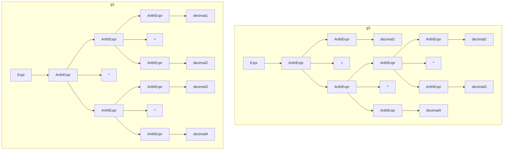

### 1.2二义性原因

- 首先若只根据实验要求给定的文法，对在表达式中出现具有确定的前后关系的运算符，应用哪个算符对应的产生式没有做出显式区分，此时无法区分应该应用哪个产生式，比如`boolean`和`:`

- 其次若只根据实验要求给定的文法，对在表达式中出现不具有确定的前后关系的运算符，应用哪个算符对应的产生式也没有做出显式区分，此时无法区分应该应用哪个产生式，比如`^`和`*`

- 比如树中的生成式`ArithExpr→ArithExpr + ArithExpr`和`ArithExpr→ArithExpr *ArithExpr`就存在这种问题，若表达式同时存在两者、不能确定使用哪个先进行归约，这就导致了二义性问题

### 1.3解析二义性

1. 首先考虑使用实验要求给定的算符优先分析法。如文法所示，显然**在任何句型中每个非终结符不会连续出现**，即每个非终结符之间一定间隔了至少一个终结符，此时实验给出的文法可以应用算符优先分析技术

2. 其次考虑算符优先分析法能否解决二义性问题。算符优先分析法要解决二义性问题，就必须保证文法是算符优先文法、即语法分析过程中不会出现有冲突的操作，这就对算符优先表中的每个表项有以下要求：
   - 允许只出现`<`、`>`、`=`其中一项，此时语法分析显然不会出现有冲突的操作
   - 允许同时出现`<`、`=`，此时语法分析进行的都是移进操作，出现可以解决的冲突操作
   - 不允许`>`与`<`、`=`同时出现，此时语法分析进行的是归约与移进，出现无法解决的移进-归约冲突操作

3. 最后需要考虑如果算符优先分析法不能解决二义性问题，需要引入实验要求给定的运算优先级（实际上，实验要求给定的文法显然不是算符优先文法，这部分在后面[构造算符优先表部分](#332-解决算符优先表冲突)进行详细解释，这里只讨论二义性相关问题）。此时算符优先表当中出现了无法解决的冲突，即`>`与`<`、`=`同时出现，这意味着表项中相关联的这两个算符在表达式出现的先后关系在文法中没有显式区分，若进行语法分析依旧无法解决二义性问题。此时需要引入实验要求给定的人工定义的运算优先级，并对所有冲突的表项[a,b]做以下操作：
   - 若运算优先级定义a>b，则表项为`>`
   - 若运算优先级定义a<b，则表项为`<`
   - 若运算优先级定义a=b（a就是b的情况也属于这类），则进行进一步讨论：
     - 若该级别运算符是左结合的，则表项为`>`
     - 若该级别运算符是右结合的，则表项为`<`
4. 经过上述操作，语法分析过程中的绝大部分二义性问题将得到解决，其余二义性一般是人工定义的运算优先级考虑不完备、或者语义分析的副作用等原因导致的，不做讨论。关于为何对表项进行这样的操作，也在后面[构造算符优先表部分](#332-解决算符优先表冲突)再给出详细解释

# 2.**设计并实现词法分析程序**

### 2.1提取词法规则

#### 2.1.1 **布尔类型的常量**

只包含两个常量`true`、`false`，需要注意的是输入表达式是大小写无关的，此时只需要把表达式所有字母都转换为小写再进行分析即可。可以给出两个常量的正则表达式：
   - $t\ r\ u\ e$
   - $f\ a\ l\ s\ e$

#### 2.1.2 **数值类型的常量**

仅支持十进制，可以是整数和浮点数常量，仅支持无符号的数值类型，符合以下正规定义式的描述：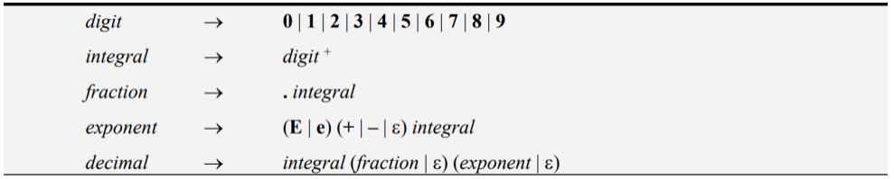

上述描述看似复杂，实际上只需要保留`digit`作为词法分析时的终结符、其具体值`[0-9]`由词法分析器赋予，然后将上述其余所有中间表达式代入最后一个表达式，即可得出这一个常量的正则表达式：

   - $digit^+ (.digit^+ |  \epsilon ) ((E | e)(+ | - |  \epsilon )digit^+ |  \epsilon )$​

#### 2.1.3 **函数终结符sin、cos**

分析方式与布尔类型的变量类似。可以直接给出两个终结符的正则表达式：

   - $s\ i\ n$
   - $c\ o\ s$

#### 2.1.4 **函数终结符max、min**

分析方式与布尔类型的变量类似，但是需要注意两者开头共用一个字母`m`，这意味着开始状态读取到字母`m`时会同时进入两者的词法分析DFA，这就需要两者共用一个词法分析DFA、即共用一个正则表达式。可以给出两个终结符的正则表达式：
   - $m\ (\ a\ x\ |\ i\ n\ )$​

#### 2.1.5 **关系运算符>、>=**

分析方式与函数终结符max、min类似，两者共用一个词法分析DFA、即共用一个正则表达式。可以给出两个运算符的正则表达式：
   - $>(\epsilon|=)$

#### 2.1.6 **关系运算符<、<=、<>**

分析方式与函数终结符max、min类似，三者共用一个词法分析DFA、即共用一个正则表达式。可以给出三个运算符的正则表达式：
   - $<(\epsilon|=|>)$​

#### 2.1.7 **数值运算符`-`、一元运算符`-`**

两者在表达式输入之初便是同一个字符，这就导致了单纯的词法分析DFA并不能直接区分两者区别，需要引入语法分析和语义分析来解决冲突。尽管实验要求也提到应该在构造算符优先关系表部分进行该冲突的解决，但是若不在词法分析时就将两者进行区分的话、语法分析也将难以进行。由于对我来说难度过高，难以只通过设计算符优先关系表就解决这一问题，故采用下面投机取巧方式，在词法分析就将两者标识为不同的终结符。它的实现是在词法分析当中，但是结合了语法分析内容。为了方便讨论，用`op-`标识数值运算符`-`，`unary-`标识一元运算符`-`：
   - 观察文法，`op-`对应产生式`ArithExpr→ArithExpr - ArithExpr`，此时`op-`左边出现非终结符`ArithExpr`。再观察`ArithExpr`对应的所有产生式，容易发现无论是什么句型对应的表达式，其最右边的终结符一定是布尔类型的常量、数值类型的常量、终结符`)`其中之一，这也就意味着表达式中`op-`左边出现的终结符**一定是布尔类型的常量、数值类型的常量、终结符`)`其中之一**
   - 观察文法，`unary-`对应产生式`ArithExpr→ -ArithExpr`，此时`unary-`一定由非终结符`ArithExpr`产生，`unary-`也一定在某个时刻归约为`ArithExpr`。再讨论表达式中`unary-`左边出现的终结符：
     - **不可能是布尔类型的常量或数值类型的常量**。因为两者只能归约成为非终结符`BoolExpr`或`ArithExpr`，此时这个句型存在连续出现的非终结符，这就违背了最初1.中提出的算符优先分析法可行性的前提了。具体理论分析需要结合语法分析，在[构造算符优先关系表部分](#341-一元取负运算符和二元减法运算符)详细分析
     - **不可能是终结符`)`**。观察终结符`)`对应所有产生式，它们都会归约为`BoolExpr`、`ArithExpr`、`UnaryFunc`、`VariablFunc`其中之一，此时这个句型存在连续出现的非终结符，这就违背了最初1.中提出的算符优先分析法可行性的前提了。具体理论分析需要结合语法分析，在[构造算符优先关系表部分](#341-一元取负运算符和二元减法运算符)详细分析
   - 由此可见，若在表达式中：`-`左边出现布尔类型的常量、数值类型的常量、终结符`)`其中之一，则这个`-`为`op-`，否则为`unary-`。容易看出上面的判断对于这个文法是完备的充分必要条件，且通过这个办法，词法分析器可以直接区分`op-`、`unary-`，可以采用与下述其余终结符+、&等类似的词法规则

#### 2.1.8 **其余终结符+、&等**

只包含自己本身一个字符。可以直接给出正则表达式：
   - $+$
   - $\&$
   - ...

### 2.2有限自动机

使用`automata`库可以简单地绘制DFA

#### 2.2.1 **布尔类型的常量**

- $t\ r\ u\ e$​

  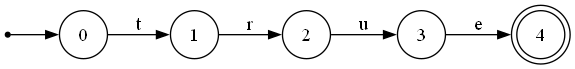

- $f\ a\ l\ s\ e$

  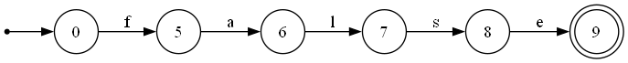

#### 2.2.2 **数值类型的常量**

   - $digit^+ (.digit^+ |  \epsilon ) ((E | e)(+ | - |  \epsilon )digit^+ |  \epsilon )$​

     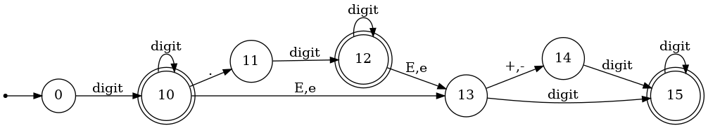

#### 2.2.3 **函数终结符sin、cos**

   - $s\ i\ n$​

     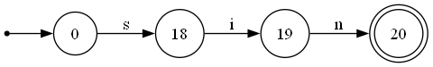

   - $c\ o\ s$​

     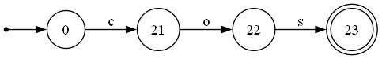

#### 2.2.4 **函数终结符max、min**

   - $m\ (\ a\ x\ |\ i\ n\ )$​

     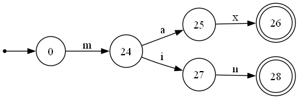

#### 2.2.5 **关系运算符>、>=**

   - $>(\epsilon|=)$​

     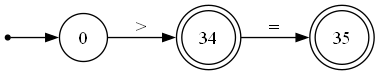

#### 2.2.6 **关系运算符<、<=、<>**

   - $<(\epsilon|=|>)$​

     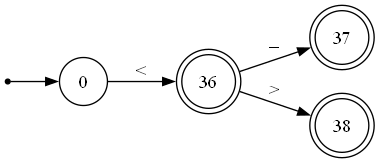

#### 2.2.7 **其余终结符+等**

   - $+$​

     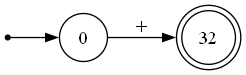

   - &

     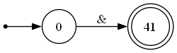

   - ...

#### 2.2.8 **完整词法分析DFA**

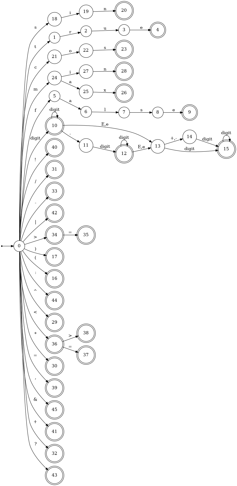

### 2.3单词分类

单词分类可以有很多依据和方式，但我个人理解是：

- 单词的分类应该在不影响算法和程序功能的前提下，尽可能简化操作、增强代码的可读性和扩展性。
- 初步考虑多粒度的索引分类方式，单词类`Token`设置两个成员变量`value`、`type`，前者为单词本身的值，后者为单词的分类。
- 前者`value`由词法分析器给定，这里主要讨论后者`type`的划分

#### 2.3.1初步根据语法分类

1. 出于上述理解，对单词的分类应该结合算符优先语法分析过程来进行。根据文法中的每个产生式可以给出粗糙的分类，比如`>`、`>=`、`<`、`<=`、`<>`这几个关系运算符在产生式中出现的形式一致，而且它们在人工定义的运算优先级也一致，那么显然它们在语法分析过程当中的行为也应该一致，只是语法制导翻译给它们赋予的操作不同，可以考虑将它们统一分类为关系运算符`relation`

2. 但是上述方式过于粗糙。进一步地，应该根据算符优先表的操作来进行形式化的分类，只要两个算符在算符优先表当中的操作行为一致，那么显然它们可以分为一类。若两个终结符a1、a2可以分为一类，它们在表中应该满足：

   - 对所有终结符b，表项`[a1,b]`=`[a2,b]`
   - 对所有终结符c，表项`[c,a1]`=`[c,a2]`

3. 根据上述规则，结合算符优先表定义的语法分析方式进行分类合并，可以得到如下分类，详细分类过程可以参考[构造算符优先关系表部分](#3.3.1-简化算符优先表)：

   | `type`   | `value`               |
   | -------- | --------------------- |
   | boolean  | true, false           |
   | decimal  | decimal               |
   | (        | (                     |
   | )        | )                     |
   | function | sin, cos, max, min    |
   | unary-   | unary-                |
   | ^        | ^                     |
   | op * /   | \*, /                 |
   | op + -   | +, op-                |
   | relation | \>,  >=, <, <=, =, <> |
   | unary!   | !                     |
   | &        | &                     |
   | \|       | \|                    |
   | ?        | ?                     |
   | :        | :                     |
   | ,        | ,                     |
   | $        | $                     |

#### 2.3.2其次根据语义分类

1. 上述初步分析已经可以保证所有单词词素在语法分析的操作具有一致性。但是显然这样的分类还不够完备，比如对于`&`、`|`这样的算符在语义上类似、即都是对两侧的布尔表达式进行布尔运算，但是它们却被单独分为一类，这显然是不合理的，因为它们本就可以通过细粒度的`value`进行单独索引，就会浪费粗粒度的`type`索引，故考虑将它们合并为一类`boolean_operator`。

2. 通过上述分析，考虑进一步根据语义进行分类，即在语法执导翻译中行为类似的可以分为一类，好处很多：

   - 方便管理，具有较高的可读性和扩展性
   - 方便进行异常处理，在语法制导翻译时可以对操作数、运算符的类型进行判断，可以简单地判断是否抛出`TypeMismatchedException`等异常

3. 根据上述分析，结合语法制导翻译进行分类合并，可以得到如下分类，在初始化DFA时就可以在这些单词的接收状态将其分类到对应的`type`。分类的具体使用过程可以参考[设计并实现语法分析和语义处理程序部分](#4.2.2-语义计算)：

   | `type`           | `value`               |
   | ---------------- | --------------------- |
   | boolean          | true, false           |
   | decimal          | decimal               |
   | parenthesis      | (, )                  |
   | function         | sin, cos, max, min    |
   | decimal_operator | ^, \*, /, +, op-      |
   | relation         | \>,  >=, <, <=, =, <> |
   | unary            | !, unary-             |
   | boolean_operator | &, \|                 |
   | trinary          | ?, :                  |
   | comma            | ,                     |
   | dollar           | $                     |

### 2.4 识别预定义函数名和布尔常量

#### 2.4.1 词法分析时

根据上面给出的词法分析DFA过程，可以简单地通过状态转换区分两类单词。当DFA接收一个完整单词，就创建对应`Token`实例加入列表，并赋予其对应的`type`和`value`

#### 2.4.2 语法、语义分析时

根据上面给出单词分类方式，可以很简单的区分预定义函数名和布尔常量，只需要调用`Token`类提供的方法`getType`、`getValue`即可读取它们的成员变量：

- 预定义函数名：
  - `type`:function
  - `value`:sin, cos, max, min
- 布尔常量：
  - `type`:boolean
  - `value`:true, false

### 2.5 处理科学记数法

#### 2.5.1 词法分析时

根据上面给出的词法分析DFA过程，可以简单地通过状态转换处理科学计数法的十进制数单词。

- 当DFA接收一个完整单词，就创建对应`Token`实例加入列表，并赋予其对应的`type`和`value`，

- 同时还提供`decimalValue`成员变量给十进制数单词、`booleanValue`成员变量给布尔单词，这些成员变量分别只是将`String`类型的`value`转化为其单词对应类型的值，方便后续语法分析、语义分析调用

- 使用java标准库提供的`parseDouble`可以直接将字符串转化为`double`类型的十进制数值

- 特别地，当一个单词以`.`开头，显然这是一个错误的单词，但是可以判断这是一个错误的十进制数类型单词

  ```java
  if (dfa.isStart()) {
      if (Character.isLetter(cur))
          startWithLetter = true;
      else if (Character.isDigit(cur) || cur == '.')
          startWithDigit = true;
  }
  ```

  

#### 2.5.2 语法、语义分析时

根据上面给出单词分类方式，可以很简单的区分预定义函数名和布尔常量，只需要调用`Token`类提供的方法`getType`、`getValue`即可读取它们的成员变量，同时还提供`getDecimal`用于读取十进制值成员变量：

- 科学计数法十进制数：
  - `type`:decimal
  - `value`:string(decimal)
  - `decimalValue`:`parseDouble`(value)

### 2.6 处理字符串的边界

#### 2.6.1 处理表达式边界

不需要特别处理表达式字符串边界，只需要在遍历扫描字符串时判断当前扫描下标是否小于字符串长度即可，可以使用java库提供的`length`

#### 2.6.2 处理单词边界

1. `Scanner`不断遍历扫描表达式字符串，每次扫描提供一个字符给DFA，并暂存已有字符串`curToken`

   ```java
   char cur = expression.charAt(index);
   char lookahead = (index + 1 < expressionLength) ? expression.charAt(index + 1) : '$';
   if (cur == ' ') {
       index++;
       continue;
   }
   curToken += cur;
   ```

   

2. DFA根据提供的字符进行状态转移，如果当前状态有字符对应的出度，则直接进行状态转移；如果当前状态没有字符对应的出度，则则返回`“error”`标识给`Scanner`并令其抛出错误，具体错误抛出方式在[异常处理部分](#4.3.1-词法分析异常处理)给出。

   ```java
   String tokenType = dfa.nextState(cur, lookahead);
   if (tokenType.equals("scanning")) {
       index++;
       continue;
   
   } else if (tokenType.equals("error")) {
   
       if (startWithLetter)
           throw new IllegalIdentifierException();
       else if (startWithDigit)
           throw new IllegalDecimalException();
       else
           throw new IllegalSymbolException();
   
   }
   ```

   

3. 若转移后状态不是结束节点，则返回`“scanning”`标识给`Scanner`并令其继续扫描下一个字符；若转移后状态是结束节点，则`Scanner`记录已有字符串`curToken`作为新的单词的`value`，同时创建对应`Token`实例加入单词列表`tokens`；然后清空已有字符串`curToken`、重置DFA等，准备扫描下一个单词，此时已经完成处理上一个单词的边界

   ```java
   else {
   
       tokens.add(dfa.getToken(curToken, isUnary(curToken)));
       dfa.reset();
       curToken = "";
       startWithLetter = false;
       startWithDigit = false;
   
   }
   index++;
   ```

   ```java
   /**
   * 返回当前状态的一个新token。
   * @param _value token的值，例如'sin'
   * @param isUnaryFlag 是否为一元操作符
   * @return 一个新的Token
   */
   public Token getToken(String _value, boolean isUnaryFlag) {
       if (isUnaryFlag)
           return new Symbol("--");
       return nodes[state].getToken(_value);
   }
   ```

   

# 3.**构造算符优先关系表**

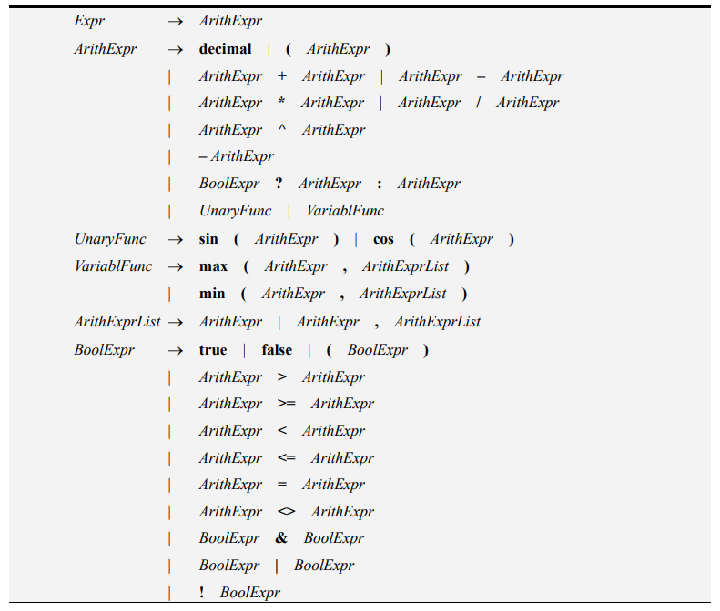

### 3.1 FIRSTVT和LASTVT

进行算符优先分析法，首先要构建所有非终结符的FIRSTVT和LASTVT集合。

#### 3.1.1 FIRSTVT

- 若产生式满足 $P \rarr a... $ 或 $P \rarr Ra.... $ ​则将a加入FIRSTVT(P)

- 若产生式满足 $P \rarr R... $ ​，则将FIRSTVT(R)加入FIRSTVT(P)

- 根据上述规则，可以得到文法中所有非终结符的FIRSTVT

  | FIRSTVT | true|false    | decimal | (    | )    |sin|cos|max|min    | unary-    | ^    | \*| /    | + |op-   | >    | >=    | <    | <=    | \<>    | =    | !    | &    | \|   | ?    | :    | ,    | $    |
  | -------- | ---- | ---- | ---- | ---- | ---- | ---- | ---- | ---- | ---- | ---- | ---- | ---- | ---- | ---- | ---- | ---- | ---- | ---- | ---- | ---- | ---- | ---- | ---- | ---- | ---- | ---- | ---- | ---- |
|Expr||||||||||||||||||||||||||||$|
|ArithExpr| true|false    | decimal | (    |     |sin|cos|max|min    | unary-    | ^    | \*| /    | + |op-   | >    | >=    | <    | <=    | \<>    | =    | !    | &    | \|   | ?    |     |     |     |
|UnaryFunc||||||sin|cos||||||||||||||||||||||
|VariablFunc||||||||max|min||||||||||||||||||||
|ArithExprList| true|false    | decimal | (    |     |sin|cos|max|min    | unary-    | ^    | \*| /    | + |op-   | >    | >=    | <    | <=    | \<>    | =    | !    | &    | \|   | ?    |     | , |     |
|BoolExpr| true|false    | decimal | (    |     |sin|cos|max|min    | unary-    | ^    | \*| /    | + |op-   | >    | >=    | <    | <=    | \<>    | =    | !    | &    | \|   | ?    |     |     |     |

#### 3.1.2 LASTVT

- 若产生式满足 $P \rarr ...a $  或 $P \rarr ...Ra $  ​则将a加入LATSVT(P)

- 若产生式满足 $P \rarr ...R $ ​，则将LASTVT(R)加入LASTVT(P)

- 根据上述规则，可以得到文法中所有非终结符的LASTVT

  | LASTVT        | true | false | decimal | (    | )    | sin  | cos  | max  | min  | unary- | ^    | \*   | /    | +    | op-  | >    | >=   | <    | <=   | \<>  | =    | !    | &    | \|   | ?    | :    | ,    | $    |
  | ------------- | ---- | ----- | ------- | ---- | ---- | ---- | ---- | ---- | ---- | ------ | ---- | ---- | ---- | ---- | ---- | ---- | ---- | ---- | ---- | ---- | ---- | ---- | ---- | ---- | ---- | ---- | ---- | ---- |
  | Expr          |      |       |         |      |      |      |      |      |      |        |      |      |      |      |      |      |      |      |      |      |      |      |      |      |      |      |      | $    |
  | ArithExpr     |      |       | decimal |      | )    |      |      |      |      | unary- | ^    | \*   | /    | +    | op-  |      |      |      |      |      |      |      |      |      |      | :    |      |      |
  | UnaryFunc     |      |       |         |      | )    |      |      |      |      |        |      |      |      |      |      |      |      |      |      |      |      |      |      |      |      |      |      |      |
  | VariablFunc   |      |       |         |      | )    |      |      |      |      |        |      |      |      |      |      |      |      |      |      |      |      |      |      |      |      |      |      |      |
  | ArithExprList |      |       | decimal |      | )    |      |      |      |      | unary- | ^    | \*   | /    | +    | op-  |      |      |      |      |      |      |      |      |      |      | :    | ,    |      |
  | BoolExpr      | true | false | decimal |      | )    |      |      |      |      | unary- | ^    | \*   | /    | +    | op-  | >    | >=   | <    | <=   | \<>  | =    | !    | &    | \|   |      | :    |      |      |

### 3.2 构造算符优先表

- 若存在产生式满足 $P \rarr ...aQb... $ 或 $P \rarr ...ab... $ ​，则`[a,b]`填入`=`

- 若存在产生式满足 $ R \rarr ...aP... $ ，则对所有 $ b \in FIRSTVT(P) $ ​，`[a,b]`填入`<`

- 若存在产生式满足 $ R \rarr ...Pb... $ ，则对所有 $ a \in LASTVT(P) $ ​，`[a,b]`填入`>`

- 根据上述规则，可以得到算符优先表

  |         | true | false | decimal | (    | )    | sin  | cos  | max  | min  | unary- | ^    | *    | /    | +    | op-  | >    | >=   | <    | <=   | <>   | =    | !    | &    | \|   | ?    | :    | ,    | $    |
  | ------- | ---- | ----- | ------- | ---- | ---- | ---- | ---- | ---- | ---- | ------ | ---- | ---- | ---- | ---- | ---- | ---- | ---- | ---- | ---- | ---- | ---- | ---- | ---- | ---- | ---- | ---- | ---- | ---- |
  | true    |      |       |         |      | >    |      |      |      |      |        |      |      |      |      |      |      |      |      |      |      |      |      | >    | >    | >    |      |      |      |
  | false   |      |       |         |      | >    |      |      |      |      |        |      |      |      |      |      |      |      |      |      |      |      |      | >    | >    | >    |      |      |      |
  | decimal |      |       |         |      | >    |      |      |      |      |        | >    | >    | >    | >    | >    | >    | >    | >    | >    | >    | >    |      | >    | >    | >    | >    | >    | >    |
  | (       | <    | <     | <       | <    | =    | <    | <    | <    | <    | <      | <    | <    | <    | <    | <    | <    | <    | <    | <    | <    | <    | <    | <    | <    | <    |      | =    |      |
  | )       |      |       |         |      | >    |      |      |      |      |        | >    | >    | >    | >    | >    | >    | >    | >    | >    | >    | >    |      | >    | >    | >    | >    | >    | >    |
  | sin     |      |       |         | =    |      |      |      |      |      |        |      |      |      |      |      |      |      |      |      |      |      |      |      |      |      |      |      |      |
  | cos     |      |       |         | =    |      |      |      |      |      |        |      |      |      |      |      |      |      |      |      |      |      |      |      |      |      |      |      |      |
  | max     |      |       |         | =    |      |      |      |      |      |        |      |      |      |      |      |      |      |      |      |      |      |      |      |      |      |      |      |      |
  | min     |      |       |         | =    |      |      |      |      |      |        |      |      |      |      |      |      |      |      |      |      |      |      |      |      |      |      |      |      |
  | unary-  | <    | <     | <       | <    | >    | <    | <    | <    | <    | <      | <, > | <, > | <, > | <, > | <, > | <, > | <, > | <, > | <, > | <, > | <, > | <    | <, > | <, > | <, > | >    | >    | >    |
  | ^       | <    | <     | <       | <    | >    | <    | <    | <    | <    | <      | <, > | <, > | <, > | <, > | <, > | <, > | <, > | <, > | <, > | <, > | <, > | <    | <, > | <, > | <, > | >    | >    | >    |
  | *       | <    | <     | <       | <    | >    | <    | <    | <    | <    | <      | <, > | <, > | <, > | <, > | <, > | <, > | <, > | <, > | <, > | <, > | <, > | <    | <, > | <, > | <, > | >    | >    | >    |
  | /       | <    | <     | <       | <    | >    | <    | <    | <    | <    | <      | <, > | <, > | <, > | <, > | <, > | <, > | <, > | <, > | <, > | <, > | <, > | <    | <, > | <, > | <, > | >    | >    | >    |
  | +       | <    | <     | <       | <    | >    | <    | <    | <    | <    | <      | <, > | <, > | <, > | <, > | <, > | <, > | <, > | <, > | <, > | <, > | <, > | <    | <, > | <, > | <, > | >    | >    | >    |
  | op-     | <    | <     | <       | <    | >    | <    | <    | <    | <    | <      | <, > | <, > | <, > | <, > | <, > | <, > | <, > | <, > | <, > | <, > | <, > | <    | <, > | <, > | <, > | >    | >    | >    |
  | >       | <    | <     | <       | <    | >    | <    | <    | <    | <    | <      | <    | <    | <    | <    | <    | <    | <    | <    | <    | <    | <    | <    | <, > | <, > | <, > |      |      |      |
  | >=      | <    | <     | <       | <    | >    | <    | <    | <    | <    | <      | <    | <    | <    | <    | <    | <    | <    | <    | <    | <    | <    | <    | <, > | <, > | <, > |      |      |      |
  | <       | <    | <     | <       | <    | >    | <    | <    | <    | <    | <      | <    | <    | <    | <    | <    | <    | <    | <    | <    | <    | <    | <    | <, > | <, > | <, > |      |      |      |
  | <=      | <    | <     | <       | <    | >    | <    | <    | <    | <    | <      | <    | <    | <    | <    | <    | <    | <    | <    | <    | <    | <    | <    | <, > | <, > | <, > |      |      |      |
  | <>      | <    | <     | <       | <    | >    | <    | <    | <    | <    | <      | <    | <    | <    | <    | <    | <    | <    | <    | <    | <    | <    | <    | <, > | <, > | <, > |      |      |      |
  | =       | <    | <     | <       | <    | >    | <    | <    | <    | <    | <      | <    | <    | <    | <    | <    | <    | <    | <    | <    | <    | <    | <    | <, > | <, > | <, > |      |      |      |
  | !       | <    | <     | <       | <    | >    | <    | <    | <    | <    | <      | <    | <    | <    | <    | <    | <    | <    | <    | <    | <    | <    | <    | <, > | <, > | <, > |      |      |      |
  | &       | <    | <     | <       | <    | >    | <    | <    | <    | <    | <      | <    | <    | <    | <    | <    | <    | <    | <    | <    | <    | <    | <    | <, > | <, > | <, > |      |      |      |
  | \|      | <    | <     | <       | <    | >    | <    | <    | <    | <    | <      | <    | <    | <    | <    | <    | <    | <    | <    | <    | <    | <    | <    | <, > | <, > | <, > |      |      |      |
  | ?       | <    | <     | <       | <    |      | <    | <    | <    | <    | <      | <    | <    | <    | <    | <    | <    | <    | <    | <    | <    | <    | <    | <    | <    | <    | =    |      |      |
  | :       | <    | <     | <       | <    | >    | <    | <    | <    | <    | <      | <, > | <, > | <, > | <, > | <, > | <, > | <, > | <, > | <, > | <, > | <, > | <    | <, > | <, > | <, > | >    | >    |      |
  | ,       | <    | <     | <       | <    | =    | <    | <    | <    | <    | <      | <    | <    | <    | <    | <    | <    | <    | <    | <    | <    | <    | <    | <    | <    | <    |      | <    |      |
  | $       | <    | <     | <       | <    |      | <    | <    | <    | <    | <      | <    | <    | <    | <    | <    | <    | <    | <    | <    | <    | <    | <    | <    | <    | <    |      |      | =    |

### 3.3 处理算符优先表

- 观察此时得到的算符优先表，尽管能够完备地反映算符之间的出现先后关系，但是可以看到表项很多、过于复杂，可以考虑之前在[单词分类](#2.3单词分类)提到的根据语法分析操作行为进行分类的简化方式

- 观察此时得到的算符优先表，有很多表项发生了冲突，即`>`与`<`、`=`同时出现，此时语法分析进行的是归约与移进，出现无法解决的移进-归约冲突操作，需要引入实验要求给定的运算优先级

  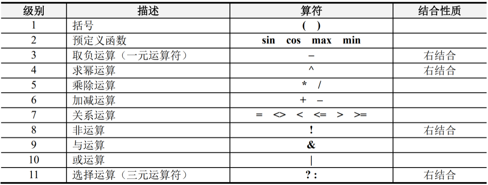

#### 3.3.1 简化算符优先表

1. 比如显然`>`、`>=`、`<`、`<=`、`<>`这几个关系运算符在产生式中出现的形式一致，而且它们在人工定义的运算优先级也一致，那么显然它们在语法分析过程当中的行为也应该一致，只是语法制导翻译给它们赋予的操作不同，可以考虑将它们统一分类为关系运算符`relation`。根据这个思想，可以给出形式化的简化方式

2. 根据算符优先表的操作来进行形式化的分类，只要两个算符在算符优先表当中的操作行为一致，那么显然它们可以分为一类。若两个终结符a1、a2可以分为一类，它们在表中应该满足：

   - 对所有终结符b，表项`[a1,b]`=`[a2,b]`
   - 对所有终结符c，表项`[c,a1]`=`[c,a2]`

3. 为了方便解决移进-归约冲突操作，将会引入实验要求给定的运算优先级。但是如果把属于不同运算优先级的终结符也合并，那么此时冲突还是无法解决，这在后面[解决算符优先表冲突部分](#3.3.2-解决算符优先表冲突)详细讨论。这里先给出进一步规定，满足下面规则的终结符a1、a2可以合并：

   - 对所有终结符b，表项`[a1,b]`=`[a2,b]`
   - 对所有终结符c，表项`[c,a1]`=`[c,a2]`
   - 在人工定义的运算优先级中，a1、a2属于同一运算优先级

4. 根据上述规则，结合算符优先表进行分类合并，可以得到：

   - `true`,   `false`的行为完全一致，可以分为一类
     - `true`,  `false`在语法分析上并无任何区别，它们都属于布尔类型常量，两者的赋值在语法制导翻译时由词法分析器赋予，故属于同一运算优先级，进行合并
   - `sin`,  `cos`,  `max`,  `min`的行为完全一致，可以分为一类
     - `sin`,  `cos`,  `max`,  `min`属于同一运算优先级，进行合并
   - `^`,  `*`,  `/`,  `+`,  `op-`的行为完全一致，可以分为一类
     - `^`比其他终结符运算优先级都高，不与其他终结符合并
     - `*`,  `/`属于同一运算优先级，进行合并
     - `+`,  `op-`属于同一运算优先级，进行合并
   - `&`,  `|`的行为完全一致，可以分为一类
     - `&`,  `|`不属于同一运算优先级，不进行合并

5. 根据上述规则，可以得到简化的算符优先表

   |      | b    | d    | (    | )    | f    | u-   | ^    | * /  | + -  | r    | !    | &    | \|   | ?    | :    | ,    | $    |
   | ---- | ---- | ---- | ---- | ---- | ---- | ---- | ---- | ---- | ---- | ---- | ---- | ---- | ---- | ---- | ---- | ---- | ---- |
   | b    |      |      |      | >    |      |      |      |      |      |      |      | >    | >    | >    |      |      |      |
   | d    |      |      |      | >    |      |      | >    | >    | >    | >    |      | >    | >    | >    | >    | >    | >    |
   | (    | <    | <    | <    | =    | <    | <    | <    | <    | <    | <    | <    | <    | <    | <    |      | =    |      |
   | )    |      |      |      | >    |      |      | >    | >    | >    | >    |      | >    | >    | >    | >    | >    | >    |
   | f    |      |      | =    |      |      |      |      |      |      |      |      |      |      |      |      |      |      |
   | u-   | <    | <    | <    | >    | <    | <    | <, > | <, > | <, > | <, > | <    | <, > | <, > | <, > | >    | >    | >    |
   | ^    | <    | <    | <    | >    | <    | <    | <, > | <, > | <, > | <, > | <    | <, > | <, > | <, > | >    | >    | >    |
   | * /  | <    | <    | <    | >    | <    | <    | <, > | <, > | <, > | <, > | <    | <, > | <, > | <, > | >    | >    | >    |
   | + -  | <    | <    | <    | >    | <    | <    | <, > | <, > | <, > | <, > | <    | <, > | <, > | <, > | >    | >    | >    |
   | r    | <    | <    | <    | >    | <    | <    | <    | <    | <    | <    | <    | <, > | <, > | <, > |      |      |      |
   | !    | <    | <    | <    | >    | <    | <    | <    | <    | <    | <    | <    | <, > | <, > | <, > |      |      |      |
   | &    | <    | <    | <    | >    | <    | <    | <    | <    | <    | <    | <    | <, > | <, > | <, > |      |      |      |
   | \|   | <    | <    | <    | >    | <    | <    | <    | <    | <    | <    | <    | <, > | <, > | <, > |      |      |      |
   | ?    | <    | <    | <    |      | <    | <    | <    | <    | <    | <    | <    | <    | <    | <    | =    |      |      |
   | :    | <    | <    | <    | >    | <    | <    | <, > | <, > | <, > | <, > | <    | <, > | <, > | <, > | >    | >    |      |
   | ,    | <    | <    | <    | =    | <    | <    | <    | <    | <    | <    | <    | <    | <    | <    |      | <    |      |
   | $    | <    | <    | <    |      | <    | <    | <    | <    | <    | <    | <    | <    | <    | <    |      |      | =    |

#### 3.3.2 解决算符优先表冲突

1. 此时算符优先表当中有无法解决的冲突，即`>`与`<`、`=`同时出现，这意味着表项中相关联的这两个算符在表达式出现的先后关系在文法中没有显式区分，若进行语法分析依旧无法解决二义性问题。

2. 此时需要引入实验要求给定的人工定义的运算优先级，并对所有冲突的表项`[a,b]`做以下操作：

   - 若运算优先级定义a>b，这意味着当栈顶为a，输入串头为b，此时希望让a相关的表达式先归约并产生结果，再让b入栈以进行下一步处理，故此时表项为`>`。比如`[^,r]`为`>`
   - 若运算优先级定义a<b，这意味着当栈顶为a，输入串头为b，此时希望b先入栈、先于a归约并产生结果，再让a相关的表达式归约并产生结果，故此时表项为`<`。比如`[:,^]`为`<`
   - 若运算优先级定义a=b（a就是b的情况也属于这类），则进行进一步讨论：
     - 若该级别运算符是左结合的，这意味着当栈顶为a，输入串头为b，此时希望让表达式左边的a相关的表达式先归约并产生结果，再让表达式右边的b入栈以进行下一步处理，故此时表项为`>`。比如`[&,&]`为`>`
     - 若该级别运算符是右结合的，这意味着当栈顶为a，输入串头为b，此时希望表达式右边的b先入栈、先于表达式左边的a归约并产生结果，再让表达式左边的a相关的表达式归约并产生结果，故此时表项为`<`。比如`[^,^]`为`<`

3. 根据上述规则，可以发现上面[简化算符优先表](#3.3.1-简化算符优先表)的操作是合理的。如果让不同运算优先级的算符进行合并，那么上述规则也可能出现无法解决的冲突，这也是在不违背人工定义的运算优先级的前提下、能进行的最大程度的简化

4. 根据上述规则，可以得到解决冲突的算符优先表

   |      | b    | d    | (    | )    | f    | u-   | ^    | * /  | + -  | r    | !    | &    | \|   | ?    | :    | ,    | $    |
   | ---- | ---- | ---- | ---- | ---- | ---- | ---- | ---- | ---- | ---- | ---- | ---- | ---- | ---- | ---- | ---- | ---- | ---- |
   | b    |      |      |      | >    |      |      |      |      |      |      |      | >    | >    | >    |      |      |      |
   | d    |      |      |      | >    |      |      | >    | >    | >    | >    |      | >    | >    | >    | >    | >    | >    |
   | (    | <    | <    | <    | =    | <    | <    | <    | <    | <    | <    | <    | <    | <    | <    |      | =    |      |
   | )    |      |      |      | >    |      |      | >    | >    | >    | >    |      | >    | >    | >    | >    | >    | >    |
   | f    |      |      | =    |      |      |      |      |      |      |      |      |      |      |      |      |      |      |
   | u-   | <    | <    | <    | >    | <    | <    | >    | >    | >    | >    | <    | >    | >    | >    | >    | >    | >    |
   | ^    | <    | <    | <    | >    | <    | <    | <    | >    | >    | >    | <    | >    | >    | >    | >    | >    | >    |
   | * /  | <    | <    | <    | >    | <    | <    | <    | >    | >    | >    | <    | >    | >    | >    | >    | >    | >    |
   | + -  | <    | <    | <    | >    | <    | <    | <    | <    | >    | >    | <    | >    | >    | >    | >    | >    | >    |
   | r    | <    | <    | <    | >    | <    | <    | <    | <    | <    | <    | <    | >    | >    | >    |      |      |      |
   | !    | <    | <    | <    | >    | <    | <    | <    | <    | <    | <    | <    | >    | >    | >    |      |      |      |
   | &    | <    | <    | <    | >    | <    | <    | <    | <    | <    | <    | <    | >    | >    | >    |      |      |      |
   | \|   | <    | <    | <    | >    | <    | <    | <    | <    | <    | <    | <    | <    | >    | >    |      |      |      |
   | ?    | <    | <    | <    |      | <    | <    | <    | <    | <    | <    | <    | <    | <    | <    | =    |      |      |
   | :    | <    | <    | <    | >    | <    | <    | <    | <    | <    | <    | <    | <    | <    | <    | >    | >    | >    |
   | ,    | <    | <    | <    | =    | <    | <    | <    | <    | <    | <    | <    | <    | <    | <    |      | <    |      |
   | $    | <    | <    | <    |      | <    | <    | <    | <    | <    | <    | <    | <    | <    | <    |      |      | =    |

### 3.4 处理敏感关系

#### 3.4.1 一元取负运算符和二元减法运算符

这里继续[2.1.7](#2.1.7-**数值运算符`-`、一元运算符`-`**)关于两者的讨论，结合上面已经给出的算符优先表，可以结合语法分析过程解释为什么会有上面给出的结论。为了方便讨论，用`op-`标识数值运算符`-`，`unary-`标识一元运算符`-`：

- 前面已经提到，观察文法，`op-`对应产生式`ArithExpr→ArithExpr - ArithExpr`，此时`op-`左边出现非终结符`ArithExpr`。再观察`ArithExpr`对应的所有产生式，容易发现无论是什么句型对应的表达式，其最右边的终结符一定是布尔类型的常量、数值类型的常量、终结符`)`其中之一，这也就意味着表达式中`op-`左边出现的终结符**一定是布尔类型的常量、数值类型的常量、终结符`)`其中之一**

- 表达式中`unary-`左边出现的终结符：

  - **不可能是布尔类型的常量或数值类型的常量**。考虑一个表达式 $ ...decimal - ... $ ，在语法分析的某一时刻，必然出现如下的栈和输入串的状态。此时对照算符优先表，`[decimal,uanry-]`为空表项，这意味着出现了未定义的操作、表明这个表达式不可能由给定文法产生，而`[boolean,uanry-]`也为空表项。这就是说一个合法的表达式，不可能有`unary-`左边出现的终结符是布尔类型的常量或数值类型的常量的情况。

    | stack | buffer |
    | ---- | ---- |
    | $ ...decimal $ | $ -... $ |

  - **不可能是终结符`)`**。考虑一个表达式 $ ...) - ... $ ，在语法分析的某一时刻，必然出现如下的栈和输入串的状态。此时对照算符优先表，`[),uanry-]`为空表项，这意味着出现了未定义的操作、表明这个表达式不可能由给定文法产生。这就是说一个合法的表达式，不可能有`unary-`左边出现的终结符是`)`的情况。
  
    | stack | buffer |
    | ----- | ------ |
    | $ ...) $ | $ -... $ |

- 由此可见，若在表达式中：`-`左边出现布尔类型的常量、数值类型的常量、终结符`)`其中之一，则这个`-`为`op-`、否则为`unary-`。容易看出上面的判断对于这个文法是完备的充分必要条件，且通过这个办法，词法分析器可以直接区分`op-`、`unary-`。

- 比如表达式 $ 2−3 *−4 $ ​：

  - 第一个`-`左边出现的是数值常量，它是`op-`；
  - 第二个`-`左边出现的不是布尔类型的常量、数值类型的常量、终结符`)`其中之一，它是`unary-`

  ```java
  /**
   检查是否为一元负号。
  * @param cur 当前token字符串。
  * @return 是否为一元负号。
  */
  private boolean isUnary(String cur) {
      if (cur.equals("-")) {
          int tokenCount = tokens.size();
          if (tokenCount > 0) {
              Token last = tokens.get(tokenCount - 1);
              if (last.getType().equals("decimal") 
                  || last.getValue().equals(")")
                  || last.getType().equals("boolean"))
                  return false;
              else
                  return true;
          } else
              return true;
      }
      return false;
  }
  ```

  

- 代码中给出的处理方法是词法分析器使用`u-`作为`unary-`的`value`成员变量、`-`作为`op-`的`value`成员变量，这样可以在最细粒度将两者区分开来。

  ```java
  /**
  * 返回当前状态的一个新token。
  * @param _value token的值，例如'sin'
  * @param isUnaryFlag 是否为一元操作符
  * @return 一个新的Token
  */
  public Token getToken(String _value, boolean isUnaryFlag) {
      if (isUnaryFlag)
          return new Symbol("u-");
      return nodes[state].getToken(_value);
  }
  ```

  

#### 3.4.2 三元运算符与其他运算符

- 本次实验在语法分析和算符优先表构造中，并没有对三元运算符与其他运算符做出特别区别处理。实际上，三元运算符`?`和`:`在使用算符优先表进行语法分析时与其他运算符并无明显区别，只需要按照算符优先表上定义的行为进行语法分析即可。而且三元运算符`?`和`:`两者的语法分析操作行为也并不完全相同，在算符优先表上还需要作为两个独立的分类。
- 在语义分析和语法制导翻译时三元运算符与其他运算符才做出区别，在[设计并实现语法分析和语义处理程序部分](#4.2.2-语义计算)再做讨论
- 在异常处理上三元运算符与其他运算符也有许多不同，这在算符优先表的空表项和语法分析异常处理时都有所体现，也在[设计并实现语法分析和语义处理程序部分](#4.3.2-语法分析异常处理)再做讨论

#### 3.4.3 预定义函数与其他运算符

- 本次实验在语法分析和算符优先表构造中，并没有对预定义函数与其他运算符做出特别区别处理。实际上，预定义函数`sin`,` cos`, `max`, `min`在使用算符优先表进行语法分析时与其他运算符并无明显区别，只需要按照算符优先表上定义的行为进行语法分析即可
- 在语义分析和语法制导翻译时预定义函数与其他运算符才做出区别，在[设计并实现语法分析和语义处理程序部分](#4.2.2-语义计算)再做讨论
- 在异常处理上预定义函数与其他运算符也有许多不同，这在算符优先表的空表项和语法分析异常处理时都有所体现，也在[设计并实现语法分析和语义处理程序部分](#4.3.2-语法分析异常处理)再做讨论

# 4.**设计并实现语法分析和语义处理程序**

### 4.1 语法分析

#### 4.1.1 构造操作表

1. 上面已经给出了算符优先表，只需要进行部分改造，就可以得到操作表。后续语法分析器每次动作都会参照栈顶第一个终结符`TopMostTerminal`、输入串头终结符`lookahead`，即操作表中[`TopMostTerminal`,`lookahead`]对应的操作数

2. 将`<`和`=`对应到操作数0，标识语法分析器此时应该进行移入操作

3. 将`>`对应到操作数1，标识语法分析器此时应该进行归约操作

4. 将部分其他空表项对应到不同的异常操作数，标识语法分析器此时应该进行抛出对应异常操作。这些异常的操作数是实验要求中给出的序号的负数，在后面[语法分析异常处理部分](#4.3.2-语法分析异常处理)给出填入操作数的详细解释

5. 将其他部分空表项对应到归约操作。这是很危险的行为、但是也是有好处的，在后面[其他空表项异常部分](#其他空表项异常)给出填入归约操作的详细解释

   ```java
   /**
   * 初始化操作符优先级表。
   */
   static {
       table = new int[][]{
           /* b    d    (    )    f    -    ^    *    +    r    !    &    |    ?    :    ,    $  */
           { -7,  -7,  -7,   1,  -7,  -7, -16, -16, -16, -16,  -7,   1,   1,   1,   1,   1,   1 }, // b 
           { -7,  -7,  -7,   1,  -7,  -7,   1,   1,   1,   1,  -7,   1,   1,   1,   1,   1,   1 }, // d 
           {  0,   0,   0,   0,   0,   0,   0,   0,   0,   0,   0,   0,   0,   0, -12,   0, -10 }, // ( 
           { -7,  -7,  -7,   1,  -7,  -7,   1,   1,   1,   1,  -7,   1,   1,   1,   1,   1,   1 }, // ) 
           {-11, -11,   0,  -9,  -9,  -9,  -9,  -9,  -9,  -9,  -9,  -9,  -9,  -9,  -9,  -9,  -9 }, // f 
           {  0,   0,   0,   1,   0,   0,   1,   1,   1,   1,   0,   1,   1,   1,   1,   1,   1 }, //u- 
           {  0,   0,   0,   1,   0,   0,   0,   1,   1,   1,   0,   1,   1,   1,   1,   1,   1 }, // ^ 
           {  0,   0,   0,   1,   0,   0,   0,   1,   1,   1,   0,   1,   1,   1,   1,   1,   1 }, //*/ 
           {  0,   0,   0,   1,   0,   0,   0,   0,   1,   1,   0,   1,   1,   1,   1,   1,   1 }, //+- 
           {  0,   0,   0,   1,   0,   0,   0,   0,   0,   0,   0,   1,   1,   1,   1,   1,   1 }, // r 
           {  0,   0,   0,   1,   0,   0,   0,   0,   0,   0,   0,   1,   1,   1,   1,   1,   1 }, // ! 
           {  0,   0,   0,   1,   0,   0,   0,   0,   0,   0,   0,   1,   1,   1,   1,   1,   1 }, // & 
           {  0,   0,   0,   1,   0,   0,   0,   0,   0,   0,   0,   0,   1,   1,   1,   1,   1 }, // | 
           {  0,   0,   0, -12,   0,   0,   0,   0,   0,   0,   0,   0,   0,   0,   0, -17, -12 }, // ? 
           {  0,   0,   0,   1,   0,   0,   0,   0,   0,   0,   0,   0,   0,   0,   1,   1,   1 }, // : 
           {  0,   0,   0,   0,   0,   0,   0,   0,   0,   0,   0,   0,   0,   0, -17,   0, -17 }, // , 
           {  0,   0,   0,  -9,   0,   0,   0,   0,   0,   0,   0,   0,   0,   0, -12, -17,   2 }  // $ 
       };
   }
   ```

   ```java
   /**
   * 算符优先分析法 (opp)。
   * 比较栈顶和缓冲区顶的标记。
   * 根据操作符优先级表决定操作行为。
   * 0 表示移入，1 表示规约，2 表示接受。
   * 负数表示错误。
   * @return 解析结果。
   * @throws ExpressionException 表示操作符优先级表中的异常。
   */
   public double opp() throws ExpressionException {
       stack.add(new Symbol("$"));
       while (true) {
           topMostTerminal = getTopMostTerminal();
           lookahead = buffer.get(0);
           action = table[topMostTerminal.getPriority()][lookahead.getPriority()];
   
           switch (action) {
               case 0:
                   shift();
                   break;
               case 1:
                   reduce();
                   break;
               case 2:
                   double result = getResult();
                   return result;
               case -7:
                   throw new MissingOperatorException();
               case -8:
                   throw new MissingOperandException();
               case -9:
                   throw new MissingLeftParenthesisException();
               case -10:
                   throw new MissingRightParenthesisException();
               case -11:
                   throw new FunctionCallException();
               case -12:
                   throw new TrinaryOperationException();
               case -16:
                   throw new TypeMismatchedException();
               case -17:
                   throw new CommaException();
           }
       }
   }
   ```

#### 4.1.2 移入操作

- [`TopMostTerminal`,`lookahead`]对应到操作数0，执行`shift`进行移入操作

- 直接将`lookahead`从输入串移除，并调用`addInStack`创建一个副本移入栈中

  ```java
  /**
  * 移入操作。
  * 将标记添加到栈中，并从缓冲区中移除。
  * @param lookahead 需要移入的标记
  * @throws IllegalSymbolException addInStack 方法可能抛出的错误
  */
  private void shift() throws IllegalSymbolException {
      stack.add(addInStack());
      buffer.remove(0);
  }
  ```
  
  ```java
  /**
  * 将新标记添加到栈中。
  * @return 实际的标记类型。
  *         可能会将标记转换为 decimal 或 boolean 等类型。
  * @throws IllegalSymbolException 如果标记类型未定义
  */
  private Token addInStack() throws IllegalSymbolException {
      switch (lookahead.getType()) {
          case "decimal":
              return new Decimal(lookahead);
          case "boolean":
              return new MyBoolean(lookahead);
          case "trinary":
          case "decimal_operator":
          case "function":
          case "relation":
          case "boolean_operator":
          case "unary":
          case "parenthesis":
          case "comma":
          case "dollar":
              return new Symbol(lookahead);
          default:
              throw new IllegalSymbolException();
      }
  }
  ```

#### 4.1.3 归约操作

- [`TopMostTerminal`,`lookahead`]对应到操作数1，执行`reduce`进行归约操作

- 调用创建归约类实例`Reducer`，调用方法`calculate`计算归约后非终结符的综合值

- 归约类实例`Reducer`根据当前传入的栈顶第一个终结符`TopMostTerminal`的类型进行归约操作：

  - 栈顶第一个终结符必然作为当前已经归约得到的句型的最左素短语的一部分，即栈顶第一个终结符一定会参与此次归约，所以它的传入是必须的；
  - 而之前提到成员变量`type`属于粗粒度的索引，主要用于归约和表达式计算；
  - 具体归约过程在后面[语义处理程序部分](#4.2-语义处理)详细讨论
  
  ```java
  /**
  * 规约操作。
  * @throws ExpressionException 规约过程中可能抛出的异常
  */
  private void reduce() throws ExpressionException {
      topMostTerminal = getTopMostTerminal();
      lookahead = buffer.get(0);
      action = table[topMostTerminal.getPriority()][lookahead.getPriority()];
      stack = new Reducer(stack).calculate(topMostTerminal.getType());
  }
  ```
  
  ```java
  /**
  * 从栈顶获取第一个终结符。
  * @return 栈顶的终结符标记
  */
  private Token getTopMostTerminal() {
      int stackLength = stack.size();
      int i = stackLength - 1;
      for (; i >= 0; i--) {
          if (stack.get(i).isTermial())
              break;
      }
      return stack.get(i);
  }
  ```

### 4.2 语义处理

#### 4.2.1 语法制导翻译

1. 观察实验要求和文法，发现显然**这个文法只有综合属性**，这个属性要么是十进制数、要么是布尔值，且显然这个属性在每个产生式当中都是由右部的属性产生、赋值给左部的属性，可以知道这个文法的语法制导定义是S-SSD

2. 算符优先分析法是自底向上的，显然语法分析主要通过移进和归约进行，属于一种LR分析法

3. 综上可以直接使用LR分析法对S-SSD进行语法制导翻译，即只需要定义不同产生式的综合属性的产生方式、并在归约时顺便执行定义的综合属性处理操作即可

4. 之前[单词分类部分](#2.3单词分类)已经给出了`Token`成员变量`type`的基本思想，即用于分类不同表达式在语义分析时的具体行为。故这里`type`值相同的单词在语义分析的行为是类似的，考虑在同一个类或方法内实现，只需要做出简单区分即可

5. 算符优先分析法在进行移进或者归约时，只考虑栈顶第一个终结符`TopMostTerminal`、输入串头终结符`lookahead`

   - 引入算符优先分析法特有的概念，最左素短语：**算符优先分析法每次归约都归约最左素短语**

     - 素短语至少包含一个终结符
     - 素短语除它自身之外不再包含其他素短语，即素短语应该是最小的
     - 最左素短语是当前句型最左边的素短语

   - 再考虑栈顶第一个终结符`TopMostTerminal`

     - 当`TopMostTerminal`优先级比`lookahead`低时，说明`TopMostTerminal`相关的产生式应该后于`lookahead`归约并产生结果，故此时应该进行移进。

     - 当`TopMostTerminal`优先级比`lookahead`高时，说明`TopMostTerminal`相关的产生式应该先于`lookahead`归约并产生结果，故此时应该进行规约。

     - 故进行归约时，`TopMostTerminal`一定是当前局部优先级最高的单词、即语法分析树上最深层的单词。考虑语法分析树，`TopMostTerminal`之前的单词都在`TopMostTerminal`的上层或同层，`TopMostTerminal`之后的单词`lookahead`在`TopMostTerminal`的上层，那么显然**`TopMostTerminal`一定是素短语的一部分**。

     - 比如考虑下面表达式`ArithExpr + ArithExpr ^ ArithExpr * ArithExpr`语法分析树，其中`ArithExpr`为非终结符。根据算符优先表，此时进行规约。容易发现`^`为当前的`TopMostTerminal`、同时在对应的语法分析树上是素短语`ArithExpr ^ ArithExpr`的一部分
     
       | stack | buffer |
       | ---- | ---- |
       | $ \$...$^ | $ *...\$ $ |
     
       ```mermaid
       graph TD
       subgraph ArithExpr + ArithExpr ^ ArithExpr * ArithExpr
         %% 根节点
         	Expr0["Expr"] --> ArithExpr0
       
         %% Expr → ArithExpr
         
           ArithExpr0["ArithExpr"]
         
       
         %% ArithExpr → ArithExpr + ArithExpr
         
           ArithExpr0 --> ArithExpr1["ArithExpr"]
           ArithExpr0 --> plus["+"]
           ArithExpr0 --> ArithExpr2["ArithExpr"]
         
       
         %% ArithExpr2 → ArithExpr * ArithExpr
           ArithExpr2 --> ArithExpr3["ArithExpr"]
           ArithExpr2 --> exA["*"]
           ArithExpr2 --> ArithExpr4["ArithExpr"]
         
       	
         %% ArithExpr3 → decimal
         	
         	ArithExpr3 --> ArithExpr5["ArithExpr"]
           ArithExpr3 --> times["^"]
           ArithExpr3 --> ArithExpr6["ArithExpr"]
       end
       
       ```

     - 由上面分析，因为算符优先分析法对表达式的分析是从左到右的，而每个素短语最右侧的终结符必然在发生归约行为时成为`TopMostTerminal`，故显然**进行规约时`TopMostTerminal`一定是最左素短语的一部分**

6. 由上面分析得知：

   - 进行规约时只需要考虑`TopMostTerminal`单词对应的产生式即可
   - `type`相同的单词对应的产生式语义行为类似，故代码中使用`TopMostTerminal`的`type`进行归约方式的判断
   - `type`判断归约方式、进入指定表达式处理类，`value`判断具体归约行为、在指定表达式处理类中确定计算方式，综上可以简单给出基于算符优先分析法的制导翻译的实现

   ```java
   /**
   * 规约操作。
   * @throws ExpressionException 规约过程中可能抛出的异常
   */
   private void reduce() throws ExpressionException {
       topMostTerminal = getTopMostTerminal();
       lookahead = buffer.get(0);
       action = table[topMostTerminal.getPriority()][lookahead.getPriority()];
       stack = new Reducer(stack).calculate(topMostTerminal.getType());
   }
   ```

   ```java
   /**
   * 根据表达式类型计算结果。
   * 支持以下类型：
   *   1. 十进制常量
   *   2. 布尔常量
   *   3. 十进制数操作符，例如 + - * /
   *   4. 布尔操作符，例如 & |
   *   5. 一元操作符，例如负号和非
   *   6. 括号，包含常量和函数
   *   7. 关系运算符，例如 > >=
   *   8. 三元操作符，例如 ?:
   * @param type 表达式类型，例如 decimal_operator
   * @return 规约后的新栈。
   * @throws ExpressionException 各种表达式计算可能抛出的异常。
   */
   public ArrayList <Token> calculate(String type) throws ExpressionException {
       int i = getTerminalLocation(stack.size() - 1);
       Token result = null;
       switch(type) {
           case "decimal":
               result = new DecimalExpr(stack.get(i)).expr();
               reduce(i, 1, result);
               break;
           case "boolean":
               result = new BooleanExpr(stack.get(i)).expr();
               reduce(i, 1, result);
               break;
           case "decimal_operator":
               result = new DecimalOperatorExpr(stack.get(i), stack.get(i - 1), stack.get(i + 1)).expr();
               reduce(i - 1, 3, result);
               break;
           case "unary":
               result = new UnaryExpr(stack.get(i + 1)).expr();
               reduce(i, 2, result);
               break;
           case "parenthesis":
               int left = findLeftParenthesis();
               ArrayList <Token> args = new ArrayList <Token> ();
               for (int j = left + 1; j < i; j++)
                   args.add(stack.get(j));
               if (left > 0 && stack.get(left - 1).getType().equals("function")) {
                   result = new FunctionExpr(stack.get(left - 1), args).expr();
                   reduce(left - 1, i - left + 2, result);
               }
               else {
                   result = args.get(0);
                   reduce(left, 3, result);
               }
               break;
           case "relation":
               result = new RelationExpr(stack.get(i), stack.get(i - 1), stack.get(i + 1)).expr();
               reduce(i - 1, 3, result);
               break;
           case "boolean_operator":
               result = new BooleanOperatorExpr(stack.get(i), stack.get(i - 1), stack.get(i + 1)).expr();
               reduce(i - 1, 3, result);
               break;
           case "trinary":
               int j = getTerminalLocation(i - 1);
               result = new TrinaryExpr(stack.get(j - 1), stack.get(j + 1), stack.get(i + 1)).expr();
               reduce(j - 1, i + 1 - (j - 1) + 1, result);
               break;
           default:
               throw new MissingOperatorException();
       }
       return new ArrayList <Token>(stack);
   }
   }
   ```

   

#### 4.2.2 语义计算

- 为了方便管理和增强可读性和扩展性，代码中没有另外创建非终结符类，只为`Token`增加一个成员变量`terminal`标识是否为终结符

- 这样只需要调用`isTermial`就可以知道这个单词是终结符还是非终结符

- 由于每个单词只有综合属性，所以也没必要额外区分不同非终结符之间的区别，直接根据其属于十进制数还是布尔值分别进行赋值即可

  ```java
  /** 是否为终结符。 */
  protected boolean terminal;
  ```

  ```java
  /**
  * 返回是否为终结符。
  * @return true或false
  */
  public boolean isTerminal() {
      return terminal;
  }
  ```

  

##### decimal类型表达式

- 对应产生式

  - ArithExpr→**decimal **

- 显然只需要将栈顶的十进制数终结符出栈，`decimalValue`相等的十进制数非终结符入栈即可

- 设栈顶第一个终结符下标为`i`，`i`处出栈1个元素，入栈上述十进制数非终结符

  ```java
  /**
  * 计算表达式的值。
  * 
  * @return 返回十进制的 Token，是一个非终结符
  */
  public Token expr() {
      return decimal;
  }
  ```

  

##### boolean类型表达式

- 对应产生式

  - BoolExpr→**true**
  - BoolExpr→**false** 

- 显然只需要将栈顶的布尔值终结符出栈，`booleanValue`相等的布尔值非终结符入栈即可

- 设栈顶第一个终结符下标为`i`，`i`处开始出栈1个元素，入栈上述布尔值非终结符

  ```java
  /**
  * 计算表达式的值。
  * 
  * @return 返回布尔值的 Token，是一个非终结符
  */
  public Token expr() {
      return myBoolean;
  }
  ```

  

##### decimal_operator类型表达式

- 对应产生式

  - ArithExpr→ArithExpr + ArithExpr 
  - ArithExpr→ArithExpr - ArithExpr
  - ArithExpr→ArithExpr *ArithExpr 
  - ArithExpr→ArithExpr / ArithExpr
  - ArithExpr→ArithExpr ^ ArithExpr

- 将栈顶的两个十进制数非终结符和运算符出栈，进行对应十进制数计算后，初始化新的`decimalValue`的十进制数非终结符入栈即可

- 设栈顶第一个终结符下标为`i`，`i-1`处开始出栈3个元素，入栈上述十进制数非终结符

  ```java
  /**
  * 计算表达式的值。
  * @return a+b, a-b, a*b, a/b 或 a exp b；返回一个非终结符
  * @throws ExpressionException 如果操作符不是 + - * / exp
  */
  public Token expr() throws ExpressionException {
      double leftDecimal = left.getDecimal();
      double rightDecimal = right.getDecimal();
      switch (opertor.getValue()) {
          case "+":
              return new Decimal(leftDecimal + rightDecimal, false);
          case "-":
              return new Decimal(leftDecimal - rightDecimal, false);
          case "*":
              return new Decimal(leftDecimal * rightDecimal, false);
          case "/":
              if (rightDecimal == 0)
                  throw new DividedByZeroException();
              return new Decimal(leftDecimal / rightDecimal, false);
          case "^":
              return new Decimal(Math.pow(leftDecimal, rightDecimal), false);
      }
      throw new MissingOperatorException();
  }
  ```

  

##### unary类型表达式

- 对应产生式

  - ArithExpr→ - ArithExpr
  - BoolExpr→ ! BoolExpr

- 将栈顶的十进制数或者布尔值非终结符和运算符出栈，`decimalValue`取负或者`booleanValue`取非的布尔值非终结符入栈即可

- 设栈顶第一个终结符下标为`i`，`i`处出栈2个元素，入栈上述十进制数或布尔值非终结符

  ```java
  /**
  * 获取 -value 或 !boolean 的结果。
  * @return 十进制数 -> -十进制数；true -> false；false -> true
  */
  public Token expr() {
      return value;
  }
  ```

  

##### parenthesis、function类型表达式

- 对应产生式

  - ArithExpr→(ArithExpr)
  - BoolExpr→(BoolExpr)
  - UnaryFunc→**sin**(ArithExpr)
  - UnaryFunc→**cos**(ArithExpr)
  - VariablFunc→**max**(ArithExpr , ArithExprList )
  - VariablFunc→**min**(ArithExpr , ArithExprList )
  - ArithExprList→ArithExpr 
  - ArithExprList→ArithExpr , ArithExprList

- 当归约操作时`TopMostTerminal`为终结符`)`，最左素短语可以对应到上述不同形式的产生式

  - ArithExpr→(ArithExpr)和BoolExpr→(BoolExpr)将栈顶的非终结符和终结符`()`出栈，`decimalValue`相等或`booleanValue`相等的非终结符入栈即可，此时甚至不需要表达式处理，直接在`Reducer`处理即可
  - 其余为函数对应产生式，需要获取参数列表`args`并出栈、同时函数和`()`终结符也出栈。判断是一参数函数还是多参数函数，最后根据函数值执行对应操作，初始化新的`decimalValue`的十进制数非终结符入栈即可

- 设栈顶第一个左括号`(`下标为`left`，`left-1`处出栈`i - left + 2`个元素，入栈上述十进制数非终结符

  ```java
  /**
  * 计算 sin 或 cos 函数的值。
  * 条件：
  *   1. 参数必须只有一个，否则抛出 FunctionCallException。
  *   2. 参数类型必须是 decimal，否则抛出 TypeMismatchedException。
  *   3. 函数名称必须是 sin 或 cos，否则抛出 FunctionCallException。
  * @return 计算结果
  * @throws ExpressionException 包括 FunctionCallException 和 TypeMismatchedException
  */
  private Token exprSinCos() throws ExpressionException {
      if (length == 0)
          throw new MissingOperandException();
      if (length != 1)
          throw new FunctionCallException();
  
      Token value = args.get(0);
  
      switch (func.getValue()) {
          case "sin":
              return new Decimal(Math.sin(value.getDecimal()), false);
          case "cos":
              return new Decimal(Math.cos(value.getDecimal()), false);
      }
      throw new FunctionCallException();
  }
  
  /**
  * 计算 max 或 min 函数的值。
  * 条件：
  *   1. 参数数量必须是奇数，因为 (逗号 = decimal - 1)，
  *      所以总数为 2 * decimal - 1，是一个奇数。
  *      否则抛出 FunctionCallException。
  *   2. decimal 的数量必须大于 1，否则抛出 MissingOperandException。
  *   3. 参数排列必须是 "decimal, comma, decimal, comma, ... decimal"。
  *      否则：
  *        - 如果不是 decimal 而是 boolean，抛出 TypeMismatchedException。
  *        - 如果缺少逗号，抛出 FunctionCallException。
  * @return 参数的最大值或最小值，非终结符
  * @throws ExpressionException 如果违反上述条件
  */
  private Token exprMaxMin() throws ExpressionException {
  
      if (length == 0)
          throw new MissingOperandException();
  
      Token firstValue = args.get(0);
      double maxValue = firstValue.getDecimal();
      double minValue = maxValue;
      for (int i = 1; i < length; i++) {
          if (i % 2 == 0) {
              Token iValue = args.get(i);
  
              double nowValue = iValue.getDecimal();
              maxValue = Math.max(nowValue, maxValue);
              minValue = Math.min(nowValue, minValue);
          } else {
              if (!args.get(i).getType().equals("comma"))
                  throw new FunctionCallException();
          }
      }
  
      if ((length + 1) / 2 <= 1)
          throw new MissingOperandException();
  
      switch (func.getValue()) {
          case "max":
              return new Decimal(maxValue, false);
          case "min":
              return new Decimal(minValue, false);
      }
      throw new FunctionCallException();
  }
  
  /**
  * 计算表达式的值。
  * 根据函数类型选择是单参数函数还是多参数函数。
  * @return 函数的计算结果
  * @throws ExpressionException 如果违反上述条件
  */
  public Token expr() throws ExpressionException {
  
      checkArgs();
  
      if (func.getValue().equals("sin") || func.getValue().equals("cos"))
          return exprSinCos();
      else
          return exprMaxMin();
  }
  ```

  

##### relation类型表达式

- 对应产生式

  - BoolExpr→ArithExpr > ArithExpr
  - BoolExpr→ArithExpr >= ArithExpr
  - BoolExpr→ArithExpr < ArithExpr
  - BoolExpr→ArithExpr <= ArithExpr
  - BoolExpr→ArithExpr = ArithExpr
  - BoolExpr→ArithExpr <> ArithExpr

- 将栈顶的两个十进制数非终结符和运算符出栈，进行对应关系计算后，初始化新的`booleanValue`的布尔值非终结符入栈即可

- 设栈顶第一个终结符下标为`i`，`i-1`处开始出栈3个元素，入栈上述布尔值非终结符

  ```java
  /**
  * 计算表达式的值。
  * @return a+b, a-b, a*b, a/b 或 a exp b；返回一个非终结符
  * @throws ExpressionException 如果操作符不是 + - * / exp
  */
  public Token expr() throws ExpressionException {
      double leftDecimal = left.getDecimal();
      double rightDecimal = right.getDecimal();
      switch (opertor.getValue()) {
          case "+":
              return new Decimal(leftDecimal + rightDecimal, false);
          case "-":
              return new Decimal(leftDecimal - rightDecimal, false);
          case "*":
              return new Decimal(leftDecimal * rightDecimal, false);
          case "/":
              if (rightDecimal == 0)
                  throw new DividedByZeroException();
              return new Decimal(leftDecimal / rightDecimal, false);
          case "^":
              return new Decimal(Math.pow(leftDecimal, rightDecimal), false);
      }
      throw new MissingOperatorException();
  }
  ```

  

##### boolean_operator类型表达式

- 对应产生式

  - BoolExpr→BoolExpr & BoolExpr
  - BoolExpr→BoolExpr | BoolExpr

- 将栈顶的两个布尔值非终结符和运算符出栈，进行对应关系计算后，初始化新的`booleanValue`的布尔值非终结符入栈即可

- 设栈顶第一个终结符下标为`i`，`i-1`处开始出栈3个元素，入栈上述布尔值非终结符

  ```java
  /**
  * 计算表达式的值。
  * 根据操作符选择 & |。
  * @return 结果
  * @throws ExpressionException 如果发生错误
  */
  public Token expr() throws ExpressionException {
      boolean leftBoolean = left.getBoolean();
      boolean rightBoolean = right.getBoolean();
      switch (opertor.getValue()) {
          case "&":
              return new MyBoolean(leftBoolean && rightBoolean, false);
          case "|":
              return new MyBoolean(leftBoolean || rightBoolean, false);
      }
      throw new MissingOperatorException();
  }
  ```

  

##### trinary类型表达式

- 对应产生式

  - ArithExpr→BoolExpr ? ArithExpr : ArithExpr

- 将栈顶的一个布尔值非终结符、两个十进制数非终结符和两个运算符出栈，进行对应关系计算后，初始化新的`dedcimalValue`的十进制数非终结符入栈即可

- 设栈顶第二个终结符下标为`j`，`j-1`处开始出栈`i + 1 - (j - 1) + 1`个元素，入栈上述十进制数非终结符

  ```java
  /**
  * 计算表达式的值。
  * 如果条件为真，则返回选择项 1，否则返回选择项 2。
  * @return 结果：选择项 1 或选择项 2
  * @throws ExpressionException 如果发生错误
  */
  public Token expr() throws ExpressionException {
      boolean choose = condition.getBoolean();
  
      if (choose) {
          if (left.getType().equals("decimal"))
              return new Decimal(left, false);
          else
              return new MyBoolean(left, false);
      }
  
      if (right.getType().equals("decimal"))
          return new Decimal(right, false);
      else
          return new MyBoolean(right, false);
  }
  ```

  

### 4.3 异常处理

#### 4.3.1 词法分析异常处理

1. 前面[处理单词边界部分](#2.6.2-处理单词边界)提到了，`Scanner`不断遍历扫描表达式字符串，每次扫描提供一个字符给DFA，并暂存已有字符串`curToken`。同时`Scanner`记录当前`Token`是以什么开头的，`startWithLetter`标识是否以字母开头，`startWithDigit`标识是否以数字开头。

2. DFA根据提供的字符进行状态转移，如果当前状态有字符对应的出度，则直接进行状态转移；如果当前状态没有字符对应的出度，则抛出错误。

3. `Scanner`接收到错误标识，根据当前`Token`是以什么开头的进行如下错误判断：

   - `startWithLetter`标识以字母开头，即进入了标识符词法分析状态，但是发生错误，抛出`IllegalIdentifierException`
   - `startWithDigit`标识以数字开头，即进入了数字词法分析状态，但是发生错误，抛出`IllegalDecimalException`
   - 两者都为`false`标识以其他符号开头，即进入了其他符号分析状态，但是发生错误，抛出`IllegalSymbolException`

   ```java
   curToken += cur;
   String tokenType = dfa.nextState(cur, lookahead);
   if (tokenType.equals("scanning")) {
       index++;
       continue;
   
   } else if (tokenType.equals("error")) {
   
       if (startWithLetter)
           throw new IllegalIdentifierException();
       else if (startWithDigit)
           throw new IllegalDecimalException();
       else
           throw new IllegalSymbolException();
   
   }
   ```

   ```java
   /**
   * 当前状态，并尝试通过一个边。
   * 如果没有对应的边，返回错误。
   * 如果lookahead不存在或为$，接受此token并返回token类型。
   * 否则返回scanning。
   * @param cur 当前边对应的字符
   * @param lookahead 下一个字符
   * @return 处理结果："error"、token类型或"scanning"
   */
   public String nextState(char cur, char lookahead) {
       if (!nodes[state].getEdges().containsKey(cur)) {
           return "error";
       }
       state = nodes[state].getEdges().get(cur);
       DFANode tempState = nodes[state];
       if (!tempState.getEdges().containsKey(lookahead) && tempState.isFinish() || lookahead == '$') {
           if (!tempState.isFinish())
               return "error";
           return nodes[state].getType();
       }
       return "scanning";
   }
   ```


#### 4.3.2 语法分析异常处理

1. 前面根据算符优先表改造，[得到了操作表](#4.1.1-构造操作表)。后续语法分析器每次动作都会参照栈顶第一个终结符`TopMostTerminal`、输入串头终结符`lookahead`，即操作表中[`TopMostTerminal`,`lookahead`]对应的操作数

2. 将`<`和`=`对应到操作数0，标识语法分析器此时应该进行移入操作

3. 将`>`对应到操作数1，标识语法分析器此时应该进行归约操作

4. 将其他空表项对应到不同的异常操作数，标识语法分析器此时应该进行抛出对应异常操作。这些异常的操作数是实验要求中给出的序号的负数：
   - -7对应`MissingOperatorException`
   - -8对应`MissingOperandException`
   - -9对应`MissingLeftParenthesisException`
   - -10对应`MissingRightParenthesisException`
   - -11对应`FunctionCallException`
   - -12对应`TrinaryOperationException`
   - -16对应`TypeMismatchedException`
   - -17对应`CommaException`，这是我自己定义的逗号异常

5. 对栈顶第一个终结符`TopMostTerminal`、输入串头终结符`lookahead`，算符优先语法分析器不关心非终结符，栈顶是否有非终结符对算符优先分析器是透明不可见的，所以下面对异常处理的讨论需要考虑两种情况：
   - 栈顶为非终结符
   - 栈顶为`TopMostTerminal`

6. 根据下面的分析初步得到部分语法分析异常处理的操作表

   |      | b    | d    | (    | )    | f    | u-   | ^    | * /  | + -  | r    | !    | &    | \|   | ?    | :    | ,    | $    |
   | ---- | ---- | ---- | ---- | ---- | ---- | ---- | ---- | ---- | ---- | ---- | ---- | ---- | ---- | ---- | ---- | ---- | ---- |
   | b    | -7   | -7   | -7   | >    | -7   | -7   | -16  | -16  | -16  | -16  | -7   | >    | >    | >    |      |      |      |
   | d    | -7   | -7   | -7   | >    | -7   | -7   | >    | >    | >    | >    | -7   | >    | >    | >    | >    | >    | >    |
   | (    | <    | <    | <    | =    | <    | <    | <    | <    | <    | <    | <    | <    | <    | <    | -12  | =    | -10  |
   | )    | -7   | -7   | -7   | >    | -7   | -7   | >    | >    | >    | >    | -7   | >    | >    | >    | >    | >    | >    |
   | f    | -11  | -11  | =    | -9   | -9   | -9   | -9   | 9-   | -9   | -9   | -9   | -9   | -9   | -9   | -9   | -9   | -9   |
   | u-   | <    | <    | <    | >    | <    | <    | >    | >    | >    | >    | <    | >    | >    | >    | >    | >    | >    |
   | ^    | <    | <    | <    | >    | <    | <    | <    | >    | >    | >    | <    | >    | >    | >    | >    | >    | >    |
   | * /  | <    | <    | <    | >    | <    | <    | <    | >    | >    | >    | <    | >    | >    | >    | >    | >    | >    |
   | + -  | <    | <    | <    | >    | <    | <    | <    | <    | >    | >    | <    | >    | >    | >    | >    | >    | >    |
   | r    | <    | <    | <    | >    | <    | <    | <    | <    | <    | <    | <    | >    | >    | >    |      |      |      |
   | !    | <    | <    | <    | >    | <    | <    | <    | <    | <    | <    | <    | >    | >    | >    |      |      |      |
   | &    | <    | <    | <    | >    | <    | <    | <    | <    | <    | <    | <    | >    | >    | >    |      |      |      |
   | \|   | <    | <    | <    | >    | <    | <    | <    | <    | <    | <    | <    | <    | >    | >    |      |      |      |
   | ?    | <    | <    | <    | -12  | <    | <    | <    | <    | <    | <    | <    | <    | <    | <    | =    | -17  | -12  |
   | :    | <    | <    | <    | >    | <    | <    | <    | <    | <    | <    | <    | <    | <    | <    | >    | >    | >    |
   | ,    | <    | <    | <    | =    | <    | <    | <    | <    | <    | <    | <    | <    | <    | <    | -17  | <    | -17  |
   | $    | <    | <    | <    | -9   | <    | <    | <    | <    | <    | <    | <    | <    | <    | <    | -12  | -17  | =    |

##### `MissingOperatorException`异常

1. 当`TopMostTerminal`=`boolean`

   - 当`lookahead`=`boolean`、`decimal`、`(`、`function`
     - 栈顶不可能为非终结符，因为`TopMostTerminal`=`boolean`时不可能发生任何合法的归约操作
     - 栈顶为`TopMostTerminal`，显然此时缺少运算符
   - 当`lookahead`=`！`、`unary-`
     - 栈顶不可能为非终结符，因为`TopMostTerminal`=`boolean`时不可能发生任何合法的归约操作
     - 栈顶为`TopMostTerminal`，`lookahead`都为一元运算符，在某一时刻归约后出现两个连续的非终结符，此时缺少运算符
2. 当`TopMostTerminal`=`decimal`

   - 当`lookahead`=`boolean`、`decimal`、`(`、`function`
     - 栈顶不可能为非终结符，因为`TopMostTerminal`=`decimal`时不可能发生任何合法的归约操作
     - 栈顶为`TopMostTerminal`，显然此时缺少运算符
   - 当`lookahead`=`！`、`unary-`
     - 栈顶不可能为非终结符，因为`TopMostTerminal`=`decimal`时不可能发生任何合法的归约操作
     - 栈顶为`TopMostTerminal`，`lookahead`都为一元运算符，在某一时刻归约后出现两个连续的非终结符，此时缺少运算符
3. 当`TopMostTerminal`=`)`

   - 当`lookahead`=`boolean`、`decimal`、`(`、`function`

     - 栈顶不可能为非终结符，因为`TopMostTerminal`=`)`时不可能发生任何合法的归约操作
     - 栈顶为`TopMostTerminal`，显然此时缺少运算符
   - 当`lookahead`=`！`、`unary-`
   
     - 栈顶不可能为非终结符，因为`TopMostTerminal`=`)`时不可能发生任何合法的归约操作
   - 栈顶为`TopMostTerminal`，在某一时刻归约为非终结符，`lookahead`都为一元运算符，在某一时刻归约后出现两个连续的非终结符，此时缺少运算符

##### `MissingOperandException`异常

- 由于算符优先分析法并不关心非终结符，而任何合法表达式中操作数都是最高优先级、即第一时间入栈和第一时间归约，所以在语法分析过程中操作数几乎是不可见的，这就导致了在算符优先语法分析过程中要抛出`MissingOperandException`异常十分地困难
- 由于对我来说难度太高，故不在语法分析过程中给出抛出`MissingOperandException`异常的实现，转而在语义分析中抛出`MissingOperandException`异常，但是为了程序的扩展性和可读性，还是在代码中加入这部分
- 实际上，后续我还对操作表进行了修改，让一些原本空白表项改为执行归约操作。这样的修改是危险的，但好处是可以让原本无法在语法分析过程中抛出的异常情况，转交给语义分析程序进行更加详细的分析，其中大部分就是语法分析过程中难以抛出的`MissingOperandException`，在后续[其他空表项异常处理部分](#其他空表项异常)详细解释

##### `MissingLeftParenthesisException`异常

1. 当`TopMostTerminal`=`function`
   - 当`lookahead`=`boolean`、`decimal`
     - 栈顶不可能为非终结符，由文法很容易得出任何合法的表达式中`function`右边一定是`(`，而与`function`连续出现的`(`不可能单独归约为非终结符
     - 栈顶为`TopMostTerminal`，显然此时缺少`(`，但是实验要求给定所有函数调用缺少左括号时，抛出`FunctionCallException`异常
   - 当`lookahead`=`)`、`function`、`unary-`、`^`、`op* /`、`op+ -`、`relation`、`!`、`&`、`|`、`?`、`:`、`,`、`$`
     - 栈顶不可能为非终结符，由文法很容易得出任何合法的表达式中`function`右边一定是`(`，而与`function`连续出现的`(`不可能单独归约为非终结符
     - 栈顶为`TopMostTerminal`，显然此时缺少`(`
2. 当`TopMostTerminal`=`$`
   - 当`lookahead`=`)`
     - 栈顶为非终结符，由文法很容易得出任何合法的表达式中`(`和`)`一定互相匹配，不可能存在`(`被归约而其对应的`)`未被归约
     - 栈顶为`TopMostTerminal`，此时表达式由`)`开始，显然缺少`(`

##### `MissingRightParenthesisException`异常

1. 当`TopMostTerminal`=`function`
   - 当`lookahead`=`：`
     - 栈顶为非终结符，无法判断是否缺少右括号，但是此时发生三元运算符异常
     - 栈顶为`TopMostTerminal`，无法判断是否缺少右括号，但是此时同时发生缺少操作数、三元运算符异常
   - 当`lookahead`=`$`
     - 栈顶为非终结符，已经扫描到表达式尾部，显然缺少右括号
     - 栈顶为`TopMostTerminal`，已经扫描到表达式尾部，显然缺少右括号

##### `FunctionCallException`异常

1. 当`TopMostTerminal`=`function`
   - 当`lookahead`=`boolean`、`decimal`
     - 栈顶不可能为非终结符，由文法很容易得出任何合法的表达式中`function`右边一定是`(`，而与`function`连续出现的`(`不可能单独归约为非终结符
     - 栈顶为`TopMostTerminal`，实验要求给定所有函数调用缺少左括号时，抛出`FunctionCallException`异常

##### `TrinaryOperationException`异常

1. 当`TopMostTerminal`=`?`
   - 当`lookahead`=`)`，`$`
     - 栈顶为非终结符，由文法很容易得出任何合法的表达式不可能展开得到`?`右边出现上述符号，出现三元运算符异常
     - 栈顶为`TopMostTerminal`，由文法很容易得出任何合法的表达式不可能展开得到`?`右边出现上述符号，出现三元运算符异常

2. 当`TopMostTerminal`=`(`
   - 当`lookahead`=`：`
     - 栈顶为非终结符，由文法很容易得出任何合法的表达式不可能展开得到`(`右边出现`：`，出现三元运算符异常
     - 栈顶为`TopMostTerminal`，由文法很容易得出任何合法的表达式不可能展开得到`(`右边出现`：`，出现三元运算符异常
3. 当`TopMostTerminal`=$
   - 当`lookahead`=：
     - 栈顶为非终结符，由文法很容易得出任何合法的表达式不可能展开得到`$`右边出现`：`，出现三元运算符异常
     - 栈顶为`TopMostTerminal`，由文法很容易得出任何合法的表达式不可能展开得到`$`右边出现`：`，出现三元运算符异常

##### `TypeMismatchedException`异常

1. 当`TopMostTerminal`=`boolean`
   - 当`lookahead`=`^`、`op* /`、`op+ -`、`relation`
     - 栈顶不可能为非终结符，因为`TopMostTerminal`=`boolean`时不可能发生任何合法的归约操作
     - 栈顶为`TopMostTerminal`，显然此时类型不匹配

##### `CommaException`异常

1. 当`TopMostTerminal`=?
   - 当`lookahead`=`，`
     - 栈顶为非终结符，由文法很容易得出任何合法的表达式不可能展开得到`?`右边`，`，出现逗号异常
     - 栈顶为`TopMostTerminal`，由文法很容易得出任何合法的表达式不可能展开得到`?`右边出现`，`，出现逗号异常
2. 当`TopMostTerminal`=`，`
   - 当`lookahead`=`：`
     - 栈顶为非终结符，由文法很容易得出任何合法的表达式不可能展开得到`，`右边出现`：`，出现逗号异常
     - 栈顶为`TopMostTerminal`，由文法很容易得出任何合法的表达式不可能展开得到`，`右边出现`：`，出现逗号异常
   - 当`lookahead`=`$`
     - 栈顶为非终结符，由文法很容易得出任何合法的表达式不可能展开得到`，`右边出现`$`，出现逗号异常
     - 栈顶为`TopMostTerminal`，由文法很容易得出任何合法的表达式不可能展开得到`，`右边出现`$`，出现逗号异常
3. 当`TopMostTerminal`=$
   - 当`lookahead`=`，`
     - 栈顶为非终结符，由文法很容易得出任何合法的表达式不可能展开得到`$`右边`，`，出现逗号异常
     - 栈顶为`TopMostTerminal`，由文法很容易得出任何合法的表达式不可能展开得到`$`右边出现`，`，出现逗号异常

##### 其他空表项异常

1. 前面[`MissingOperandException`异常](#`MissingOperandException`异常)提到了，考虑对操作表进行了修改，让一些原本空白表项改为执行归约操作，可以让原本无法在语法分析过程中抛出的异常情况，转交给语义分析程序进行更加详细的分析

2. 空表项本质就是实验给定的文法未定义的操作、即两个终结符不可能具有空表项对应的前后相邻关系，理论上一个分析合法的表达式永远不会进入空表项对应的状态。但是使用空表项标识异常局限较大，一个状态只能标识一个异常，而实际上同一个状态往往可以出现多种异常

3. 小部分空白表项可以进行修改，使其变为归约操作。本质上就是将语法分析器无法处理的操作转交给语义处理程序进行识别，而语义处理程序大部分分析过程都是由程序员定义，有比较大的灵活性

4. 但是修改空表项成为归约操作是非常危险的行为，可能严重影响语法分析的正确性。目前我粗略且不严谨的总结到的条件是，**`TopMostTerminal`归约产生的结果能保证被`lookahead`对应归约动作识别为异常**，但是条件勉强能满足只是因为实验给定的文法的归约操作使用的都是相邻的单词、不具备泛用性。符合这个条件的空表项可以修改成为归约操作：

   - `|`归约产生的结果属于布尔值类型，`:`归约动作会检查其左右的类型是否为十进制数类型

   - `!`归约产生的结果属于布尔值类型，`，`归约动作会检查每个函数参数是否为十进制数类型

   - ...

   - 特别地，如果`TopMostTerminal`归约产生的结果属于布尔值类型，`lookahead`为$，显然文法没有任何产生式能把表达式最右端的布尔值类型归约为十进制数类型。最坏情况下，最后句型只剩一个布尔值类型，此时表达式输出为布尔值、与要求的输出为十进制数冲突，也能保证抛出`TypeMismatchedException`异常。

5. 考虑表达式 $ 32.5|65 $ 和 $ true| $ 

   - 如果只使用空表项进行异常判断，某个时刻两个表达式都会出现如同下面栈和输入串对应的行为`[|,$]`，其中`ArithExpr`和`BoolExpr`为非终结符。

     - 此时按照实验要求3.4.16对`TypeMismatchedException`的要求， $ 32.5|65 $ 应该抛出`TypeMismatchedException`；
     - 而 $ true| $ 抛出什么异常可能有所争议，但大概率不会是`TypeMismatchedException`，这就在语法分析异常处理发生了冲突

     | stack | buffer |
     | ----- | ------ |
     | $ \$ArithExpr \| ArithExpr $ | $ \$ $ |
     | $ \$BoolExpr \| $ | $ \$ $ |

   - 如果使用归约替代空表项进行异常处理，语义分析程序在执行`|`的语义行为时会检查两个表达式

     -  $ 32.5|65 $ 两个操作数类型与`|`不匹配，抛出`TypeMismatchedException`
     -  $ true| $ ​缺少右操作数，抛出`MissingOperandException`

6. 由上面的分析，发现其余空表项恰好都可以填入归约操作，可以给出最终的操作表：

   ```java
   /**
   * 初始化操作符优先级表。
   */
   static {
       table = new int[][]{
           /* b    d    (    )    f    -    ^    *    +    r    !    &    |    ?    :    ,    $  */
           { -7,  -7,  -7,   1,  -7,  -7, -16, -16, -16, -16,  -7,   1,   1,   1,   1,   1,   1 }, // b 
           { -7,  -7,  -7,   1,  -7,  -7,   1,   1,   1,   1,  -7,   1,   1,   1,   1,   1,   1 }, // d 
           {  0,   0,   0,   0,   0,   0,   0,   0,   0,   0,   0,   0,   0,   0, -12,   0, -10 }, // ( 
           { -7,  -7,  -7,   1,  -7,  -7,   1,   1,   1,   1,  -7,   1,   1,   1,   1,   1,   1 }, // ) 
           {-11, -11,   0,  -9,  -9,  -9,  -9,  -9,  -9,  -9,  -9,  -9,  -9,  -9,  -9,  -9,  -9 }, // f 
           {  0,   0,   0,   1,   0,   0,   1,   1,   1,   1,   0,   1,   1,   1,   1,   1,   1 }, //u- 
           {  0,   0,   0,   1,   0,   0,   0,   1,   1,   1,   0,   1,   1,   1,   1,   1,   1 }, // ^ 
           {  0,   0,   0,   1,   0,   0,   0,   1,   1,   1,   0,   1,   1,   1,   1,   1,   1 }, //*/ 
           {  0,   0,   0,   1,   0,   0,   0,   0,   1,   1,   0,   1,   1,   1,   1,   1,   1 }, //+- 
           {  0,   0,   0,   1,   0,   0,   0,   0,   0,   0,   0,   1,   1,   1,   1,   1,   1 }, // r 
           {  0,   0,   0,   1,   0,   0,   0,   0,   0,   0,   0,   1,   1,   1,   1,   1,   1 }, // ! 
           {  0,   0,   0,   1,   0,   0,   0,   0,   0,   0,   0,   1,   1,   1,   1,   1,   1 }, // & 
           {  0,   0,   0,   1,   0,   0,   0,   0,   0,   0,   0,   0,   1,   1,   1,   1,   1 }, // | 
           {  0,   0,   0, -12,   0,   0,   0,   0,   0,   0,   0,   0,   0,   0,   0, -17, -12 }, // ? 
           {  0,   0,   0,   1,   0,   0,   0,   0,   0,   0,   0,   0,   0,   0,   1,   1,   1 }, // : 
           {  0,   0,   0,   0,   0,   0,   0,   0,   0,   0,   0,   0,   0,   0, -17,   0, -17 }, // , 
           {  0,   0,   0,  -9,   0,   0,   0,   0,   0,   0,   0,   0,   0,   0, -12, -17,   2 }  // $ 
       };
   }
   ```

   

#### 4.3.3 语义分析异常处理

- 前面[单词分类部分](#2.3.2其次根据语义分类)提到过，根据语法分析行为、语义分析操作进行单词分类便于进行异常处理，可以根据不同分类简单抛出异常
- 前面[其他空表项异常处理部分](#其他空表项异常)提到过，语法分析无法处理的部分异常，可以交由语义分析进行异常处理

##### decimal类型表达式

- 如果不是十进制，缺少操作数时抛出`MissingOperandException`异常

  ```java
  /**
  * 构造一个常量表达式。
  * 
  * @param _value 十进制常量表达式
  * @throws MissingOperandException 如果不是十进制，缺少操作数时抛出异常
  */
  public DecimalExpr(Token _value) throws MissingOperandException {
      if(_value.getType().equals("decimal"))
          decimal = new Decimal(_value, false);
      else
          throw new MissingOperandException();
  }
  ```

  


##### boolean类型表达式

- 如果不是布尔值，缺少操作数时抛出`MissingOperandException`异常

  ```java
  /**
  * 构造一个常量表达式。
  * 
  * @param _value 布尔表达式
  * @throws MissingOperandException 如果不是布尔值，缺少操作数时抛出异常
  */
  public BooleanExpr(Token _value) throws MissingOperandException {
      if(_value.getType().equals("boolean"))
          myBoolean = new MyBoolean(_value, false);
      else
          throw new MissingOperandException();
  }
  ```

  


##### decimal_operator类型表达式

- 如果左操作数或右操作数不是十进制数抛出`TypeMismatchedException`

- 如果缺少运算符抛出`MissingOperatorException`

- 如果除数为0抛出`DividedByZeroException`

  ```java
  /**
  * 构造函数。
  * 左操作数和右操作数必须是十进制数。
  * @param _opertor 操作符: + - * / 和 exp
  * @param _left 表达式的左操作数
  * @param _right 表达式的右操作数
  * @throws TypeMismatchedException 如果左操作数或右操作数不是十进制数
  */
  public DecimalOperatorExpr(Token _opertor, Token _left, Token _right) throws TypeMismatchedException {
      if (!_left.getType().equals("decimal"))
          throw new TypeMismatchedException();
      if (!_right.getType().equals("decimal"))
          throw new TypeMismatchedException();
      opertor = new Symbol(_opertor);
      left = new Decimal(_left);
      right = new Decimal(_right);
  }
  
  /**
  * 计算表达式的值。
  * @return a+b, a-b, a*b, a/b 或 a exp b；返回一个非终结符
  * @throws ExpressionException 如果操作符不是 + - * / exp
  */
  public Token expr() throws ExpressionException {
      double leftDecimal = left.getDecimal();
      double rightDecimal = right.getDecimal();
      switch (opertor.getValue()) {
          case "+":
              return new Decimal(leftDecimal + rightDecimal, false);
          case "-":
              return new Decimal(leftDecimal - rightDecimal, false);
          case "*":
              return new Decimal(leftDecimal * rightDecimal, false);
          case "/":
              if (rightDecimal == 0)
                  throw new DividedByZeroException();
              return new Decimal(leftDecimal / rightDecimal, false);
          case "^":
              return new Decimal(Math.pow(leftDecimal, rightDecimal), false);
      }
      throw new MissingOperatorException();
  }
  ```

  


##### unary类型表达式

- 如果值既不是十进制数也不是布尔值抛出`TypeMismatchedException`

  ```java
  /**
  * 构造函数。
  * @param _value 需要进行一元操作的十进制数或布尔值
  * @throws TypeMismatchedException 如果值既不是十进制数也不是布尔值
  */
  public UnaryExpr(Token _value) throws TypeMismatchedException {
      if (_value.getType().equals("decimal"))
          value = new Decimal(-_value.getDecimal(), false);
      else if (_value.getType().equals("boolean"))
          value = new MyBoolean(!_value.getBoolean(), false);  
      else
          throw new TypeMismatchedException();
  }
  ```

  


##### parenthesis、function类型表达式

- 如果函数参数列表存在布尔值，抛出`TypeMismatchedException`

- 如果函数参数列表存在多余的逗号，抛出`MissingOperandException`

- 如果函数参数列表为空，抛出`FunctionCallException`

- 如果函数参数列表不是参数逗号交替出现，抛出`FunctionCallException`

- sincos函数参数必须只有一个，否则抛出 `FunctionCallException`

- sincos函数参数类型必须是 decimal，否则抛出 `TypeMismatchedException`

- sincos函数函数名称必须是 sin 或 cos，否则抛出 `FunctionCallException`

- maxmin函数参数数量必须是奇数，否则抛出 `FunctionCallException`

- maxmin函数decimal 的数量必须大于 1，否则抛出 `MissingOperandException`

- maxmin函数参数列表参数逗号交替出现，否则抛出`FunctionCallException`

  ```java
  /**
  * 检查参数列表是否合法。
  * @throws ExpressionException 根据 switch case 的情况抛出异常
  */
  private void checkArgs() throws ExpressionException {
      for (int i = 0; i < length; i++) {
          if (i % 2 == 0) {
              Token iValue = args.get(i);
  
              switch (iValue.getType()) {
                  case "boolean":
                      throw new TypeMismatchedException();
                  case "comma":
                      throw new MissingOperandException();
                  case "decimal":
                      break;
                  default:
                      throw new FunctionCallException();
              }
  
              double nowValue = iValue.getDecimal();
          } else {
              if (!args.get(i).getType().equals("comma"))
                  throw new FunctionCallException();
          }
      }
      if (length % 2 == 0)
          throw new MissingOperandException();
  }
  
  /**
  * 计算 sin 或 cos 函数的值。
  * 条件：
  *   1. 参数必须只有一个，否则抛出 FunctionCallException。
  *   2. 参数类型必须是 decimal，否则抛出 TypeMismatchedException。
  *   3. 函数名称必须是 sin 或 cos，否则抛出 FunctionCallException。
  * @return 计算结果
  * @throws ExpressionException 包括 FunctionCallException 和 TypeMismatchedException
  */
  private Token exprSinCos() throws ExpressionException {
      if (length == 0)
          throw new MissingOperandException();
      if (length != 1)
          throw new FunctionCallException();
  
      Token value = args.get(0);
  
      switch (func.getValue()) {
          case "sin":
              return new Decimal(Math.sin(value.getDecimal()), false);
          case "cos":
              return new Decimal(Math.cos(value.getDecimal()), false);
      }
      throw new FunctionCallException();
  }
  
  /**
  * 计算 max 或 min 函数的值。
  * 条件：
  *   1. 参数数量必须是奇数，因为 (逗号 = decimal - 1)，
  *      所以总数为 2 * decimal - 1，是一个奇数。
  *      否则抛出 FunctionCallException。
  *   2. decimal 的数量必须大于 1，否则抛出 MissingOperandException。
  *   3. 参数排列必须是 "decimal, comma, decimal, comma, ... decimal"。
  *      否则：
  *        - 如果不是 decimal 而是 boolean，抛出 TypeMismatchedException。
  *        - 如果缺少逗号，抛出 FunctionCallException。
  * @return 参数的最大值或最小值，非终结符
  * @throws ExpressionException 如果违反上述条件
  */
  private Token exprMaxMin() throws ExpressionException {
  
      if (length == 0)
          throw new MissingOperandException();
  
      Token firstValue = args.get(0);
      double maxValue = firstValue.getDecimal();
      double minValue = maxValue;
      for (int i = 1; i < length; i++) {
          if (i % 2 == 0) {
              Token iValue = args.get(i);
  
              double nowValue = iValue.getDecimal();
              maxValue = Math.max(nowValue, maxValue);
              minValue = Math.min(nowValue, minValue);
          } else {
              if (!args.get(i).getType().equals("comma"))
                  throw new FunctionCallException();
          }
      }
  
      if ((length + 1) / 2 <= 1)
          throw new MissingOperandException();
  
      switch (func.getValue()) {
          case "max":
              return new Decimal(maxValue, false);
          case "min":
              return new Decimal(minValue, false);
      }
      throw new FunctionCallException();
  }
  
  /**
  * 计算表达式的值。
  * 根据函数类型选择是单参数函数还是多参数函数。
  * @return 函数的计算结果
  * @throws ExpressionException 如果违反上述条件
  */
  public Token expr() throws ExpressionException {
  
      checkArgs();
  
      if (func.getValue().equals("sin") || func.getValue().equals("cos"))
          return exprSinCos();
      else
          return exprMaxMin();
  }
  ```

  

##### relation类型表达式

- 如果左操作数和右操作数类型不匹配或不是十进制数，抛出`TypeMismatchedException`

  ```java
  /**
  * 构造函数。
  * 条件：
  *   1. 左操作数和右操作数必须类型相同。
  *   2. 左操作数和右操作数必须是十进制数。
  * @param _operator 操作符: > < = <= >= <>
  * @param _left 表达式的左操作数
  * @param _right 表达式的右操作数
  * @throws TypeMismatchedException 如果左操作数和右操作数类型不匹配或不是十进制数
  */
  public RelationExpr(Token _operator, Token _left, Token _right) throws TypeMismatchedException {
      if (_left.getType().equals("decimal") &&
          _right.getType().equals("decimal") &&
          _operator.getType().equals("relation")) {
          left = new Decimal(_left);
          right = new Decimal(_right);
      } else
          throw new TypeMismatchedException();
  
      opertor = new Symbol(_operator);
  }
  ```

  


##### boolean_operator类型表达式

- 如果左操作数和右操作数类型不匹配或不是布尔值，抛出`TypeMismatchedException`

  ```java
  /**
  * 构造函数。
  * 条件：
  *   1. 左操作数和右操作数必须类型相同。
  *   2. 左操作数和右操作数必须是布尔值。
  * @param _operator 操作符: & |
  * @param _left 表达式的左操作数
  * @param _right 表达式的右操作数
  * @throws TypeMismatchedException 如果左操作数和右操作数类型不匹配或不是布尔值
  */
  public BooleanOperatorExpr(Token _operator, Token _left, Token _right) throws TypeMismatchedException {
      if (_left.getType().equals("boolean") &&
          _right.getType().equals("boolean") &&
          _operator.getType().equals("boolean_operator")) {
          left = new MyBoolean(_left);
          right = new MyBoolean(_right);
      } else
          throw new TypeMismatchedException();
  
      opertor = new Symbol(_operator);
  }
  ```

  


##### trinary类型表达式

- 条件必须是布尔值，选择项必须是布尔值或十进制数，否则抛出`TypeMismatchedException`

- 三元操作数都必须存在，否则抛出`MissingOperandException`

  ```java
  /**
  * 构造函数。
  * 条件：
  *   1. 条件必须是布尔值。
  *   2. 选择项必须是布尔值或十进制数。
  * @param _condition 条件：A ? B : C 中的 A
  * @param _left 选择项 1：A ? B : C 中的 B
  * @param _right 选择项 2：A ? B : C 中的 C
  * @throws ExpressionException 如果违反条件 1 或 2
  */
  public TrinaryExpr(Token _condition, Token _left, Token _right) throws ExpressionException {
      if (!_condition.getType().equals("boolean"))
          throw new TypeMismatchedException();
      condition = new MyBoolean(_condition);
  
      if (_left.getType().equals("decimal"))
          left = new Decimal(_left);
      else if (_left.getType().equals("boolean"))
          left = new MyBoolean(_left);
      else
          throw new MissingOperandException();
  
      if (_right.getType().equals("decimal"))
          right = new Decimal(_right);
      else if (_right.getType().equals("boolean"))
          right = new MyBoolean(_right);
      else
          throw new MissingOperandException();
  }
  ```

  

# 5.**测试你的实验结果**

### 5.0测试编译运行

双击`build.bat`和`run.bat`编译运行计算器，输入尽可能包含所有单词的表达式，进行测试：`!1+-2*3^4<max(5,sin(6))&true?7-8:9/10`

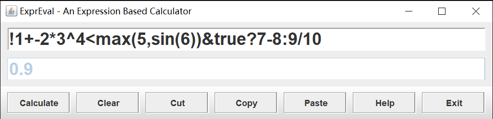

### 5.1测试simple

运行`test_simple.bat`

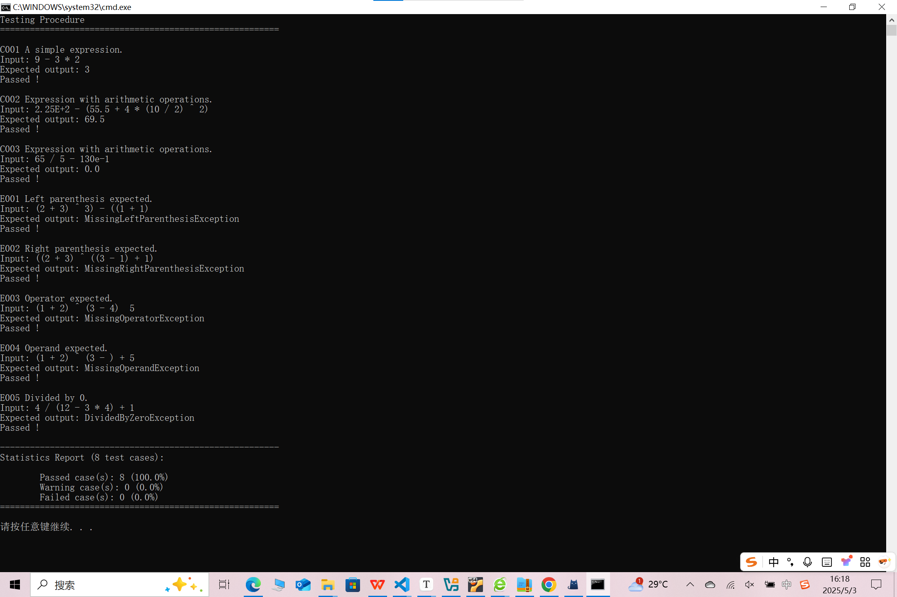

### 5.2测试standard

运行`test_standard.bat`

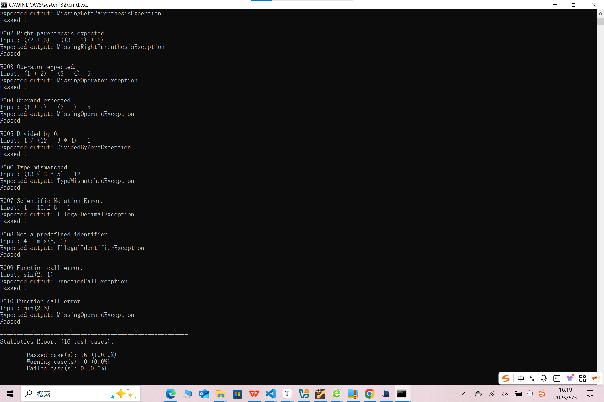

### 5.3测试更多正确案例

将实验要求中2.4语义描述中关于各种运算的描述示例作为测试案例进行测试，运行`test_correct.bat`

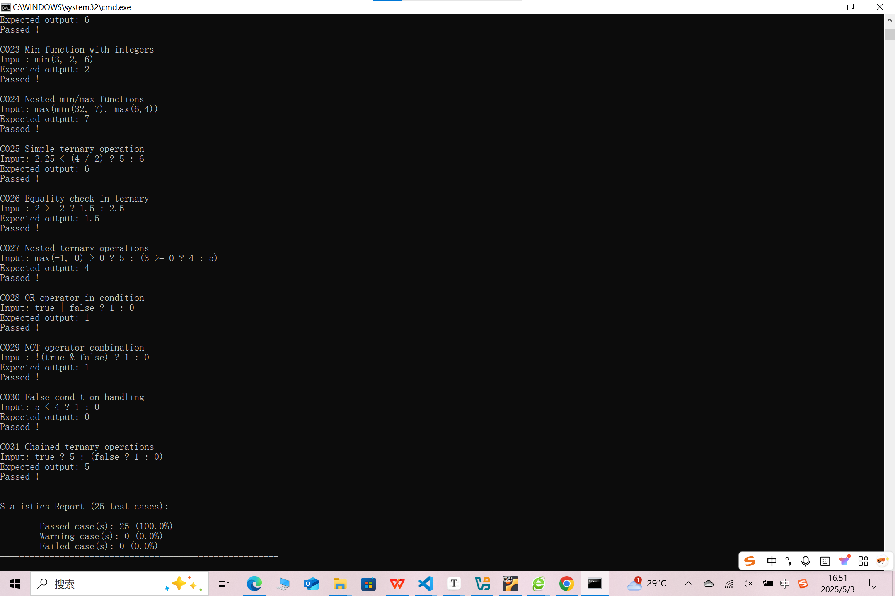

### 5.4测试更多异常案例

将实验要求中3.4异常类型详解中关于各种异常的描述示例作为测试案例进行测试，运行`test_exception.bat`


可以看到大部分输入得到的异常抛出都是正确的，但是有一个异常案例 $ 3.14 * 2 >= 2.5 * 3 ? (6 : 7) + 8 $ ，实验要求它抛出的异常是`MissingOperandException`，我这里给它设定的异常为`TrinaryOperationException`。

- 每一步对照算符优先分析法进行分析，发现`TopMostTerminal`为`(`，`lookahead`为`:`时遇到了未定义的空表项，也就是说一个合法的表达式不可能出现这种状态，故这种类型的异常需要人工定义

  | stack | buffer |
  | ----- | ------ |
  | $ ...( $ | $ :... $ |

- 在3.4.8给出了上述测试案例，并希望抛出`MissingOperandException`

  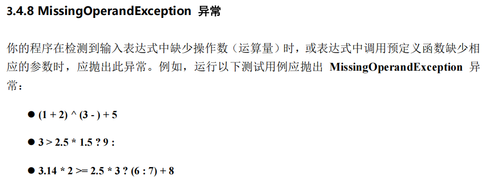

  

- 而在3.4.12给出了另外一个测试案例 $ 5 ? (8 : 8) $ ，并希望抛出`TrinaryOperationException`，容易观察这个表达式也会出现上述同样的`TopMostTerminal`为`(`，`lookahead`为`:`时遇到未定义的空表项

  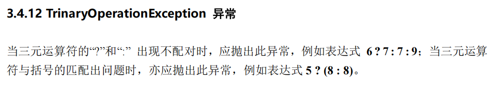

  

- 同样的异常状态却希望抛出两个不同的异常类型，难以解决，故考虑不进行该类型的测试

  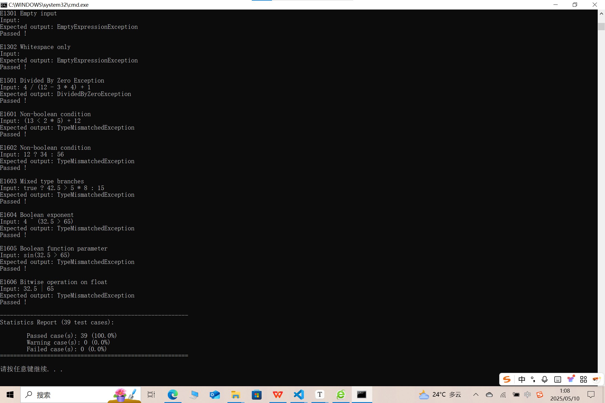

# 6.实验的心得体会

- 掌握了词法分析程序的工作原理与构造方法，包括较复杂的浮点数常量的词法规则定义及其识别程序的构造。学习了如何根据词法规则定义（例如正则表达式或正则文法）来构造一个词法扫描程序的程序蓝图（即有限状态自动机），并利用高级程序设计语言实现词法分析过程。

- 掌握了算符优先分析技术，除最基础的算术运算符外，还包括重载的（Overloading）一元运算符、三元运算符、关系运算符、逻辑运算符、预定义函数等运算符的处理。
- 掌握了基本的语义处理技术，能够正确地处理表达式计算中的类型兼容检测和类型自动推导。

- 通过加强软件设计方面的交流与讨论，并在面向对象编程风格的大量实践，提高对面向对象设计的认识，养成良好的编程习惯，并了解大型工程文档的组织与提交。
- 加深了解软件测试的工作原理与使用方法，初步体会软件测试自动化的基本思路。
