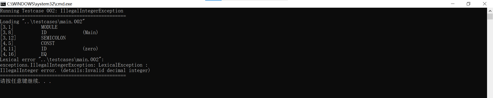

## 2.1 **总结** **Oberon-0** **语言的词汇表**

### 2.1.1 抽取词汇表

对所有英文单词，可以将其分类为保留字和关键字。但是根据语义规则和语义动作进行分类时，如`DIV`、`MOD`等保留字也可以划分为运算符，所以这里根据是否保留字、语义规则进行两种分类

#### 2.1.1.1 按保留字和关键字分类

- 保留字是构成语言语法结构的单词，它们是语法的组成部分，不能被用作标识符
- 关键字是语言预先定义好的标识符单词，它们可以在局部作用域中被重新声明为标识符
- 其他运算符和标点符号在语义上就不符合标识符的定义，自然也就不能被用作标识符

| 分类                 | 单词                                                         |
| -------------------- | ------------------------------------------------------------ |
| 保留字               | MODULE, PROCEDURE, BEGIN, END, CONST, TYPE, VAR, IF, THEN, ELSIF, ELSE, WHILE, DO, ARRAY, RECORD, OF, OR, DIV, MOD |
| 关键字               | INTEGER, BOOLEAN, READ, WRITE, WRITELN                       |
| 其他运算符和标点符号 | :=, =, #, <, <=, >, >=, +, -, *, &, ~, ., ;, ,, :, (, ), [, ] |

#### 2.1.1.2 按语义规则分类

- 对`+`和`*`，`=`和`#`这些操作符，显然它们各自的语义动作类似，考虑将它们分作一类
- 对`()`，`[]`，显然它们在语义分析过程中出现的形式类似，也考虑将它们分作一类
- 对`;`和`,`，它们自身并不具备语义规则，通常与其他符号一同出现，考虑将它们分作一类
- 对`MODULE`、`PROCEDURE`、`BEGIN`等保留字，它们的语义动作都各不相同，，考虑将它们分作一类

| 分类       | 单词                                                         |
| ---------- | ------------------------------------------------------------ |
| 类型       | ARRAY, RECORD                                                |
| 算术运算符 | +, -, *, DIV, MOD                                            |
| 布尔运算符 | &, ~, OR                                                     |
| 关系运算符 | =, #, <, <=, >, >=                                           |
| 括号       | (, ), [, ]                                                   |
| 类型定义   | :                                                            |
| 赋值       | :=                                                           |
| 句号       | .                                                            |
| 标识符     | letter {letter \|digit}                                      |
| 常量       | digit {digit}                                                |
| 预定义过程 | READ, WRITE, WRITELN                                         |
| 注释       | [ (* *) ]                                                    |
| 其他符号   | ;, ,                                                         |
| 其他保留字 | MODULE, PROCEDURE, BEGIN, END, CONST, TYPE, VAR, IF, THEN, ELSIF, ELSE, WHILE, DO,  OF |

#### 2.1.1.3 两种分类结合

- 对照上述两个表格，发现实际上除了`DIV`、`MOD`等保留字，大部分分类并不冲突，所以上述两种分类方法可以作为粗粒度和细粒度两种层次的分类

### 2.1.2 如何处理 Oberon-0 语言中保留字和关键字两类略有不同的单词

- 如同之前在ex1已经分析过的，Oberon-0 语言中保留字和关键字最大的区别就是前者不能被重新声明为标识符、而后者可以作为标识符覆盖原先预设的声明定义
- 对保留字，编译器应该保证符号表`env`当中不包含任何与保留字重名的任何符号，若出现则应该抛出异常
- 对关键字，编译器允许出现符号表`env`当中包含与关键字重名的符号，但是需要确定符号的作用域、保证符号只在自己的作用域内覆盖关键字，在作用域外应该恢复关键字原有的预设声明定义

## 2.2 **抽取** **Oberon-0** **语言的词法规则**

### 2.2.1 正则定义式

- 对整数，0开头的整数是八进制整数，其余数字开头的是十进制整数，还需要注意八进制整数每一位只能包含0-7，十进制每一位可以是0-9

  ```
  Integer -> 0[0-7]* | [1-9]+[0-9]*
  ```

  

- 对标识符，开头字符必须是大小写字母，其余字符可以是大小写字母或者数字

  ```
  Identifier -> [a-zA-Z][a-zA-Z0-9]*
  ```

  

- 对空白，考虑将每个连续的空白作为一个单词，任何标识空白转义符都需要被考虑

  ```
  Whitespace -> [ \t\n\r] | \r\n
  ```

  

- 对注释，考虑将每个注释单独作为一个单词，每个`(*`找到第一个匹配的的`*)`

  ```
  Comment -> "(*" ~ "*)"
  ```

  

- 对其余单词，比如`MODULE`、`>=`，可以直接使用字符串匹配，jflex也可以很简单地处理字符串匹配

  ```
  Module -> "MODULE"
  >= -> ">="
  ```

  

### 2.2.2 词法规则异同

#### 2.2.2.1 相同

- Pascal 、C/C++、Java和Oberon-0的整形字面量词法规则都类似，0开头的整数是八进制整数，其余数字开头的是十进制整数，还需要注意八进制整数每一位只能包含0-7，十进制每一位可以是0-9
- Pascal 、C/C++、Java和Oberon-0的标识符词法规则都类似，开头字符必须是大小写字母，其余字符可以是大小写字母或者数字
- Pascal 、C/C++、Java和Oberon-0的空白词法规则都类似，空格、制表符、换行符等空白字符都会被视作一个单词、进而被编译器直接忽略

#### 2.2.2.2 不同

- **大小写敏感**
  - 传统的Oberon-0词法一般是大小写敏感的，而实验要求给定的Oberon-0词法是大小写不敏感的
  - Pascal词法大小写不敏感
  - C/C++/Java词法大小写敏感
- **保留字与关键字**
  - Oberon-0/Pascal区分保留字与关键字
  - C/C++/Java不区分保留字与关键字，所有预定义的单词都是保留字
- **注释**
  - Oberon-0/Pascal注释的词法是`(* *)`，允许嵌套注释
  - C/C++/Java注释的词法是`//`和`/* */`，不允许嵌套注释
- **运算符和标点符号**
  - 赋值、相等、不等号、逻辑与、逻辑或、逻辑非等符号具有同样的表达式语义，但是两种语法的对应词法符号不同
  - Oberon-0：`:=`、`=`、`#`、 `AND`、 `OR`、 `~`、...
  - Pascal：`:=`、`=`、 `<>`、 `AND`、 `OR`、 `NOT`、...
  - C++/Java：`=`、`==`、`!=`、 `&&`、 `||`、 `!`、...

## 2.3 **下载词法分析程序自动生成工具** **JFlex**

- 选择下载最新版的`jflex-full-1.9.1.jar`

- 将jar文件放置在目录`/lib/jflex-full-1.9.1.jar`

- 设置环境变量

  

  

- 检查是否安装成功

  

## 2.4 **生成** **Oberon-0** **语言的词法分析程序**

### 2.4.1 编写一个 JFlex 输入源文件

#### 2.4.1.1 词法分析

- 对上面已经给出 Oberon-0 语言词法规则的正则定义式，可以根据上面给出的正则式给出jflex的代码

  ```
  /* Regular definitions */
  
  MyInteger     = 0[0-7]* | [1-9]+[0-9]*
  Identifier    = [a-zA-Z][a-zA-Z0-9]*
  Whitespace    = [ \t\n\r] | \r\n
  Comment       = "(*" ~ "*)" 
  ```

  

- 对其他不需要正则表达式的单词，比如`MODULE`、`>=`，可以直接使用字符串匹配，jflex也可以很简单地处理字符串匹配

  ```
  "MODULE"        { return Keyword.symModule(yyline + 1, yycolumn + 1); }
  
  ">="            { return Operator.gteq(yyline + 1, yycolumn + 1); }
  
  ...
  ```

#### 2.4.1.2 异常处理

- 对词法分析的所有异常，它们都继承自`LexicalException`

##### 2.4.1.2.1 `IllegalIdentifierLengthException`

- 实验要求标识符长度不能超过24，否则抛出`IllegalIdentifierLengthException`

- 使用jflex提供的方法`yylength()`检测长度，若超过要求长度则抛出异常、否则接受当前单词

  ```java
  {Identifier}    { 
      /* Parse Identifier */
  
      if (yylength() > 24) {
          throw new IllegalIdentifierLengthException("Too long identifier");
      }
  
      return new Identifier(yyline + 1, yycolumn + 1, yytext()); 
  }
  ```

  

##### 2.4.1.2.2 `IllegalIntegerRangeException`

- 实验要求标识符长度不能超过12，否则抛出`IllegalIntegerRangeException`

- 使用jflex提供的方法`yylength()`检测长度，若超过要求长度则抛出异常

  ```java
  // Check integer length
  if (yytext().length() > 12) {
      throw new IllegalIntegerRangeException("Too long integer");
  }
  ```


##### 2.4.1.2.3 `IllegalOctalException`

- 0开头的整数是八进制整数，否则抛出`IllegalOctalException`

- 使用非法八进制数正则表达式检测是否为非法八进制数、即以0开头但是后续包含8或9，若匹配非法八进制数则抛出异常、否则接受当前单词

  ```java
  if (yytext().startsWith("0")) {
                              // Parse octal integer
                              try {
                                  return new MyInteger(yyline + 1, yycolumn + 1, Integer.parseInt(yytext(), 8));
                              } catch (NumberFormatException e) {
                                  throw new IllegalOctalException("Invalid octal integer");
                              }
                          }
  ```

  ```java
  IllegalOctal = 0[0-7]* [8|9|"."]+ [0-9]*
  
  {IllegalOctal}      {throw new IllegalOctalException("Invalid octal integer");}
  ```

  

##### 2.4.1.2.4 `IllegalIntegerException`

- 其余数字开头的是十进制整数，十进制每一位可以是0-9，否则抛出`IllegalIntegerException`

- 使用非法整数正则表达式检测是否为非法整数、即以数字开头但是后续包含字母，若匹配非法整数则抛出异常、否则接受当前单词

  ```java
  else {
      // Parse decimal integer
      try {
          return new MyInteger(yyline + 1, yycolumn + 1, Integer.parseInt(yytext()));
      } catch (NumberFormatException e) {
          throw new IllegalIntegerException("Invalid decimal integer");
      }
  }
  ```

  ```java
  IllegalInteger 	= {MyInteger}+{Identifier}+
  
  {IllegalInteger}    {throw new IllegalIntegerException("Invalid decimal integer");}
  ```


##### 2.4.1.2.5 `MismatchedCommentException`

- 考虑将每个注释单独作为一个单词，每个`(*`找到第一个匹配的的`*)`，否则抛出`MismatchedCommentException`

- 使用非法注释正则表达式检测是否为非法注释、即以`(*`开头但是后续不包含`*)`、或者即以`*)`结尾但是之前不包含`(*`，若匹配非法整数则抛出异常、否则接受当前单词

  ```java
  {Comment}       { /* Skip comments */ }
  ```

  ```java
  IllegalComment = "(*" ([^\*] | "*"+[^\)])+ | ([^\(]|"("+[^\*])+"*)"
  
  {IllegalComment} {throw new MismatchedCommentException("Open comment error");}
  ```

  

##### 2.4.1.2.6 `IllegalSymbolException`

- 其余情况都是词法规则未定义的情况，统一抛出`IllegalSymbolException`

  ```java
  /* Error fallback */
  
  [^]                 {
                          /* Unknown symbol, read one character */
                          throw new IllegalSymbolException("Unknown symbol");
                      }
  ```

  

### 2.4.2 生成源代码

- 按照实验要求，将词法分析器命名为`OberonScanner`

  ```java
  %class OberonScanner
  ```

  

- 编写生成脚本`gen.bat`，链接jflex，运行得到源代码

  ```bat
  @echo off
  cd src
  java -jar ..\lib\jflex-full-1.9.1.jar --outdir scanner oberon.flex
  cd ..
  pause
  ```


### 2.4.3 运行源代码

除了实验要求之外，还利用jflex提供的`yyline`、`yycolumn`，可以体现词法分析过程，也为后续实验的错误定位做准备

#### 2.4.3.0 正确版本


#### 2.4.3.1 变异版本`LexicalException——IllegalSymbolException`


#### 2.4.3.2 变异版本`LexicalException——IllegalIntegerException`



#### 2.4.3.3 变异版本`LexicalException——IllegalIntegerRangeException`


#### 2.4.3.4 变异版本`LexicalException——IllegalOctalException`


#### 2.4.3.5 变异版本`LexicalException——IllegalIdentifierLengthException`


#### 2.4.3.6 变异版本`LexicalException——MismatchedCommentException`


## 2.5 **讨论不同词法分析程序生成工具的差异**

### 2.5.1 目标语言

- JFlex/JLex的目标语言是java：
  - 词法规则对应的动作是java代码
  - 一般通过返回创建Java对象来接受单词，单词的变量和状态都可以直接储存在单词类实例当中
  - 可以直接调用Java的类库和方法
- GNU Flex的目标语言是C/C++：
  - 词法规则对应的动作是C/C++代码
  - 一般通过返回一个`int`类型的记号编码来接受单词，单词的变量和状态通过全局变量传递给编译器
  - 可以直接调用C/C++的函数库

### 2.5.2 宏定义

- JFlex/JLex使用`name = {definition}`的形式
- GNU Flex使用`name definition`的形式，省略了等号和花括号

### 2.5.3 Unicode

- JLex对Unicode的适配程度较低，只能处理ASCII码，处理非ASCII字符比较困难、需要手动编码范围
- GNU Flex对Unicode的适配程度较好，通过`%option`提供了对UTF-8等多字节编码的支持，但Unicode功能不如JFlex原生和易用
- JFlex对Unicode的适配程度最好，底层设计就是以适配Unicode为目标，可以直接在规则中使用Unicode转义，支持Unicode属性、可以处理各种类型的符号

### 2.5.4 状态管理

- JFlex/JLex使用`%state`关键字声明
- GNU Flex使用普通状态`%s`和独占状态`%x`声明