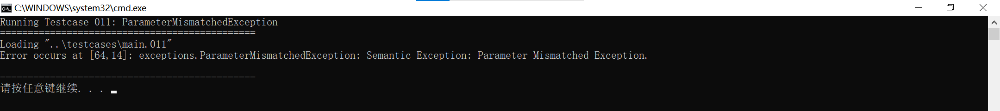

## 3.1 **下载自动生成工具** **JavaCUP**

- 选择下载最新版的`java-cup-11b.jar`和`java-cup-11b-runtime.jar`
- 将jar文件放置在目录`/lib/`

## 3.2 **配置和试用** **JavaCUP**

- 按照实验要求，将语法分析器命名为`Parser`、符号类命名为`Symbol`

  ```bat
  java -jar ..\lib\java-cup-11b.jar -interface -parser Parser -symbols Symbol -nonterms oberon.cup
  ```

  

- 编写生成脚本`gen.bat`，链接jflex和javacup

  ```bat
  @echo off
  cd src
  if exist OberonScanner.java (
      del OberonScanner.java
  )
  if exist Parser.java (
      del Parser.java
  )
  if exist Symbol.java (
      del Symbol.java
  )
  java -jar ..\lib\jflex-full-1.9.1.jar oberon.flex
  java -jar ..\lib\java-cup-11b.jar -interface -parser Parser -symbols Symbol -nonterms oberon.cup
  cd ..
  pause
  ```

  

## 3.3 **生成 Oberon-0 语法分析和语法制导翻译程序**

### 3.3.1 词法分析

- 词法分析部分与ex2类似，只做了一些修改以适配javacup，但是正则定义式是完全一致的

- 对上面已经给出 Oberon-0 语言词法规则的正则定义式，可以根据上面给出的正则式给出jflex的代码

  ```java
  /* Regular definitions */
  
  MyInteger     = 0[0-7]* | [1-9]+[0-9]*
  Identifier    = [a-zA-Z][a-zA-Z0-9]*
  Whitespace    = [ \t\n\r] | \r\n
  Comment       = "(*" ~ "*)" 
  ```

  

- 对其他不需要正则表达式的单词，比如`MODULE`、`>=`，可以直接使用字符串匹配，jflex也可以很简单地处理字符串匹配

  ```
  "MODULE"        { return Keyword.symModule(yyline + 1, yycolumn + 1); }
  
  ">="            { return Operator.gteq(yyline + 1, yycolumn + 1); }
  
  ...
  ```


- 对非法单词的正则表达式，也和ex2类似

  ```java
  /* Exception definitions */
  
  IllegalComment = "(*" ([^\*] | "*"+[^\)])* | ([^\(]|"("+[^\*])* "*)"
  IllegalOctal = 0[0-7]*[9|8]+[0-9]*
  IllegalInteger = {MyInteger} + {Identifier}+
  ```


- 利用jflex提供的`yyline`、`yycolumn`，并给出函数以返回每个单词分析的位置，可以体现词法分析过程，也为后续的错误定位做准备

  ```java
  int getLine()	{	return yyline;}
  int getColumn()	{	return yycolumn;}
  ```

  

### 3.3.2 语法分析

#### 3.3.2.1 宏定义

- 根据实验要求，语法分析过程中还应该进行调用图分析，所以还需要初始化调用图相关数据结构

  ```java
  init with {:
  	callee = 1;
  	graph = new CallGraph();
  	procedure = new Vector<String>();
  	callSites = new Vector<String>();
  	callEdges = new Vector<String>();
  	symbols = new Vector<Node>();
  :}
  ```

  

- 语法分析离不开词法分析，语法分析器分析过程依赖于词法分析器不断扫描提供单词，所以需要显式指定词法分析器提供的方法

  ```java
  scan with {:
  	return getScanner().next_token();
  :};
  ```

  

- 定义终结符，对原本已经为英文单词的直接使用原名作为标识符即可、对原本为符号的需要重新命名为英文标识符

  ```java
  terminal PROCEDURE;
  terminal MODULE;
  terminal BEGIN;
  ...
  ```

  

- 定义非终结符，对原本已经给出BNF定义的直接使用原名作为标识符即可，但是由于javacup接受的是产生式、而实验要求给定的是BNF定义，所以还需要做额外处理、增添额外的非终结符，这里在后面解释

  ```java
  non terminal String	module;
  non terminal String	module_body;
  non terminal String	declarations;
  non terminal String	procedure_declaration;
  non terminal String	procedure_begin;
  non terminal String	procedure_heading;
  non terminal String	procedure_body;
  non terminal String	format_parameters;
  ...
  ```


- 还需要定义操作符的优先级，列表中位置越靠后，优先级越高

  ```java
  precedence right ASSIGNMENT;
  precedence left OR;
  precedence left AND;
  precedence right NOT;
  precedence left LessThan, LessThanOrEqual, GreatThan, GreatThanOrEqual,EQUAL, NOTEQUAL ;
  precedence left PLUS, MINUS;
  precedence left TIMES, DIV, MOD;
  precedence left LeftParenthesis;
  ```

  

#### 3.3.2.2 翻译模式

##### 3.3.2.2.1 处理`[]`

- 在BNF中，`[]`表示其中内容会产生0或1次

- 一种处理办法是将`[]`的部分单独作为一个非终结符，将产生式判断延后

  ```java
  declarations ::=  const_declarations type_declarations var_declarations procedure_declaration  {:  :}
                 ;
  ```

  

- 另一种处理办法是将`[]`的部分给出`对应产生式|空产生式`，实际上也处理了上述情况

  ```java
  field_list ::=	{:RESULT = new Node();:}
  		     | 	identifier_list:identifierList COLON special_type: specialTypeToken
  			    {:
  					RESULT = new Node();
  					for (int i = 0; i < identifierList.size(); i++) {
  						RESULT.type += specialTypeToken.type;
  						RESULT.name += identifierList.elementAt(i).name;
  					}
  			    :}
  			 ;
  ```

  

##### 3.3.2.2.2 处理`{}`

- 在BNF中，`{}`表示其中内容会产生0到任意次

- 一种处理办法是将`{}`的部分单独作为一个非终结符，将产生式判断延后

  ```java
  record_type ::=	 RECORD field_list:field_listTokne field_list_list: field_list_listToken END
                   {:
  			        RESULT = new Node();
  			        RESULT.type = field_listTokne.type +field_list_listToken.type;
  		         :}
  			  ;
  ```

  

- 另一种处理办法是将`{}`的部分给出`递归产生式|空产生式`、其中递归产生式对应原本`{}`对应部分，实际上也处理了上述情况

  ```java
  field_list ::=	{:RESULT = new Node();:}
  		     | 	identifier_list:identifierList COLON special_type: specialTypeToken
  			    {:
  					RESULT = new Node();
  					for (int i = 0; i < identifierList.size(); i++) {
  						RESULT.type += specialTypeToken.type;
  						RESULT.name += identifierList.elementAt(i).name;
  					}
  			    :}
  			 ;
  
  field_list_list ::=	 {: RESULT = new Node(); :}
  		          |  field_list_list : field_list_listToken SEMICOLON field_list : field_listToken
  					 {:
  						 RESULT = new Node();
  						 RESULT.name = field_list_listToken.name + field_listToken.name;
  						 RESULT.type = field_list_listToken.type + field_listToken.type;
  					 :}
  				  ;
  ```

  

##### 3.3.2.2.3 绘制调用图

- 初始化调用图需要的各种变量和数据结构

  ```
  init with {:
  	callee = 1;
  	graph = new CallGraph();
  	procedure = new Vector<String>();
  	callSites = new Vector<String>();
  	callEdges = new Vector<String>();
  	symbols = new Vector<Node>();
  :}
  ```

  

- 整体思想其实比较直观

  - 只需要在每次进入某个过程就将其接入调用节点
  - 如果在过程作用域内还调用任何子过程，就将这个子过程添加到子节点
  - 单个过程的每个调用都需要单独编号，指向目标过程

  ```java
  procedure_call ::=	IDENTIFIER: procedureName actual_parameters: actualParameters
  		            {:
  			            if (parser.callee == 1 && parser.currentProcedure.isEmpty()) {
  				            parser.currentProcedure = "Main";
  				            parser.graph.addProcedure("Main", "Main( )");
  				            String newProcedure = new String(parser.currentProcedure + "=" + "( "  + " )");
  				            parser.procedure.addElement(newProcedure);
  			            }
  			            parser.callSites.addElement(new String(parser.currentProcedure + parser.callee + "=" + parser.currentProcedure + "( )" + "=" + procedureName + "( " + actualParameters.name + ")" + "=" + actualParameters.type));
  			            parser.callEdges.addElement(new String(parser.currentProcedure + parser.callee + "=" + procedureName));
  			            parser.callee++;
  		            :}
                   ;
  ```


- 思路参考了语法制导翻译中code拼接的思想，使用`=`作为拼接符号，在语法分析结束时通过综合属性得到所有调用信息

- 每个调用的信息都是类似的，都符合`callerID=callerSignature=calleeSignatureWithArgs=actualArgTypes`的结构

- 比如对`Main1=Main( )=Add(x, y)=INTEGER BOOLEAN`

  - `callerID`: `Main1`调用者+唯一ID
  - `callerSignature`: `Main( )`调用者签名
  - `calleeSignatureWithArgs`: `Add(x, y)`被调用者签名及其实参名
  - `actualArgTypes`: `INTEGER BOOLEAN`实参的类型列表，用空格分隔

- 最后分析每个调用向量，通过`addCallSite`和`addEdge`把对应信息添加到图节点，可以得到实验要求的调用图

  ```java
  /* call sites */
  for (int i = 0; i < parser.callSites.size(); i++) {
      String[] splitInformation = parser.callSites.elementAt(i).split("=");
      parser.graph.addCallSite(splitInformation[0], splitInformation[1], splitInformation[2]);
  }
  /* edges */
  for (int i = 0; i < parser.callEdges.size(); i++) {
      String[] splitInformation = parser.callEdges.elementAt(i).split("=");
      parser.graph.addEdge(splitInformation[0], splitInformation[1]);
  }
  ```

  

#### 3.3.2.3 异常定位

- 上面提到了利用jflex提供的`yyline`、`yycolumn`，并给出函数以返回每个单词分析的位置，可以体现词法分析过程，也为后续的错误定位做准备

- 利用java的语言特性，在某个位置抛出异常后，编译器会递归向上返回这个异常、并停止程序的运行

- 上面提到每次词法分析器调用一次`next_token`，语法分析器才进行一步分析，也就是说任何一个产生式对应的异常抛出后，词法分析也恰好停止在异常抛出的位置，此时直接调用`yyline`、`yycolumn`就是异常抛出的位置

  ```java
  try {
      p.parse();
  } catch (Exception e) {
      int line = scanner.getLine() + 1;
      int column = scanner.getColumn() + 1;
      System.out.println("Error occurs at [" + line + "," + column + "]: " + e + "\n");
  }
  ```

  

#### 3.3.2.4 异常处理

- 对词法分析的所有异常，它们都继承自`LexicalException`，异常的抛出条件与ex2一致、这里不再做说明

- 对语法分析的所有异常，它们都继承自`SyntacticException`
- 对语义分析的所有异常，它们都继承自`SemanticException`

##### 3.3.2.4.1 `MissingLeftParenthesisException`、`MissingRightParenthesisException`

- 语法BNF要求每个产生式中的`(`和`)`总是同时产生的、也就是说任何合法的句柄中`(`和`)`总是匹配的，否则抛出`MissingLeftParenthesisException`、`MissingRightParenthesisException`

- 比如对`format_parameters`对应产生式：

  - `()`是合法的句柄
  - `(fp_section)`是合法的句柄
  - `fp_section)`是非法的句柄，抛出`MissingLeftParenthesisException`
  - `(fp_section`是非法的句柄，抛出`MissingRightParenthesisException`

  ```java
  format_parameters ::=  {: RESULT = ""; :}
                      |  LeftParenthesis RightParenthesis {: RESULT = ""; :}
  					|  LeftParenthesis fp_section:fp_sectionReturnString RightParenthesis {: RESULT = fp_sectionReturnString; :}
  					|  fp_section:fp_sectionReturnString RightParenthesis {: if (true) throw new MissingLeftParenthesisException(); :}
  					|  LeftParenthesis fp_section:fp_sectionReturnString {: if (true) throw new MissingRightParenthesisException(); :}
  					;
  ```

  

##### 3.3.2.4.2 `MissingOperandException`

- 语法BNF要求表达式等产生式应该符合递归展开、以符合结合性，除了第一个是操作数、每次递归都匹配一个操作符和一个操作数，否则抛出`MissingOperandException`

- 比如对`simple_expression_list`对应产生式：

  - `op simple_expression`是合法的句柄
  - `op`是非法的句柄，抛出`MissingOperandException`

  ```java
  simple_expression_list ::=  EQUAL simple_expression : simpleExpressionToken
  			                {:
  				                if ((simpleExpressionToken.type.indexOf("INTEGER") == -1 && simpleExpressionToken.type.indexOf("ARRAY") == -1 && simpleExpressionToken.type.indexOf("RECORD") == -1)) {
  					                throw new TypeMismatchedException();
  				                }
  				                RESULT = new Node();
  				                RESULT.name = "=" + simpleExpressionToken.name;
  				                RESULT.type = "BOOLEAN";
  			                :}
  		                 |  EQUAL
  			                {:
  				                if (true) throw new MissingOperandException();
  			                :}
  		                 |	...
  ```


##### 3.3.2.4.3 `MissingOperatorException`

- 语法BNF要求表达式中所有操作数都在最底层的`factor`对应产生式才产生、此时右部只能是另一个子表达式或者单个操作数，否则抛出`MissingOperatorException`

- 比如对`simple_expression_list`对应产生式：

  - `NUMBER`是合法的句柄
  - `(expression)`是合法的句柄
  - `NUMBER NUMBER`是非法的句柄，抛出`MissingOperatorException`
  - `IDENTIFIER IDENTIFIER`非法的句柄，抛出`MissingOperatorException`

  ```java
  factor ::=  ...
      	 |  NUMBER :number
              {:
  				RESULT = new Node(number, "INTEGER");
  			:}
           |	LeftParenthesis expression:expressionToken RightParenthesis
              {:
  				RESULT = new Node();
  				RESULT.name = "(" + expressionToken.name + ")";
  				RESULT.type = expressionToken.type;
  			:}
           |	...
           |  NUMBER NUMBER
              {:
  				if (true) throw new MissingOperatorException();
  			:}
           |  IDENTIFIER IDENTIFIER
              {:
  				if (true) throw new MissingOperatorException();
  			:}
           ;
  ```

  

##### 3.3.2.4.4 `ParameterMismatchedException`

- 语义要求所有过程调用时参数应该和声明的参数一致，否则抛出`ParameterMismatchedException`

- 根据上面给出的每个调用向量：

  - 如果向量长度为3，说明向量最后一维为空、即不存在实际参数，说明这次调用没有实际参数
  - 如果向量第2维`splitSites[2]`长度不为0、即存在形式参数，说明参数不匹配，抛出`ParameterMismatchedException`

  ```java
  //0 parameter
  if(splitSites.length == 3) {
      for(int j = 0; j < parser.procedure.size(); j++) {
          String[] splitProcedure = parser.procedure.elementAt(j).split("=");
          if ((splitSites[2]).substring(0, (splitSites[2].indexOf("("))).equals(splitProcedure[0])) {
              String parameters2 = splitProcedure[1].replace(",", "").replace(" ", "").replace("(", "").replace(")", "");
              if(parameters2.length() != 0) {
                  throw new ParameterMismatchedException();
              }
          }
      }
  }
  ```

  

- 根据上面给出的每个调用向量：

  - 如果向量长度不为3，说明向量最后一维不为空、即存在实际参数，说明这次调用有实际参数
  - 如果向量第2维`splitSites[2]`对应的形式参数不等于向量第3维`splitSites[3]`对应的实际参数，说明参数不匹配，抛出`ParameterMismatchedException`
  
  ```java
  //1 or more parameter
  else {
      for(int j = 0; j < parser.procedure.size(); j++) {
          String[] splitProcedure = parser.procedure.elementAt(j).split("=");
          if ((splitSites[2]).substring(0, (splitSites[2].indexOf("("))).equals(splitProcedure[0])) {
              String parameters1 = splitSites[3].replace(",", "").replace(" ", "");
              String parameters2 = splitProcedure[1].replace(",", "").replace(" ", "").replace("(", "").replace(")", "");
              if (!parameters1.equals(parameters2))
                  throw new ParameterMismatchedException();
          }
      }
  }
  ```


##### 3.3.2.4.5 `TypeMismatchedException`

- 语义要求所有操作符对应的操作数应该类型匹配、这也是Oberon-0作为强类型语言的要求之一，否则抛出`TypeMismatchedException`

- 比如对`simple_expression_list`对应产生式：

  - `INTEGER = ARRAY`是非法的句柄，抛出`TypeMismatchedException`
  - `INTEGER = RECORD`是非法的句柄，抛出`TypeMismatchedException`

  ```java
  simple_expression_list ::=  EQUAL simple_expression : simpleExpressionToken
  			                {:
  				                if ((simpleExpressionToken.type.indexOf("INTEGER") == -1 && simpleExpressionToken.type.indexOf("ARRAY") == -1 && simpleExpressionToken.type.indexOf("RECORD") == -1)) {
  					                throw new TypeMismatchedException();
  				                }
  				                RESULT = new Node();
  				                RESULT.name = "=" + simpleExpressionToken.name;
  				                RESULT.type = "BOOLEAN";
  			                :}
  		                 |	...
  ```

  

### 3.3.3 运行源代码

#### 3.3.3.0 正确版本


除了ex1编写的正确版本代码，我还尝试了实验要求给出的另一个调用示例，发现结果也一致


#### 3.3.3.1 变异版本 `SyntacticException——MissingRightParenthesisException`


#### 3.3.3.2 变异版本 `SyntacticException——MissingLeftParenthesisException`


#### 3.3.3.3 变异版本 `SyntacticException——MissingOperatorException`


#### 3.3.3.4 变异版本 `SyntacticException——MissingOperandException`


#### 3.3.3.5 变异版本 `SemanticException——ParameterMismatchedException`



#### 3.3.3.6 变异版本 `SemanticException——TypeMismatchedException`


## 3.4 **讨论不同生成工具的差异**

### 3.4.1 JavaCUP 和 GNU Bison

#### 3.4.1.1 目标语言

- JavaCUP的目标语言是java：
  - 语法规则对应的语义动作是java代码
  - 一般通过基于Java对象来执行语义动作，对象的变量和状态都可以直接储存在对象类实例当中
  - 可以直接调用Java的类库和方法
- GNU Bison的目标语言是C/C++：
  - 语法规则对应的语义动作是C/C++代码
  - 一般通过属性操作来执行语义动作，变量和状态通过全局变量传递给编译器
  - 可以直接调用C/C++的函数库

#### 3.4.1.2 文件组织

- 文件扩展名不同：
  - JavaCUP的文件扩展名一般是.cup
  - GNU Bison的文件扩展名一般是.y
- 文件结构不同：
  - JavaCUP没有显式的全局分隔符，使用`parser code`, `init with`, `terminal`, `non terminal`等预定义指令来组织文件
  - GNU Bison使用`%%`将文件分为声明区、规则区、用户代码区三个部分

#### 3.4.1.3 语法规则

- 规则定义操作符不同：
  - JavaCUP使用`::=`
  - GNU Bison使用冒号`:`
- 语义动作代码块不同：
  - JavaCUP的Java 代码被包裹在`{: ... :}`中
  - GNU Bison的C/C++ 代码被包裹在`{ ... }`中
- 访问符号值方式不同：
  - JavaCUP使用命名标签，即在规则中为符号附加一个名字，然后在语义动作中直接使用这个名字
  - GNU Bison使用位置变量`$$`代表左侧非终结符的语义值，`$1`, `$2`, `$3`, ... 按顺序代表右侧各符号的语义值

- 返回值不同
  - JavaCUP为`RESULT`特殊变量赋值
  - GNU Bison为 `$$` 赋值
- 非终结符类型声明
  - JavaCUP使用`non terminal <类型> <名称>`
  - GNU Bison使用`%type <<类型>> <名称>`

### 3.4.2 JavaCC 与 JavaCUP

- JavaCUP是一个自底向上的LALR(1)分析器生成器，它需要与一个独立的词法分析器、如JFlex配合使用来共同完成任务
- JavaCC则是一个自顶向下的LL(k)分析器生成器，它将词法规范和语法规则合并在同一个文件中，能独立生成一个完整的、包含了词法分析功能的递归下降分析器