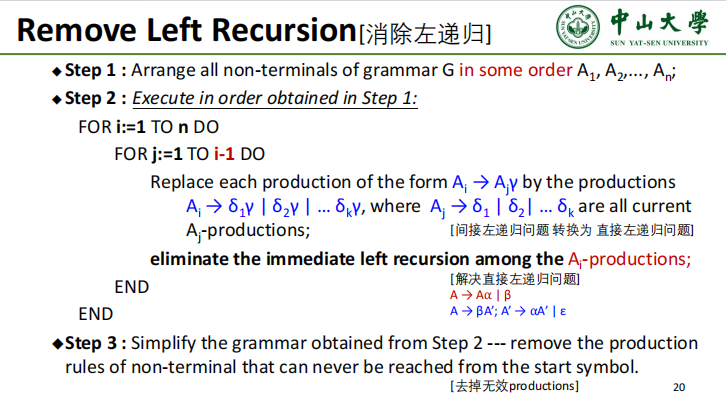
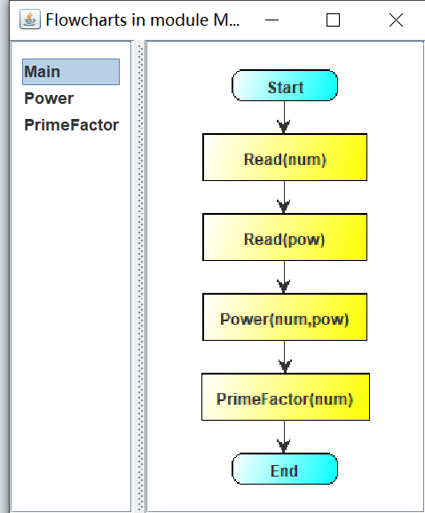
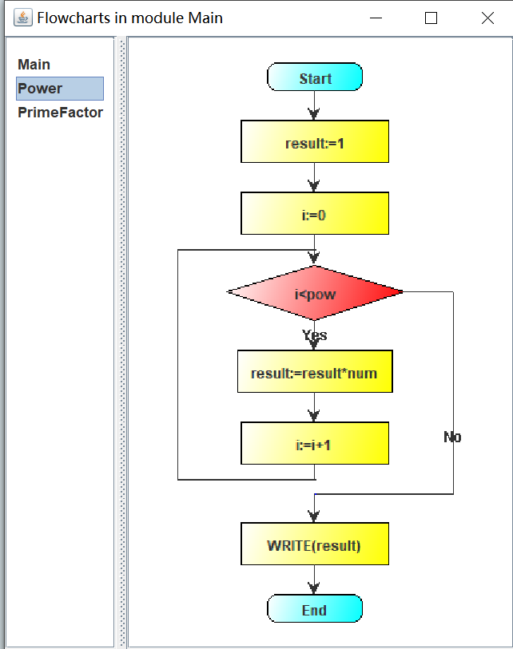
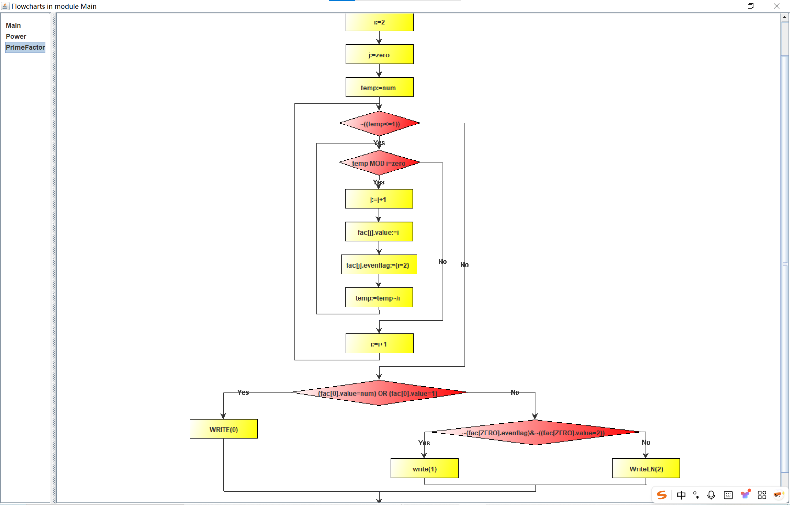
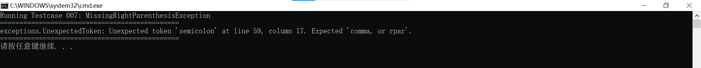

## 4.1 **设计** **Oberon-0** **语言的翻译模式**

### 4.1.1 改造文法

#### 4.1.1.1 消除二义性

- 包括递归下降在内的任何翻译模式都应该消除二义性
- 在ex1已经讨论过，可以认为Oberon-0是没有二义性的，所以这部分不需要任何改造

#### 4.1.1.2 消除空产生式

- 将每个产生式右部的非终结符均替换成𝛆，如果该非终结符能推出𝛆的话

- 比如考虑下面ex3中`procedure_call`对应的产生式，`actual_parameters`能推出𝛆

  ```java
  procedure_call ::=	IDENTIFIER: procedureName actual_parameters: actualParameters
  		            {:
                       ...
  		            :}
                   ;
  
  actual_parameters::=  /* epsilon */
                     |  LeftParenthesis expression_list:parameters RightParenthesis 						{:                                                                                  	...                                                                           :}
                     ;
  ```


- 把所有可能性都替换出来

- 比如考虑代入`actual_parameters`推出𝛆后的右部

  ```java
  procedure_call ::=	IDENTIFIER: procedureName actual_parameters: actualParameters
  		            {:
                       ...
  		            :}
  				|	IDENTIFIER: procedureName
  		            {:
                       ...
  		            :}
                   ;
  
  actual_parameters::=  LeftParenthesis expression_list:parameters RightParenthesis 						{:                                                                                  ...                                                                           :}
                     ;
  ```

  

- 但是本次实验不考虑消除空产生式：
  - 一方面这样修改文法的开销太大，需要递归地考虑所有可能推出空产生式的非终结符、再递归地将其代入其所在的所有位置，同时有可能会导致文法的可读性太差
  - 另一方面递归下降预测分析法可以处理空产生式、只需要额外定义一些其他的附加行为，但本质上产生式和语义动作的选择还是基于`lookahead`，并不影响分析过程的正确性

#### 4.1.1.3 消除直接左递归

- 对于具有直接左递归的产生式，其一般形式为：
  - $$A \rightarrow A\alpha_1 \ | \ A\alpha_2 \ | \ \dots \ | \ A\alpha_m \ | \ \beta_1 \ | \ \beta_2 \ | \ \dots \ | \ \beta_n$$

- 可以将这组产生式替换为以下两组等价的、无直接左递归的产生式：

  - $$\begin{align*} A &\rightarrow \beta_1 A' \ | \ \beta_2 A' \ | \ \dots \ | \ \beta_n A' \\ A' &\rightarrow \alpha_1 A' \ | \ \alpha_2 A' \ | \ \dots \ | \ \alpha_m A' \ | \ \varepsilon \end{align*}$$​

- 比如本次实验中`simple_expression`和`term`对应的BNF表达式

  - `simple_expression = ["+"|"-"] term {("+"|"-") term}`
  - `term = factor {("*"|"DIV") factor}`

- 如果直接将上述BNF翻译为CFG的产生式，其中为了进行左结合而做出的设计就会导致左递归：

  - 对ex3中LALR(1)分析法中不会引发问题、因为自底向上分析法对左递归不敏感
  - 对递归下降预测分析法影响很大，会出现死循环

  ```java
  simple_expression ::=  /*["+" | "-"] term {("+" | "-" | "OR") term} */
                         term : termToken  term_list : termListToken
  				       {:
  					       ...
  				       :}
  			        |  ...
                      ;
                      
  term ::=  factor : factorToken  {: ... :}
  	   |  term : termToken TIMES factor : factorToken
  		  {:
  			  ...
  		  :}
  	   |                    
  ```

  

- 根据上述规则，将上面的BNF表达式改造为不具有左递归的产生式、转而成为右递归

  - `simple_expression -> [+|-] term post_term | term post_term`
  - `post_term -> (+|-|or) term post_term | ε`
  - `term -> factor post_factor`
  - `post_factor -> (*|&|div|mod) factor post_factor | ε`

- 其他直接左递归的处理方法也类似

#### 4.1.1.4 消除间接左递归

- 对于具有间接左递归的产生式，其左递归需要将某个产生式代入另一个产生式的右部

- 经过下面算法代入后，可以将这一组产生式中所有间接左递归转化为直接左递归，实际上处理方法和消除直接左递归一致

  

------

#### 4.1.1.5 提取左公因子

- 对于一组产生式，如果它们有共同的左公因子，其一般形式为：
  - $$A \rightarrow \alpha\beta_1 \ | \ \alpha\beta_2 \ | \ \dots \ | \ \alpha\beta_n \ | \ \gamma$$

- 可以将这组产生式替换为以下两组等价的、无公共左公因子的产生式：
  - $$\begin{align*} A &\rightarrow \alpha A' \ | \ \gamma \\ A' &\rightarrow \beta_1 \ | \ \beta_2 \ | \ \dots \ | \ \beta_n \end{align*}$$

- 需要注意这里的操作可能是递归的，即如果替换后，新的 $A'$ 产生式仍然有公共左因子，则需要重复上述过程

- 比如本次实验中`statement`、`assignment`和`procedure_call`对应的BNF表达式

  - `statement = [assignment | procedure_call | ... ]`
  - `assignment = identifier ...`
  - `procedure_call = identifier ...`

- 如果直接将上述BNF翻译为CFG的产生式，会产生左公因子问题：

- 对ex3中LALR(1)分析法中不会引发问题、因为自底向上分析法对左公因子不敏感

- 对递归下降预测分析法影响较大，尽管可以通过回溯机制让递归下降预测分析法可以处理左公因子，但是这种操作开销过大，故需要考虑消除左公因子

  ```java
  statement ::=  assignment
              |  procedure_call
              |  ...
              ;       
  
  assignment ::=	IDENTIFIER:identifier selector:selectorName ASSIGNMENT expression:expressionToken
  		        {:
  			        ...
  		        :}
               ;
  
  procedure_call ::=	IDENTIFIER: procedureName actual_parameters: actualParameters
  		            {:
  			            ...
  		            :}
                   ;
  ```

  

- 根据上述规则，将上面的BNF表达式改造为不具有左公因子的产生式

  - `statement -> identifier id_statement | if_statement | while_statement`
  - `id_statement -> assignment | procedure_call`

- 其他左公因子的处理方法也类似

#### 4.1.1.6 修改后的文法

$$
\begin{aligned}
\textit{module} \rightarrow & \; \textbf{module} \; \textbf{identifier} \; \textbf{;} \; \textit{declarations} \; \textit{statement\_block} \; \textbf{end} \; \textbf{identifier} \; \textbf{.} \\
\textit{statement\_block} \rightarrow & \; \textbf{begin} \; \textit{statement\_sequence} \\
    & | \; \epsilon \\
\textit{declarations} \rightarrow & \; \textit{const\_declaration} \;\; \textit{type\_declaration} \;\; \textit{var\_declaration} \;\; \textit{procedure\_declaration\_sequence} \\
\textit{const\_declaration} \rightarrow & \; \textbf{const} \; \textit{const\_assign} \\
    & | \; \epsilon \\
\textit{const\_assign} \rightarrow & \; \textbf{identifier} \; \textbf{=} \; \textit{expression} \; \textbf{;} \; \textit{const\_assign} \\
    & | \; \epsilon \\
\textit{type\_declaration} \rightarrow & \; \textbf{type} \; \textit{type\_assign} \\
    & | \; \epsilon \\
\textit{type\_assign} \rightarrow & \; \textbf{identifier} \; \textbf{=} \; \textit{type} \; \textbf{;} \; \textit{type\_assign} \\
    & | \; \epsilon \\
\textit{type} \rightarrow & \; \textbf{identifier} \\
    & | \; \textit{type\_arr} \\
    & | \; \textit{type\_rec} \\
    & | \; \textbf{integer} \\
    & | \; \textbf{boolean} \\
\textit{type\_arr} \rightarrow & \; \textbf{array} \; \textit{expression} \; \textbf{of} \; \textit{type} \\
\textit{type\_rec} \rightarrow & \; \textbf{record} \; \textit{field\_list} \; \textbf{end} \\
\textit{field\_list} \rightarrow & \; \textbf{identifier} \; \textbf{:} \; \textit{type} \; \textbf{;} \; \textit{field\_list} \\
    & | \; \epsilon \\
\textit{var\_declaration} \rightarrow & \; \textbf{var} \; \textit{var\_list} \\
    & | \; \epsilon \\
\textit{var\_list} \rightarrow & \; \textit{identifier\_list} \; \textbf{:} \; \textit{type} \; \textbf{;} \; \textit{var\_list} \\
    & | \; \epsilon \\
\textit{procedure\_declaration\_sequence} \rightarrow & \; \textit{procedure\_declaration} \; \textbf{;} \; \textit{procedure\_declaration\_sequence} \\
    & | \; \epsilon \\
\textit{procedure\_declaration} \rightarrow & \; \textit{procedure\_head} \; \textbf{;} \; \textit{procedure\_body} \\
\textit{procedure\_head} \rightarrow & \; \textbf{procedureedure} \; \textbf{identifier} \; \textit{procedure\_parameters} \\
\textit{procedure\_parameters} \rightarrow & \; \textbf{(} \; \textit{parameter\_list} \; \textbf{)} \\
    & | \; \epsilon \\
\textit{parameter\_list} \rightarrow & \; \textit{parameter} \; \textit{extended\_parameter} \\
\textit{parameter} \rightarrow & \; \textbf{var} \; \textit{identifier\_list} \; \textbf{:} \; \textit{type} \\
    & | \; \textit{identifier\_list} \; \textbf{:} \; \textit{type} \\
\textit{extended\_parameter} \rightarrow & \; \textbf{;} \; \textit{parameter} \; \textit{extended\_parameter} \\
    & | \; \epsilon \\
\textit{identifier\_list} \rightarrow & \; \textbf{identifier} \; \textit{extended\_identifier} \\
\textit{extended\_identifier} \rightarrow & \; \textbf{,} \; \textbf{identifier} \; \textit{extended\_identifier} \\
    & | \; \epsilon \\
\textit{procedure\_body} \rightarrow & \; \textit{declarations} \;\; \textit{statement\_block} \;\; \textbf{end} \; \textbf{identifier} \\
\textit{statement\_sequence} \rightarrow & \; \textit{statement} \; \textit{extended\_statement} \\
\textit{extended\_statement} \rightarrow & \; \textbf{;} \; \textit{statement} \; \textit{extended\_statement} \\
    & | \; \epsilon \\
\textit{statement} \rightarrow & \; \textbf{identifier} \; \textit{identifier\_statement} \\
    & | \; \textit{if\_statement} \\
    & | \; \textit{while\_statement} \\
\textit{identifier\_statement} \rightarrow & \; \textit{assignignment} \\
    & | \; \textit{procedure\_call} \\
\textit{assignignment} \rightarrow & \; \textit{selector} \; \textbf{:=} \; \textit{expression} \\
\textit{selector} \rightarrow & \; \textbf{.} \; \textbf{identifier} \; \textit{selector} \\
    & | \; \textbf{[} \; \textit{expression} \; \textbf{]} \; \textit{selector} \\
    & | \; \epsilon \\
\textit{procedure\_call} \rightarrow & \; \textit{act\_parameters} \\
\textit{act\_parameters} \rightarrow & \; \textbf{(} \; \textit{expression\_list} \; \textbf{)} \\
    & | \; \epsilon \\
\textit{expression\_list} \rightarrow & \; \textit{expression} \; \textit{extended\_expression} \\
    & | \; \epsilon \\
\textit{extended\_expression} \rightarrow & \; \textbf{,} \; \textit{expression} \; \textit{extended\_expression} \\
    & | \; \epsilon \\
\textit{if\_statement} \rightarrow & \; \textbf{if} \; \textit{expression} \; \textbf{then} \; \textit{statement\_sequence} \; \textit{elif\_sequence} \; \textit{else\_statement} \; \textbf{end} \\
\textit{elif\_sequence} \rightarrow & \; \textbf{elsif} \; \textit{expression} \; \textbf{then} \; \textit{statement\_sequence} \; \textit{elif\_sequence} \\
    & | \; \epsilon \\
\textit{else\_statement} \rightarrow & \; \textbf{else} \; \textit{statement\_sequence} \\
    & | \; \epsilon \\
\textit{while\_statement} \rightarrow & \; \textbf{while} \; \textit{expression} \; \textbf{do} \; \textit{statement\_sequence} \; \textbf{end} \\
\textit{expression} \rightarrow & \; \textit{simple\_expression} \; \textit{post\_expression} \\
\textit{post\_expression} \rightarrow & \; \textit{rel\_op} \; \textit{simple\_expression} \\
    & | \; \epsilon \\
\textit{rel\_op} \rightarrow & \; \textbf{=} \; | \; \textbf{\#} \; | \; \textbf{<} \\
    & | \; \textbf{<=} \; | \; \textbf{>} \; | \; \textbf{>=} \\
\textit{simple\_expression} \rightarrow & \; \textbf{+} \; \textit{term} \; \textit{post\_term} \\
    & | \; \textbf{-} \; \textit{term} \; \textit{post\_term} \\
    & | \; \textit{term} \; \textit{post\_term} \\
\textit{post\_term} \rightarrow & \; \textbf{+} \; \textit{term} \; \textit{post\_term} \\
    & | \; \textbf{-} \; \textit{term} \; \textit{post\_term} \\
    & | \; \textbf{or} \; \textit{term} \; \textit{post\_term} \\
    & | \; \epsilon \\
\textit{term} \rightarrow & \; \textit{factor} \; \textit{post\_factor} \\
\textit{post\_factor} \rightarrow & \; \textbf{*} \; \textit{factor} \; \textit{post\_factor} \\
    & | \; \textbf{\&} \; \textit{factor} \; \textit{post\_factor} \\
    & | \; \textbf{div} \; \textit{factor} \; \textit{post\_factor} \\
    & | \; \textbf{mod} \; \textit{factor} \; \textit{post\_factor} \\
    & | \; \epsilon \\
\textit{factor} \rightarrow & \; \textbf{identifier} \; \textit{selector} \\
    & | \; \textbf{num\_token} \\
    & | \; \textbf{(} \; \textit{expression} \; \textbf{)} \\
    & | \; \thicksim \; \textit{factor} \\
\end{aligned}
$$

### 4.1.2 翻译模式

#### 4.1.2.1 数据结构

##### 4.1.2.1.1 `env`符号表

- 符号表类储存当前作用域的各种标识符
- 符号表需要使用`new Env(env)`的语义动作支持嵌套作用域的栈式结构
- 当进入一个新的过程作用域，应该创建一个新的`env`并将其链接到旧的`env`
- 查找符号时，会先在当前作用域对应的`env`查找，如果找不到，则沿着链接去父作用域对应的`env`查找

##### 4.1.2.1.2 `Decl`声明

- 声明类存储标识符的名称、类型`type`和`const`、`var`等修饰符

##### 4.1.2.1.3 `Type`类型

- 类型层次结构，包括 `IntegerType`, `BooleanType`, `ArrayType`, `RecType` , `FunctionType` , `ModuleType` 等
- 类型结构主要用于类型检查等语义分析过程

##### 4.1.2.1.4 `g_mod`, `g_proc` 

- 调用图的数据结构，对应调用图
- `g_mod`代表整个模块
- `g_proc` 代表其中的一个过程。

##### 4.1.2.1.5 `calls`

- 全局调用列表，可以汇总解析时遇到的所有过程调用
- 显然在调用一个过程时，可能出现前向引用，此时过程的完整定义可能还未被解析，所以不能立即验证分析
- 全局调用列表将验证工作推迟到整个过程解析完毕后

##### 4.1.2.1.6 各种属性

- 非终结符具有综合属性和继承属性，终结符也有综合属性、但是由词法分析器给定不需要额外分析

- 综合属性是自底向上传递信息，一般由其子节点的属性
- 继承属性是自顶向上传递信息，一般自上向下传递

------

#### 4.1.2.2 语义动作

##### 4.1.2.2.1 作用域分析

- `module` 规则

  - 初始化`g_mod`作为顶层流图，初始化全局符号表

  - 使用`{ cur = env; env = new Env(env); }`表示进入模块作用域

  - 使用`{ g_proc = g_mod.add('Main'); stat_block.g_stats = g_proc::add }`表示：

    - `g_mod`中创建过程流图 `g_proc`、命名为main，用于存放主程序体的语句

    - `g_proc` 的`add`方法作为继承属性`g_stats`传递给`stat_block`
    - 上述操作将主程序中所有过程都添加到主模块中

  - `{ env = cur }`表示退出模块作用域

- `proc` 规则

  - 初始化`g_proc`作为局部流图，初始化局部符号表
  - `{ proc_body.g_proc = g_mod.add(proc_head.id.lexeme) }`表示在全局模块流图`g_mod`中，为当前过程创建一个新的过程流图`g_proc`
  - `{ stat_block.g_stats = proc_body.g_proc::add }`表示将新创建的`g_proc`的`add`方法传递下去，确保该过程体内的语句被正确地添加到自己的流图，其中add是java提供的接口`interface`

##### 4.1.2.2.2 流图构建

- `stat_seq`规则

  - `{ stat.g_stats = stat_seq.g_stats }`表示将从父节点接收到的`g_stats`抽象函数接口直接传递给它的子节点`stat`
  - 在流图上形成了一条上下文传递链

- `stat`规则

  - `{ stat.g_stats.add(if_stat.statement) }`表示`if_stat`完成解析后，编译器会向上返回完整的`IfStatement`流图节点对象实例
  - `stat`节点接收到这个节点后，调用继承下来的`g_stats`函数，将这个`IfStatement`节点添加到当前上下文的语句列表中

- `if_stat`规则

  - `{ statement = new IfStatement(expr.text) }`: 遇到 `if`，立即创建一个 `IfStatement` 流图节点。这个节点内部有自己的 "true" 和 "false" 语句列表。

  - `{ g_tbody = statement.getTrueBody(); stat_seq.g_stats = g_tbody::add }`表示
    - 首先获取`IfStatement`节点的true分支列表`g_tbody`
    - 然后切换上下文，将`g_tbody`的`add`方法作为新的`g_stats`继承属性，传递给`then`后面的`stat_seq`
    - 最后`then`代码块中的所有语句都会被添加到`IfStatement`节点的true分支中，而不是外部语句列表当中

  - `{ g_fbody = statement.getFalseBody(); elif_seq.g_stats = g_fbody::add }`表示
    - 首先获取`IfStatement`节点的false分支列表`g_tbody`
    - 然后切换上下文，将`g_tbody`的`add`方法作为新的`g_stats`继承属性，传递给`elif`、`else`后面的`stat_seq`
    - 最后`then`代码块中的所有语句都会被添加到`IfStatement`节点的false分支中，而不是外部语句列表当中

  - `{ if_stat.statement = statement }`表示将构建完成的、包含了所有内嵌语句的`IfStatement`节点作为综合属性向上返回

- `while_stat` 规则

  - 在本质上也是通过true分支和false分支进行语义分析
  - 工作原理与上述`if_stat`完全相同，不再过多赘述

##### 4.1.2.2.3 表达式、赋值、过程调用

- `expr`、`term`、`factor`表达式规则
  - 语义动作是类型检查和文本合成
  - 语义检查确保表达式中的类型兼容，并生成一个文本表示
  - 文本表示可以被放入`PrimitiveStatement`、`IfStatement`等流图节点中作为对应的标签
- `assignment`、`proc_call` 规则
  - `{ assignment.statement = new PrimitiveStatement(...) }`表示创建`PrimitiveStatement`对象
  - `PrimitiveStatement`对象是一个流图节点，内容是赋值或过程调用的文本表示
  - `PrimitiveStatement`对象随后通过`id_stat`规则，被`id_stat.g_stats.add(...)`语义动作添加到当前的流图分支中

#### 4.1.2.3 最终翻译模式

$$
\begin{aligned}
\textit{s} \rightarrow & \; \{ \; env = null \; \} \\
    & \; \textit{module} \\
    & \; \{ \; for \; ( \; call \; \textbf{in} \; calls \; ) \quad call.verify() \; \} \\
    & \; \{ \; module.g\_mod.show() \; \} \\
\textit{module} \rightarrow & \; \textbf{module} \; \textbf{id} \; \textbf{;} \\
    & \; \{ \;
            decl = \textbf{new} \; Decl(\textbf{id}, \; \textbf{new} \; ModuleType()); \;
            env.put(decl) \;
        \} \\
    & \; \{ \;
            g\_mod = \textbf{new} \; Module(\textbf{id}.lexeme); \;
            module.g\_mod = g\_mod \;
        \} \\
    & \; \{ \;
            cur = env; \;
            env = \textbf{new} \; Env(env); \;
        \} \\
    & \; \{ \;
            decls.g\_mod = g\_mod; \;
        \} \\
    & \; \textit{decls} \\
    & \; \{ \;
            g\_proc = g\_mod.add(\text{\;}'Main' \;); \;
            stat\_block.g\_stats = g\_proc::add \;
        \} \\
    & \; \textit{stat\_block} \; \textbf{end} \; \textbf{id} \; \textbf{.} \\
    & \; \{ \;
            env = cur \;
        \} \\
\textit{stat\_block} \rightarrow & \; \textbf{begin} \\
    & \; \{ \; stat\_seq.g\_stats = stat\_block.g\_stats \; \} \\
    & \; \textit{stat\_seq} \\
    & | \; \epsilon \\
\textit{decls} \rightarrow & \; \textit{cnst\_decl} \;\; \textit{type\_decl} \;\; \textit{var\_decl} \\
    & \; \{ \; proc\_decl\_seq.g\_mod = decls.g\_mod \; \} \\
    & \; \textit{proc\_decl\_seq} \\
\textit{cnst\_decl} \rightarrow & \; \textbf{const} \; \textit{cnst\_ass} \\
    & | \; \epsilon \\
\textit{cnst\_ass} \rightarrow & \; \textbf{id} \; \textbf{=} \; \textit{expr} \\
    & \; \{ \; decl = \textbf{new} \; Decl(\textbf{id}, \; expr.type, \; \{ \; modifiers: [ \; Decl.Modifiers.Const \; ] \; \}) \; \} \\
    & \; \{ \; env.put(\textbf{id}.lexeme, \; decl) \; \} \\
    & \; \textbf{;} \; \textit{cnst\_ass}_1 \\
    & | \; \epsilon \\
\textit{type\_decl} \rightarrow & \; \textbf{type} \; \textit{type\_ass} \\
    & | \; \epsilon \\
\textit{type\_ass} \rightarrow & \; \textbf{id} \; \textbf{=} \; \textit{type} \\
    & \; \{ \; decl = \textbf{new} \; Decl(\textbf{id}, \; \textbf{new} \; Typedef(type.val)) \} \\
    & \; \{ \; env.put(\textbf{id}.lexeme, \; decl) \; \} \\
    & \; \textbf{;} \; \textit{type\_ass}_1 \\
    & | \; \epsilon \\
\textit{type} \rightarrow & \; \textbf{id} \\
    & \; \{ \;
            decl = env.get(\textbf{id}.lexeme); \;
            type.val = decl.type.val \;
        \} \\
    & | \; \textit{type\_arr} \\
    & \; \{ \; type.val = type\_arr.val \; \} \\
    & | \; \textit{type\_rec} \\
    & \; \{ \; type.val = type\_rec.val \; \} \\
    & | \; \textbf{integer} \\
    & \; \{ \; type.val = \textbf{new} \; IntegerType() \; \} \\
    & | \; \textbf{boolean} \\
    & \; \{ \; type.val = \textbf{new} \; BooleanType() \; \} \\
\textit{type\_arr} \rightarrow & \; \textbf{array} \; \textit{expr} \; \textbf{of} \; \textit{type} \\
    & \; \{ \;
            type\_arr.val = \textbf{new} \; ArrayType(type.val)
        \} \\
\textit{type\_rec} \rightarrow & \; \textbf{record} \\
    & \; \{ \; field\_list.l\_fields = \{ \; \} \; \} \\
    & \; \textit{field\_list} \; \textbf{end} \\
    & \; \{ \; type\_rec.val = \textbf{new} \; RecType(field\_list.fields) \; \} \\
\textit{field\_list} \rightarrow & \; \textbf{id} \; \textbf{:} \; \textit{type} \; \textbf{;} \\
    & \; \{ \; decl = \textbf{new} \; Decl(\textbf{id}, \; type.val, \; \{ \; modifiers: \; [ \; Decl.Modifiers.Var \; ] \; \}) \; \} \\
    & \; \{ \;
            field\_list.l\_fields.put(\textbf{id}.lexeme, \; decl); \;
            field\_list_1.l\_fields = field\_list.l\_fields \;
        \} \\
    & \; \textit{field\_list}_1 \\
    & \; \{ \; field\_list.fields = field\_list_1.fields \; \} \\
    & | \; \epsilon \quad \{ \; field\_list.fields = field\_list.l\_fields \; \} \\
\textit{var\_decl} \rightarrow & \; \textbf{var} \; \textit{var\_list} \\
    & | \; \epsilon \\
\textit{var\_list} \rightarrow & \; \textit{id\_list} \; \textbf{:} \; \textit{type} \; \textbf{;} \\
    & \; \{ \\
    & \quad for(id \; \textbf{in} \; id\_list.ids) \; \{ \\
    & \quad \quad env.put(\textbf{id}.lexeme, \; \textbf{new} \; Decl(\textbf{id}, \; type.val, \; \{ \; modifiers: \; [ \; Decl.Modifieres.Var \; ] \; \})); \\
    & \quad \} \\
    & \; \} \\
    & \; \textit{var\_list}_1 \\
    & | \; \epsilon \\
\textit{proc\_decl\_seq} \rightarrow & \; \{ \; proc\_decl.g\_mod = proc\_decl\_seq.g\_mod \; \} \\
    & \; \textit{proc\_decl} \; \textbf{;} \\
    & \; \{ \; proc\_decl\_seq_1.g\_mod = proc\_decl\_seq.g\_mod \; \} \\
    & \; \textit{proc\_decl\_seq}_1 \\
    & | \; \epsilon \\
\textit{proc\_decl} \rightarrow
    & \; \{ \;
            cur = env; \;
            env = \textbf{new} \; Env(env) \;
        \} \\
    & \; \textit{proc\_head} \; \textbf{;} \\
    & \; \{ \;
            proc\_body.g\_mod = proc\_decl.g\_mod; \;
            proc\_body.g\_proc = proc\_decl.g\_mod.add( proc\_head.id.lexeme ) \;
        \} \\
    & \; \{ \; proc\_body.decl\_id = proc\_head.id \; \} \\
    & \; \textit{proc\_body} \\
    & \; \{ \;
            env = cur; \;
            env.put(proc\_head.id, \; proc\_head.decl) \;
        \} \\
\textit{proc\_head} \rightarrow & \; \textbf{procedure} \; \textbf{id} \; \textit{proc\_pars} \\
    & \; \{ \; decl = \textbf{new} \; Decl(\textbf{id}, \; \textbf{new} \; FunctionType(proc\_pars.params)) \; \} \\
    & \; \{ \;
            proc\_head.decl = decl; \;
            proc\_head.id = \textbf{id} \;
        \} \\
\textit{proc\_pars} \rightarrow & \; \textbf{(} \; \textit{par\_list} \; \textbf{)} \quad \{ \; proc\_pars.params = par\_list.params \; \} \\
    & | \; \epsilon \quad \{ \; proc\_pars.params = [ \; ] \; \} \\
\textit{par\_list} \rightarrow & \; \textit{par} \; \textit{ext\_par} \\
    &  \; \{ \;
            par\_list.params = [ \; ...par.params, \; ...ext\_par.params \; ]
        \} \\
\textit{par} \rightarrow & \; \{ \; par.params = [ \; ] \; \} \\
    & \; \textbf{var} \; \textit{id\_list} \; \textbf{:} \; \textit{type} \\
    & \; \{ \\
    & \quad for(id \; \textbf{in} \; id\_list.ids) \; \{ \\
    & \quad \quad decl = \textbf{new} \; Decl(\textbf{id}, \; type.val, \; \{ \; modifiers: \; [ \; Decl.Modifiers.Var \; ] \; \}); \\
    & \quad \quad par.params.push(decl); \\
    & \quad \quad env.put(\textbf{id}.lexeme, \; decl); \\
    & \quad \} \\
    & \; \} \\
    & | \{ \;
            par.params = [ \; ] \;
        \} \\
    & \; \textit{id\_list} \; \textbf{:} \; \textit{type} \\
    & \; \{ \\
    & \quad for(id \; \textbf{in} \; id\_list.ids) \; \{ \\
    & \quad \quad decl = \textbf{new} \; Decl(\textbf{id}, \; type.val); \\
    & \quad \quad par.params.push(decl); \\
    & \quad \quad env.put(\textbf{id}.lexeme, \; decl); \\
    & \quad \} \\
    & \; \} \\
\textit{ext\_par} \rightarrow & \; \textbf{;} \; \textit{par} \; \textit{ext\_par}_1 \\
    & \; \{ \;
            ext\_par.params = [ \; ...par.params, \; ...ext\_par_1.params \; ] \;
        \} \\
    & | \; \epsilon \quad \{ \; ext\_par.params = [ \; ] \; \} \\
\textit{id\_list} \rightarrow & \; \textbf{id} \; \textit{ext\_id} \quad \{ \; id\_list.ids = [ \; \textbf{id}, \; ...ext\_id.ids \; ] \; \} \\
\textit{ext\_id} \rightarrow & \; \textbf{,} \; \textbf{id} \; \textit{ext\_id}_1 \quad \{ \; ext\_id.ids = [ \; \textbf{id}, \; ...ext\_id_1.ids \; ] \; \} \\
    & | \; \epsilon \quad \{ \; ext\_id.ids = [ \; ] \; \} \\
\textit{proc\_body} \rightarrow & \; \{ \; decls.g\_mod = proc\_body.g\_mod \; \} \\
    & \; \textit{decls} \\
    & \; \{ \; stat\_block.g\_stats = proc\_body.g\_proc::add \; \} \\
    & \; \textit{stat\_block} \;\; \textbf{end} \; \textbf{id} \\
\textit{stat\_seq} \rightarrow & \; \{ \; stat.g\_stats = stat\_seq.g\_stats \; \} \\
    & \; \textit{stat} \\
    & \; \{ \; ext\_stat.g\_stats = stat\_seq.g\_stats \; \} \\
    & \; \textit{ext\_stat} \\
\textit{ext\_stat} \rightarrow & \; \textbf{;} \quad \{ \; stat.g\_stats = ext\_stat.g\_stats \; \} \\
    & \; \textit{stat} \\
    & \; \{ \; ext\_stat_1.g\_stats = ext\_stat.g\_stats \; \} \\
    & \; \textit{ext\_stat}_1 \\
    & | \; \epsilon \\
\textit{stat} \rightarrow & \; \textbf{id} \\
    & \; \{ \;
            id\_stat.g\_stats = stat.g\_stats; \;
            id\_stat.id = \textbf{id}
        \} \\
    & \; \textit{id\_stat} \\
    & | \; \textit{if\_stat} \quad \{ \; stat.g\_stats.add(if\_stat.statement) \; \} \\
    & | \; \textit{while\_stat} \quad \{ \; stat.g\_stats.add(while\_stat.statement) \; \} \\
\textit{id\_stat} \rightarrow & \; \{ \; assignment.decl = env.get(id\_stat.id.getLexeme()); \; assignment.id = id\_stat.id \; \} \\
    & \; \textit{assignment} \\
    & \; \{ \; id\_stat.g\_stats.add(assignment.statement) \; \} \\
    & | \; \{ \; proc\_call.decl = env.get(id\_stat.id.getLexeme()); \; proc\_call.id = id\_stat.id \; \} \\
    & \; \textit{proc\_call} \\
    & \; \{ \; id\_stat.g\_stats.add(proc\_call.statement) \; \} \\
\textit{assignment} \rightarrow & \; \{ \; decl = assignment.decl; \; sel.parent\_type = decl.type \; \} \\
    & \; \textit{sel} \; \textbf{:=} \; \textit{expr} \\
    & \; \{ \; assignment.statement = \textbf{new} \; PrimitiveStatement(decl.lexeme \; || \; sel.text \; || \; \text{}':=' \; || \; expr.text) \; \} \\
\textit{sel} \rightarrow & \; \textbf{.} \; \textbf{id} \\
    & \; \{ \; type = sel.parent\_type.fields.get(\textbf{id}); \; sel_1.parent\_type = type \; \} \\
    & \; \textit{sel}_1 \\
    & \; \{ \;
            sel.text = \text{}'.' \; || \; \textbf{id}.lexeme \; || \; sel_1.text; \;
            sel.type = sel_1.type \;
        \} \\
    & | \; \textbf{[} \; \textit{expr} \; \textbf{]} \\
    & \; \{ \; sel_1.parent\_type = sel.parent\_type.type \; \} \\
    & \; \textit{sel}_1 \\
    & \; \{ \;
            sel.text = \text{}'[' \; || \; expr.text \; || \; \text{}']' \; || \; sel_1.text; \;
            sel.type = sel_1.type \;
        \} \\
    & | \; \epsilon \quad \{ \; sel.text = \text{}''; \; sel.type = sel.parent\_type \; \} \\
\textit{proc\_call} \rightarrow & \; \{ \; decl = proc\_call.decl \; \} \\
    & \; \textit{act\_pars} \\
    & \; \{ \; calls.add(\textbf{new} ProcCall(proc\_call.id, \; act\_pars.types)) \; \} \\
    & \; \{ \; proc\_call.statement = \textbf{new} \; PrimitiveStatement(decl.lexeme \; || \; act\_pars.text) \; \} \\
\textit{act\_pars} \rightarrow & \; \textbf{(} \; \textit{expr\_list} \; \textbf{)} \\
    & \; \{ \; act\_pars.types = expr\_list.types \; \} \\
    & \; \{ \; act\_pars.text = \text{}'(' \; || \; expr\_list.text \; || \; \text{}')' \; \} \\
    & | \; \epsilon \\
    & \; \{ \; act\_pars.types = [ \; ] \; \} \\
    & \; \{ \; act\_pars.text = \text{}'' \; \} \\
\textit{expr\_list} \rightarrow & \; \textit{expr} \; \textit{ext\_expr} \\
    & \; \{ \; expr\_list.types = [ \; expr.type, \; ...ext\_expr.types \; ] \; \} \\
    & \; \{ \; expr\_list.text = expr.text \; || \; ext\_expr.text \; \} \\
    & | \; \epsilon \\
    & \; \{ \; expr\_list.types = [ \; ] \; \} \\
    & \; \{ \; expr\_list.text = \text{}'' \; \} \\
\textit{ext\_expr} \rightarrow & \; \textbf{,} \; \textit{expr} \; \textit{ext\_expr} \\
    & \; \{ \; ext\_expr_1.types = [ \; expr.type, \; ...ext\_expr.types \; ] \; \} \\
    & \; \{ \; ext\_expr.text = \text{}',' \; || \; expr.text \; || \; ext\_expr_1.text \; \} \\
    & | \; \epsilon \\
    & \; \{ \; ext\_expr.types = [ \; ] \; \} \\
    & \; \{ \; ext\_expr.text = \text{}'' \; \} \\
\textit{if\_stat} \rightarrow & \; \textbf{if} \; \textit{expr} \\
    & \; \{ \; statement = \textbf{new} \; IfStatement(expr.text) \; \} \\
    & \; \textbf{then} \\
    & \; \{ \;
            g\_tbody = statement.getTrueBody(); \;
            stat\_seq.g\_stats = g\_tbody::add \;
        \} \\
    & \; \textit{stat\_seq} \\
    & \; \{ \;
            g\_fbody = statement.getFalseBody(); \;
            elif\_seq.g\_stats = g\_fbody::add \;
        \} \\
    & \; \textit{elif\_seq} \\
    & \; \{ \;
            g\_stats = elif\_seq.g\_pstats; \;
            else\_stat.g\_stats = g\_stats \;
        \} \\
    & \; \textit{else\_stat} \; \textbf{end} \\
    & \{ \; if\_stat.statement = statement \; \} \\
\textit{elif\_seq} \rightarrow & \; \textbf{elsif} \; \textit{expr} \\
    & \; \{ \; statement = \textbf{new} \; IfStatement(expr.text) \; \} \\
    & \; \textbf{then} \\
    & \; \{ \;
            g\_tbody = statement.getTrueBody(); \;
            stat\_seq.g\_stats = g\_tbody::add \;
        \} \\
    & \; \textit{stat\_seq} \\
    & \; \{ \;
            g\_fbody = statement.getFalseBody(); \;
            elif\_seq_1.g\_stats = g\_fbody::add \;
        \} \\
    & \; \textit{elif\_seq}_1 \\
    & \; \{ \;
            elif\_seq.g\_stats.add(statement); \;
            elif\_seq.g\_pstats = elif\_seq_1.g\_pstats \;
        \} \\
    & | \; \epsilon \quad \{ \; elif\_seq.g\_pstats = elif\_seq.g\_stats \; \} \\
\textit{else\_stat} \rightarrow & \; \textbf{else} \\
    & \; \{ \; stat\_seq.g\_stats = else\_stat.g\_stats \; \} \\
    & \; \textit{stat\_seq} \\
    & | \; \epsilon \\
\textit{while\_stat} \rightarrow & \; \textbf{while} \; \textit{expr} \\
    & \; \{ \; statement = \textbf{new} \; WhileStatement(expr.text) \; \} \\
    & \; \textbf{do} \\
    & \; \{ \;
            g\_lbody = statement.getLoopBody(); \;
            stat\_seq.g\_stats = g\_lbody::add \;
        \} \\
    & \; \textit{stat\_seq} \; \textbf{end} \\
    & \; \{ \; while\_stat.statement = statement \; \} \\
\textit{expr} \rightarrow & \; \textit{simple\_expr} \\
    & \; \{ \; post\_expr.l\_type = simple\_expr.type \; \} \\
    & \; \{ \; post\_expr.l\_text = simple\_expr.text \; \} \\
    & \; \textit{post\_expr} \\
    & \; \{ \; expr.type = post\_expr.type \; \} \\
    & \; \{ \; expr.text = post\_expr.text \; \} \\
\textit{post\_expr} \rightarrow & \; \textit{rel\_op} \; \textit{simple\_expr} \\
    & \; \{ \; post\_expr.text = post\_expr.l\_text \; || \; rel\_op.text \; || \; simple\_expr.text \; \} \\
    & \; \{ \; post\_expr.type = \textbf{new} \; BooleanType() \; \} \\
    & | \; \epsilon \\
    & \; \{ \; post\_expr.text = post\_expr.l\_text \; \} \\
    & \; \{ \; post\_expr.type = post\_expr.l\_type \; \} \\
\textit{rel\_op} \rightarrow & \; \textbf{=} \quad \{ \; rel\_op.text = \text{}'=' \; \} \\
    & | \; \textbf{\#} \quad \{ \; rel\_op.text = \text{}'\#' \; \} \\
    & | \; \textbf{<} \quad \{ \; rel\_op.text = \text{}'<' \; \} \\
    & | \; \textbf{<=} \quad \{ \; rel\_op.text = \text{}'<=' \; \} \\
    & | \; \textbf{>} \quad \{ \; rel\_op.text = \text{}'>' \; \} \\
    & | \; \textbf{>=} \quad \{ \; rel\_op.text = \text{}'>=' \; \} \\
\textit{simple\_expr} \rightarrow & \; \textbf{+} \; \textit{term} \\
    & \; \{ \; post\_term.l\_type = \textbf{new} \; IntegerType() \; \} \\
    & \; \{ \; post\_term.l\_text = \text{}'(+' \; || \; term.text \; || \; \text{}')' \; \} \\
    & \; \textit{post\_term} \\
    & \; \{ \; simple\_expr.type = post\_term.type; \; simple\_expr.text = post\_term.text \; \} \\
    & | \; \textbf{-} \; \textit{term} \\
    & \; \{ \; post\_term.l\_type = \textbf{new} \; IntegerType() \; \} \\
    & \; \{ \; post\_term.l\_text = \text{}'(-' \; || \; term.text \; || \; \text{}')' \; \} \\
    & \; \textit{post\_term} \\
    & \; \{ \; simple\_expr.type = post\_term.type; \; simple\_expr.text = post\_term.text \; \} \\
    & | \; \textit{term} \\
    & \; \{ \; post\_term.l\_type = term.type; \; post\_term.l\_text = term.text \; \} \\
    & \; \textit{post\_term} \\
    & \; \{ \; simple\_expr.type = post\_term.type; \; simple\_expr.text = post\_term.text \; \} \\
\textit{post\_term} \rightarrow & \; \textbf{+} \; \textit{term} \\
    & \; \{ \; post\_term_1.l\_type = \textbf{new} \; IntegerType() \; \} \\
    & \; \{ \; post\_term_1.l\_text = post\_term.l\_text \; || \; \text{}'+' \; || \; term.text \; \} \\
    & \; \textit{post\_term}_1 \\
    & \; \{ \; post\_term.type = post\_term_1.type; \; post\_term.text = post\_term_1.text \; \} \\
    & | \; \textbf{-} \; \textit{term} \\
    & \; \{ \; post\_term_1.l\_type = \textbf{new} \; IntegerType() \; \} \\
    & \; \{ \; post\_term_1.l\_text = post\_term.l\_text \; || \; \text{}'-' \; || \; term.text \; \} \\
    & \; \textit{post\_term}_1 \\
    & \; \{ \; post\_term.type = post\_term_1.type; \; post\_term.text = post\_term_1.text \; \} \\
    & | \; \textbf{or} \; \textit{term} \\
    & \; \{ \; post\_term_1.l\_type = \textbf{new} \; BooleanType() \; \} \\
    & \; \{ \; post\_term_1.l\_text = post\_term.l\_text \; || \; \text{}'or' \; || \; term.text \; \} \\
    & \; \textit{post\_term}_1 \\
    & \; \{ \; post\_term.type = post\_term_1.type; \; post\_term.text = post\_term_1.text \; \} \\
    & | \; \epsilon \\
    & \; \{ \; post\_term.type = post\_term.l\_type \; \} \\
    & \; \{ \; post\_term.text = post\_term.l\_text \; \} \\
\textit{term} \rightarrow & \; \textit{factor} \\
    & \; \{ \; post\_factor.l\_type = factor.type; \; post\_factor.l\_text = factor.text \; \} \\
    & \; \textit{post\_factor} \\
    & \; \{ \; term.type = post\_factor.type; \; term.text = post\_factor.text \; \} \\
\textit{post\_factor} \rightarrow & \; \textbf{*} \; \textit{factor} \\
    & \; \{ \; post\_factor_1.l\_type = \textbf{new} \; IntegerType() \; \} \\
    & \; \{ \; post\_factor_1.l\_text = post\_factor.l\_text \; || \; \text{}'*' \; || \; factor.text \; \} \\
    & \; \textit{post\_factor}_1 \\
    & \; \{ \; post\_factor.type = post\_factor_1.type; \; post\_factor.text = post\_factor_1.text \; \} \\
    & | \; \textbf{\&} \; \textit{factor} \\
    & \; \{ \; post\_factor_1.l\_type = \textbf{new} \; BooleanType() \; \} \\
    & \; \{ \; post\_factor_1.l\_text = post\_factor.l\_text \; || \; \text{}'\&' \; || \; factor.text \; \} \\
    & \; \textit{post\_factor}_1 \\
    & \; \{ \; post\_factor.type = post\_factor_1.type; \; post\_factor.text = post\_factor_1.text \; \} \\
    & | \; \textbf{div} \; \textit{factor} \\
    & \; \{ \; post\_factor_1.l\_type = \textbf{new} \; IntegerType() \; \} \\
    & \; \{ \; post\_factor_1.l\_text = post\_factor.l\_text \; || \; \text{}'div' \; || \; factor.text \; \} \\
    & \; \textit{post\_factor}_1 \\
    & \; \{ \; post\_factor.type = post\_factor_1.type; \; post\_factor.text = post\_factor_1.text \; \} \\
    & | \; \textbf{mod} \; \textit{factor} \\
    & \; \{ \; post\_factor_1.l\_type = \textbf{new} \; IntegerType() \; \} \\
    & \; \{ \; post\_factor_1.l\_text = post\_factor.l\_text \; || \; \text{}'mod' \; || \; factor.text \; \} \\
    & \; \textit{post\_factor}_1 \\
    & \; \{ \; post\_factor.type = post\_factor_1.type; \; post\_factor.text = post\_factor_1.text \; \} \\
    & | \; \epsilon \\
    & \; \{ \;post\_factor.type = post\_factor.l\_type \; \} \\
    & \; \{ \; post\_factor.text = post\_factor.l\_text \; \} \\
\textit{factor} \rightarrow & \; \textbf{id} \\
    & \; \{ \; decl = env.get(\textbf{id}.lexeme); \; sel.parent\_type = decl.type \; \} \\
    & \; \textit{sel} \\
    & \; \{ \; factor.type = sel.type; \; factor.text = \textbf{id}.lexeme \; || \; sel.text \; \} \\
    & | \; \textbf{num\_token} \\
    & \; \{ \; factor.type = \textbf{new} \; IntegerType(); \; factor.text = \textbf{num\_token}.lexeme \; \} \\
    & | \; \textbf{(} \; \textit{expr} \; \textbf{)} \\
    & \; \{ \; factor.type = expr.type; \; factor.text = \text{}'(' \; || \; expr.text \; || \; \text{}')' \; \} \\
    & | \; \thicksim \; \textit{factor}_1 \\
    & \; \{ \; factor.type = \textbf{new} \; BooleanType(); \; factor.text = \text{}'\thicksim' \; || \; factor_1.text \; \} \\
\end{aligned}
$$

## 4.2 编写递归下降预测分析程序

### 4.2.1词法分析

- 词法分析部分与ex2一致

- 对上面已经给出 Oberon-0 语言词法规则的正则定义式，可以根据上面给出的正则式给出jflex的代码

  ```java
  /* Regular definitions */
  
  MyInteger     = 0[0-7]* | [1-9]+[0-9]*
  Identifier    = [a-zA-Z][a-zA-Z0-9]*
  Whitespace    = [ \t\n\r] | \r\n
  Comment       = "(*" ~ "*)" 
  ```

  

- 对其他不需要正则表达式的单词，比如`MODULE`、`>=`，可以直接使用字符串匹配，jflex也可以很简单地处理字符串匹配

  ```
  "MODULE"        { return Keyword.symModule(yyline + 1, yycolumn + 1); }
  
  ">="            { return Operator.gteq(yyline + 1, yycolumn + 1); }
  
  ...
  ```


- 对非法单词的正则表达式，也和ex2类似

  ```java
  /* Exception definitions */
  
  IllegalComment = "(*" ([^\*] | "*"+[^\)])* | ([^\(]|"("+[^\*])* "*)"
  IllegalOctal = 0[0-7]*[9|8]+[0-9]*
  IllegalInteger = {MyInteger} + {Identifier}+
  ```


### 4.2.2 语法分析

#### 4.2.2.1 环境表

- `env`表示一个环境，用于存储声明及其作用域链

  ```java
  package parser.env;
  
  import java.util.*;
  import exceptions.*;
  import parser.type.*;
  
  /**
   * 表示一个环境，用于存储声明及其作用域链。
   */
  public class Env {
  
      private Hashtable<String, Declaration> decls;
      protected Env prev;
  
      /**
       * 创建一个基于当前环境的新嵌套环境。
       * 
       * @param cur 当前环境
       */
      public Env(Env cur) {
          decls = new Hashtable<String, Declaration>();
          prev = cur;
      }
  
      /**
       * 向环境中添加声明。
       * 
       * @param s 声明的词素
       * @param t 声明对象
       * @throws OberonException 如果已存在同名声明
       */
      public void putDecl(String s, Declaration t) throws OberonException {
          if (decls.containsKey(s.toLowerCase()))
              throw new OberonException();
          decls.put(s.toLowerCase(), t);
      }
  
      /**
       * 从环境中获取声明。
       * 
       * @param s 声明的词素
       * @return 声明对象，若不存在则返回null
       */
      public Declaration getDecl(String s) {
          String key = s.toLowerCase();
          for (Env e = this; e != null; e = e.prev) {
              Declaration found = e.decls.get(key);
              if (found != null)
                  return found;
          }
          return null;
      }
  }
  ```

  

- `declaration`表示一个声明，包括标识符、类型和扩展属性等

  ```java
  /**
  * 构造一个声明对象。
  * @param id 标识符
  * @param type 类型
  * @param extAttrs 扩展属性
  */
  public Declaration(Identifier id, Type type, Hashtable<String, Object> extAttrs) {
      this.id = id;
      this.lexeme = id.getLexeme();
      this.line = id.getLine();
      this.column = id.getColumn();
      this.type = type;
      this.extAttrs = extAttrs == null ? new Hashtable<String, Object>() : extAttrs;
  }
  ```

  

- `call`是语法分析过程中记录调用的主要类，表示一次过程调用，包括过程标识符、签名和环境

  ```java
  /**
  * 构造一个过程调用对象。
  * @param id 过程标识符
  * @param params 参数类型列表
  * @param env 当前环境
  */
  public Call(Identifier id, ArrayList<Type> params, Env env) {
      this.id = id;
      this.signature = ProcedureType.rawSig(params);
      this.env = env;
  }
  ```

  

#### 4.2.2.2 递归下降预测分析

- `AddSeq`是一个接口：

  - 语法分析过程中parser获取一个方法`add`的引用，该方法能将语句添加到它当前正在构建的流程图结构中
  - 通过方法引用创建这个接口对象，语法分析过程中可以将这个引用以`AddSeq`对象的形式传递给`stat_block`和`stat_seq`等解析方法
  - 每个`stat`方法都只会调用自己接收到的`add`

  ```java
  package parser;
  
  import flowchart.*;
  
  public interface AddSeq {
      public AbstractStatement add(AbstractStatement arg0);
  }
  ```

  

- `NextToken`也是一个类似的接口，只不过它的用处只有替代词法分析器的`next_token`

  ```
  package parser;
  
  import exceptions.*;
  import scanner.token.*;
  
  public interface NextToken {
      public Token nextToken() throws java.io.IOException, OberonException;
  }
  
  ```

  

- `parser`按照实验要求进行递归下降预测分析

  - 文法的每一非终结符号应对应着一个递归子程序，开始符号则对应着其中的主程序
  - 由向前看符号Lookahead决定分支动作
  - 每一个继承属性对应一个形式参数，所有综合属性对应返回值，子结点的每一属性对应一个局部变量
  - 翻译模式中产生式右部的结终符号、非终结符号与语义动作分别执行匹配、递归调用和嵌入代码等动作

- 这里的具体实现和上述`proc`规则一致：

  - 初始化`g_proc`作为局部流图，初始化局部符号表
  
  - 继承属性作为参数传递表示在全局模块流图`g_mod`中，为当前过程创建一个新的过程流图`g_proc`
  
  ```java
  /**
  * 解析单个过程声明。
  */
  private void proc_decl(flowchart.Module g_mod) throws IOException, OberonException {
      // 递归下降分析 proc_decl
  
  
      if (lookahead.equals(Keyword.symProcedure())) {
          // 应用产生式 eq1
  
          Env cur = env;
          env = new Env(env);
  
          _r_proc_head head = proc_head();
  
          match(Symbol.semicol(), Symbol.class);
  
          flowchart.Procedure g_proc = g_mod.add(head.id.getLexeme());
  
          proc_body(g_mod, g_proc, head.id);
  
          env = cur;
          try {
              env.putDecl(head.id.getLexeme(), head.decl);
          } catch (OberonException e)  {
              Declaration prevDecl = env.getDecl(head.id.getLexeme());
              throw new IdentifierAlreadyExists(head.id, prevDecl.getId());
          }
  
          // 分析结果返回 proc_decl
      }
      else {
          throw new UnexpectedToken(Keyword.symProcedure(), lookahead);
      }
  }
  ```
  
  - 调用`stat_block(g_proc::add)`表示将新创建的`g_proc`的`add`方法传递下去，确保该过程体内的语句被正确地添加到自己的流图，其中add是java提供的接口`interface`
  
  ```java
  /**
  * 解析过程体。
  */
  private void proc_body(flowchart.Module g_mod, flowchart.Procedure g_proc, Identifier decl_id) throws IOException, OberonException {
      // 递归下降分析 proc_body
  
  
      if (
          lookahead.equals(Keyword.symConst()) ||
          lookahead.equals(Keyword.symType()) ||
          lookahead.equals(Keyword.symVar()) ||
          lookahead.equals(Keyword.symProcedure()) ||
          lookahead.equals(Keyword.symBegin()) ||
          lookahead.equals(Keyword.symEnd())
      ) {
          // 应用产生式 eq1
  
          decls(g_mod);
  
          stat_block(g_proc::add);
  
          match(Keyword.symEnd(), Keyword.class);
  
          Identifier id = match(new Identifier(), Identifier.class);
          if (!decl_id.getLexeme().toLowerCase().equals(id.getLexeme().toLowerCase())) {
              throw new MismatchedDeclaration("PROCEDURE", decl_id, id);
          }
  
          // 分析结果返回 proc_body
      }
      else {
          throw new UnexpectedToken(new Token[] { Keyword.symConst(), Keyword.symType(), Keyword.symVar(), Keyword.symProcedure(), Keyword.symBegin(), Keyword.symEnd() }, lookahead);
      }
  }
  ```
  
  

### 4.2.3 语义检查

- 由于本次实验的主要任务是绘制流图，所以实际上语义动作的实现已经在递归下降预测的语法分析过程中已经完成了、即在分析的过程中划分基本块并给出流图，这与过程、分支等语句是紧密相关的，所以语义分析实际上在上面已经近乎完备了

- 为了利用上面已经给出的各种异常和类型匹配规则，这里的语义分析仅用作类型匹配、参数匹配等语义检查

- 比如`or`的操作数必须是`BooleanType`，若不符合则抛出异常

  ```java
  else if (lookahead.equals(Operator.or())) {
      // 应用产生式 eq3
  
      Operator op = match(Operator.or(), Operator.class);
  
      _r_term t = term();
  
      if (!(l_type instanceof BooleanType) || !(t.type instanceof BooleanType)) {
          throw new UnexpectedType(op, new BooleanType(), new BooleanType(), l_type, t.type);
      }
  
      Type post_l_type = new BooleanType();
      String post_l_text = l_text + " OR " + t.text;
  
      _r_post_term postTerm = post_term(post_l_type, post_l_text);
  
      // 分析结果返回 post_term
      return new _r_post_term(postTerm.type, postTerm.text);
  }
  ```


### 4.2.3 运行测试

#### 4.2.3.0 正确版本





分解质因数的函数流图太大了，上面只有start、下面只有end被覆盖了




#### 4.2.3.1 变异版本

由于实验要求没有要求，这里就不一一展示了，但是前述的各种异常也能被正确抛出




## 4.3 **语法分析讨论**

### 4.3.1 分析技术的简单性、调试便利性

#### 4.3.1.1 递归下降预测分析

##### 4.3.1.1.1 优点

- 递归下降法更加简单，因为其核心思想非常直观，即为每个非终结符编写一个对应的分析函数
- 递归下降法整个分析程序就是这些函数之间的相互调用，其结构与语言的BNF范式高度同构
- 递归下降法这种直接的映射关系使得代码容易理解和维护，也非常容易调试
- 实际实验过程中，递归下降法调试过程非常轻松，因为可以在关键函数处设置断点，查看调用栈，跟踪程序的执行流程，从而快速定位语法匹配错误，大部分IDE也能正确抛出异常定位

##### 4.3.1.1.2 缺点

- 递归下降法简单性来自于在改造文法时的各种规范和限制，即要求文法必须是LL(1)的
- 递归下降法改造过程中最复杂的部分是消除左递归和提取左公因子，这个过程本身容易出错，且修改后的文法可读性会变得较差、语义规则的构造也就变得更加复杂

#### 4.3.1.2 LR分析

##### 优点

- LR分析的分析算法和驱动表等具体实现都是标准化的，通常不需要手动编写，而是使用前几个实验给出的Yacc、Bison、CUP等工具自动生成，实际编写过程中也比较简单
- LR分析能力比LL更强，这也就意味着文法需要的调整更小，而更直观、更简单的文法在语法分析、语义分析的设计中会更加简单

##### 缺点

- LR分析器的内部工作机制非常抽象和复杂，它基于一个下推自动机的状态转换，对于一个错误往往很难直观地看报告错误定位
- LR分析对应的工具包含状态机报告、比如`.cup`文件生成的`parser.out`，但是还是需要理解项集、闭包和状态转换，才能正确的解决文法冲突
- LR分析调试运行时错误也极为困难，因为调试器展示的是一个不断变化的状态栈和输入流，而不是直观的函数调用

### 4.3.2 分析技术的通用性、能处理的语言范围

#### 4.3.2.1 递归下降预测分析

##### 缺点

- 递归下降通用性较差，标准的递归下降预测分析器只能处理LL(1) 文法，这是一个相对严格的文法，是大部分常见文法的真子集
- 递归下降都无法直接处理左递归，必须进行改造，这包括许多在程序设计语言中非常自然的语法结构，如左递归的表达式`expr -> expr + term`

#### 4.3.2.2 LR分析

##### 优点

- LR分析通用性极强，能够处理比 LL(1) 大得多的文法类，几乎所有无二义的上下文无关文法都可以用LR(1)来分析
- 实践中常用的 LALR(1)虽然比 LR(1) 稍弱，但仍能覆盖绝大多数程序设计语言的语法结构
- LR分析可以直接处理左递归，这在定义表达式、列表等语法时非常方便

### 4.3.3 语义动作与语法制导翻译的便利性

#### 4.3.3.1 **递归下降预测分析**:

##### 优点

- 递归下降预测嵌入语义动作非常灵活，本质上分析器就是程序员手写的代码，所以可以在分析函数的任何位置插入任意的语义动作
- 递归下降可以便利地处理需要在规则中间执行的动作

#### 4.3.3.2 LR分析

##### 优点

- LR分析的语义动作的嵌入位置只能附加在产生式的末尾当分析器完成一次归约操作时，相应的动作才被执行
- LR也可以通过处理嵌入在产生式中间的语义动作，即使用marker机制
- 上述这种方式非常规整，使得语法和语义的耦合更加清晰，便于编写语义动作

##### 缺点

- LR分析的语义动作的嵌入位置只能附加在产生式的末尾当分析器完成一次归约操作时，相应的动作才被执行
- LR分析的语义动作也是高度受限的，在处理继承属性相关等嵌入在产生式内部的语义动作时比较受限
- LR分析使用marker方法会导致文法变得复杂，在语义设计上也会更加抽象

### 4.3.4 出错恢复的实现难易度

#### 4.3.4.1**递归下降预测分析**:

##### 缺点

- 递归下降分析实现高质量的出错恢复比较困难，通常是启发式和特设的
- 递归下降分析可以考虑实现恐慌模式，当在某个分析函数中发现不匹配的记号时，就向前扫描输入流，直到找到一个由该函数所能处理的同步记号syn，然后继续分析
- 递归下降分析设计完备的同步记号集需要对语言有深入的理解，相对抽象和复杂

#### 4.3.4.2 **LR 分析**:

##### 优点

- LR分析虽然同样复杂，但其框架为系统化的出错恢复提供了更好的支持，对每次归约都是对句柄局部进行操作、此时进行错误判断和出错恢复要简单一些
- LR分析有良好的生态支持，像Yacc/Bison这样的工具提供了一个特殊的`error`终结符，程序员可以在文法中明确地编写包含`error`的产生式，来定义当错误发生时，分析器应该如何跳转状态、丢弃多少记号，并从哪个语法结构开始恢复分析
- LR分析整体上实现更健壮、更可预测，出错恢复更为简单

### 4.3.5 分析表大小

#### 4.3.5.1 **递归下降预测分析**:

##### 优点

- 递归下降分析是手动编写的递归程序，LL1分析法是表格驱动的方式实现
- LL(1)分析表的大小为`|Vn| × |Vt|`非终结符数量 × 终结符数量
- LL(1)分析表大小相对较小，且表内部一般比较稀疏

#### 4.3.5.2 **LR 分析**:

##### 缺点

- LR分析表的大小与状态数量成正比，状态数量可能非常大，对于复杂的文法状态数可能难以估量
- LR(1)分析表可能包含数千个状态，占用相当大的空间
- LALR(1) 通过合并状态，显著减小了分析表的大小，但其分析表通常也比同等文法的LL(1)表要大得多

### 4.3.6 分析速度

- LL(1)和LR分析表格驱动的分析器都非常高效，核心操作都是查表和栈操作，时间复杂度与输入代码的长度成线性关系`O(n)`
- 递归下降分析器由于手写函数调用的开销，可能比高度优化的表格驱动LR分析器慢，这一定程度上取决于程序员的代码水平，但整体上区别应该是微乎其微的
